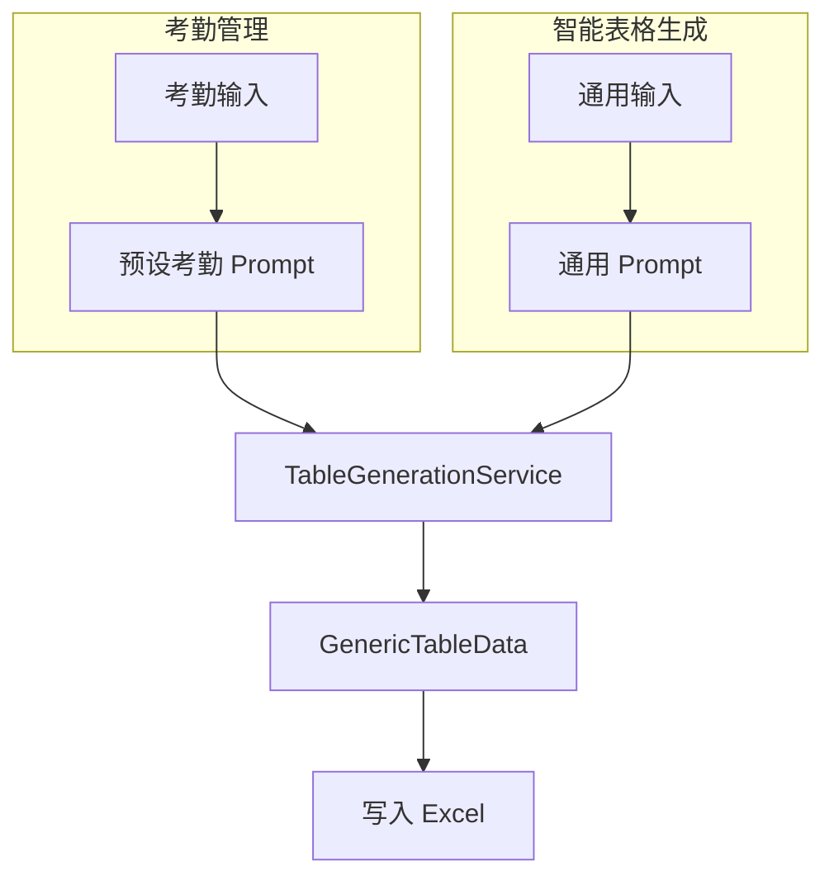

# 功能重构提案：合并考勤管理与智能表格生成

## 问题分析

当前存在两个功能重叠的模块：

1. **考勤管理** - 使用 `AIService` + `useAIAttendance`
2. **智能表格生成** - 使用 `TableGenerationService` + `useTableGeneration`

两者都通过 AI 根据自然语言生成表格，但有以下区别：

| 特性       | 考勤管理             | 智能表格生成 |
| ---------- | -------------------- | ------------ |
| AI Prompt  | 专注考勤场景         | 通用场景     |
| 列类型     | 5 种                 | 12 种        |
| 数据转换   | 转为 Employee/Record | 直接使用     |
| Store 集成 | 是                   | 否           |
| Excel 写入 | 手动触发             | 手动触发     |

## 重构方案

### 方案 A：统一为通用表格生成（推荐）

删除考勤专用逻辑，统一使用通用表格生成服务：

```mermaid
graph TD
    A[用户输入自然语言] --> B[TableGenerationService]
    B --> C[AI 生成 GenericTableData]
    C --> D[TablePreview 预览]
    D --> E[写入 Excel]

    subgraph 可选：场景模板
        F[考勤模板] --> A
        G[销售模板] --> A
        H[库存模板] --> A
    end
```

**实现步骤：**

1. 删除 `src/services/ai-service.ts` 中的考勤专用逻辑
2. 删除 `src/hooks/useAIAttendance.ts`
3. 删除考勤专用的 Zustand store（或保留用于其他目的）
4. 在 `TableGeneratorPanel` 中添加"场景模板"选择器
5. 更新 `App.tsx`，移除"考勤管理"标签页，只保留"智能表格生成"

### 方案 B：保留两个入口，共享后端

保留两个标签页，但共享同一个服务：



**实现步骤：**

1. 更新 `useAIAttendance` 使用 `TableGenerationService`
2. 保留考勤专用的 Prompt 模板
3. 统一数据类型为 `GenericTableData`

## 推荐方案

**推荐方案 A**，原因：

1. 代码更简洁，减少维护成本
2. 用户体验更一致
3. "场景模板"功能可以提供考勤等预设场景
4. 更符合"像 Kilo 一样的通用表格生成"需求

## 保留的文件

方案 A 实施后保留：

- `src/services/table-generation-service.ts`
- `src/hooks/useTableGeneration.ts`
- `src/components/TableGeneratorPanel/`
- `src/adapters/excel-adapter.ts`（包含 `writeGenericTable`）

可删除：

- `src/services/ai-service.ts` 中的考勤专用 Prompt（保留基础 AI 调用方法供其他用途）
- `src/hooks/useAIAttendance.ts`
- 考勤相关的 store 状态
- `App.tsx` 中的考勤管理标签页

## 场景模板功能设计

在 `TableGeneratorPanel` 中添加预设模板：

```typescript
const sceneTemplates = [
  {
    id: 'attendance',
    name: '考勤表',
    prompt: '创建一个员工考勤表，包含姓名、日期、上班时间、下班时间、工作时长、状态',
  },
  {
    id: 'sales',
    name: '销售报表',
    prompt: '创建一个销售数据表，包含日期、产品、数量、单价、总额、销售员',
  },
  {
    id: 'inventory',
    name: '库存表',
    prompt: '创建一个产品库存表，包含产品名称、SKU、数量、单价、库存位置',
  },
  {
    id: 'contacts',
    name: '联系人表',
    prompt: '创建一个客户联系表，包含姓名、公司、电话、邮箱、地址',
  },
];
```

用户点击模板后自动填充 Prompt，可以在此基础上修改。
