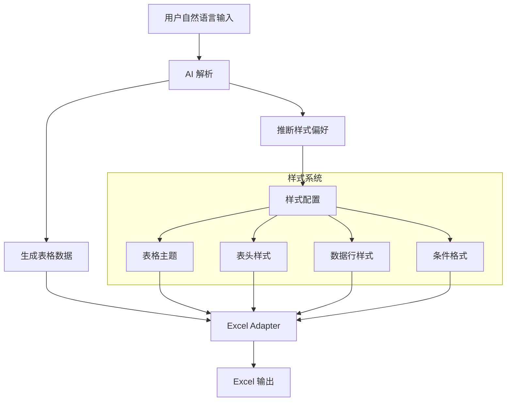

# 表格样式设计文档

## 功能概述

本功能旨在让 AI 生成的表格具有丰富的视觉样式，结合用户的自然语言描述和 Excel 内置表格样式，创建专业美观的表格。

## 设计目标

1. **智能样式推断** - 根据表格类型和用户描述自动选择合适的样式
2. **Excel 原生样式** - 利用 Excel 内置的表格样式（TableStyleLight, TableStyleMedium, TableStyleDark）
3. **自定义样式扩展** - 支持自定义颜色主题、字体、边框等
4. **条件格式化** - 根据数据类型自动添加条件格式（如状态列的颜色编码）

## 架构设计



## 类型定义

### 表格样式配置

```typescript
/**
 * Excel 内置表格样式
 */
type ExcelTableStyleName =
  // Light 系列 - 浅色主题
  | 'TableStyleLight1'
  | 'TableStyleLight2'
  | 'TableStyleLight3'
  | 'TableStyleLight4'
  | 'TableStyleLight5'
  | 'TableStyleLight6'
  | 'TableStyleLight7'
  | 'TableStyleLight8'
  | 'TableStyleLight9'
  | 'TableStyleLight10'
  | 'TableStyleLight11'
  | 'TableStyleLight12'
  | 'TableStyleLight13'
  | 'TableStyleLight14'
  // Medium 系列 - 中等主题
  | 'TableStyleMedium1'
  | 'TableStyleMedium2'
  | 'TableStyleMedium3'
  | 'TableStyleMedium4'
  | 'TableStyleMedium5'
  | 'TableStyleMedium6'
  | 'TableStyleMedium7'
  | 'TableStyleMedium8'
  | 'TableStyleMedium9'
  | 'TableStyleMedium10'
  | 'TableStyleMedium11'
  | 'TableStyleMedium12'
  | 'TableStyleMedium13'
  | 'TableStyleMedium14'
  // Dark 系列 - 深色主题
  | 'TableStyleDark1'
  | 'TableStyleDark2'
  | 'TableStyleDark3'
  | 'TableStyleDark4'
  | 'TableStyleDark5'
  | 'TableStyleDark6'
  | 'TableStyleDark7'
  | 'TableStyleDark8'
  | 'TableStyleDark9'
  | 'TableStyleDark10'
  | 'TableStyleDark11';

/**
 * 颜色主题
 */
interface ColorTheme {
  /** 主色 - 用于表头 */
  primary: string;
  /** 辅助色 - 用于交替行 */
  secondary: string;
  /** 强调色 - 用于重要数据 */
  accent: string;
  /** 文字颜色 */
  text: string;
  /** 背景颜色 */
  background: string;
}

/**
 * 预定义颜色主题
 */
const COLOR_THEMES = {
  // 专业商务
  professional: {
    primary: '#4472C4', // 蓝色
    secondary: '#D6DCE5', // 浅灰蓝
    accent: '#ED7D31', // 橙色
    text: '#000000',
    background: '#FFFFFF',
  },
  // 活力橙
  energetic: {
    primary: '#ED7D31', // 橙色
    secondary: '#FCE4D6', // 浅橙
    accent: '#4472C4', // 蓝色
    text: '#000000',
    background: '#FFFFFF',
  },
  // 自然绿
  nature: {
    primary: '#70AD47', // 绿色
    secondary: '#E2EFDA', // 浅绿
    accent: '#5B9BD5', // 蓝色
    text: '#000000',
    background: '#FFFFFF',
  },
  // 优雅紫
  elegant: {
    primary: '#7030A0', // 紫色
    secondary: '#E4DFEC', // 浅紫
    accent: '#FF00FF', // 洋红
    text: '#000000',
    background: '#FFFFFF',
  },
  // 深色主题
  dark: {
    primary: '#333333', // 深灰
    secondary: '#555555', // 中灰
    accent: '#FFCC00', // 金色
    text: '#FFFFFF',
    background: '#1A1A1A',
  },
  // 清新蓝
  fresh: {
    primary: '#5B9BD5', // 天蓝
    secondary: '#DEEBF7', // 浅蓝
    accent: '#A5A5A5', // 灰色
    text: '#000000',
    background: '#FFFFFF',
  },
};

/**
 * 表格样式配置
 */
interface TableStyleConfig {
  /** 使用 Excel 内置样式名称 */
  excelTableStyle?: ExcelTableStyleName;

  /** 或使用自定义颜色主题 */
  colorTheme?: keyof typeof COLOR_THEMES | ColorTheme;

  /** 表头样式 */
  header?: {
    backgroundColor?: string;
    fontColor?: string;
    fontSize?: number;
    bold?: boolean;
    align?: 'left' | 'center' | 'right';
  };

  /** 数据行样式 */
  body?: {
    fontSize?: number;
    alternateRowColor?: boolean;
    alternateColor?: string;
  };

  /** 边框样式 */
  border?: {
    style?: 'thin' | 'medium' | 'thick' | 'none';
    color?: string;
    showInner?: boolean;
    showOuter?: boolean;
  };

  /** 条件格式规则 */
  conditionalFormats?: ConditionalFormatRule[];
}

/**
 * 条件格式规则
 */
interface ConditionalFormatRule {
  /** 应用的列名 */
  columnName: string;
  /** 规则类型 */
  type: 'colorScale' | 'dataBar' | 'iconSet' | 'cellValue';
  /** 规则配置 */
  config: ColorScaleConfig | DataBarConfig | IconSetConfig | CellValueConfig;
}

interface ColorScaleConfig {
  minColor: string;
  midColor?: string;
  maxColor: string;
}

interface DataBarConfig {
  color: string;
  showValue?: boolean;
}

interface IconSetConfig {
  iconType: 'arrows' | 'circles' | 'flags' | 'stars';
}

interface CellValueConfig {
  operator: 'greaterThan' | 'lessThan' | 'equal' | 'between' | 'contains';
  values: (string | number)[];
  format: {
    backgroundColor?: string;
    fontColor?: string;
    bold?: boolean;
  };
}
```

### 扩展 GenericTableData

```typescript
/**
 * 扩展的表格数据（带样式）
 */
interface StyledTableData extends GenericTableData {
  /** 样式配置 */
  style?: TableStyleConfig;
}

/**
 * 扩展的表格生成请求
 */
interface StyledTableGenerationRequest extends TableGenerationRequest {
  /** 样式偏好 */
  stylePreference?: {
    /** 风格关键词：专业、活泼、简约、优雅、深色等 */
    keywords?: string[];
    /** 指定颜色主题 */
    theme?: keyof typeof COLOR_THEMES;
    /** 是否启用条件格式 */
    enableConditionalFormat?: boolean;
  };
}
```

## AI Prompt 扩展

在生成表格时，AI 需要同时推断样式：

```
你是一个智能表格生成引擎。根据用户的自然语言描述，生成一个结构化的表格定义，包括数据和样式。

**样式推断规则:**
1. 如果用户提到"专业"、"商务"、"正式"，使用 professional 主题
2. 如果用户提到"活泼"、"活力"、"鲜艳"，使用 energetic 主题
3. 如果用户提到"自然"、"清新"、"绿色"，使用 nature 主题
4. 如果用户提到"优雅"、"高端"、"紫色"，使用 elegant 主题
5. 如果用户提到"深色"、"暗色"、"黑色"，使用 dark 主题
6. 默认使用 professional 主题

**条件格式自动添加规则:**
1. 状态列（如"状态"、"审批状态"）：使用不同颜色表示不同状态
2. 完成率/百分比列：使用数据条显示进度
3. 金额/价格列：负数显示红色，正数显示绿色
4. 日期列：过期日期显示红色

**返回格式扩展:**
{
  "tableName": "...",
  "columns": [...],
  "rows": [...],
  "style": {
    "colorTheme": "professional",
    "excelTableStyle": "TableStyleMedium2",
    "header": {
      "bold": true,
      "align": "center"
    },
    "body": {
      "alternateRowColor": true
    },
    "conditionalFormats": [
      {
        "columnName": "状态",
        "type": "cellValue",
        "config": {
          "operator": "equal",
          "values": ["正常", "完成"],
          "format": { "backgroundColor": "#C6EFCE", "fontColor": "#006100" }
        }
      }
    ]
  }
}
```

## 实现计划

### 阶段 1：基础样式支持

1. 扩展类型定义，添加 `TableStyleConfig`
2. 更新 AI Prompt，让 AI 同时生成样式配置
3. 扩展 `ExcelAdapter.writeGenericTable()`，应用基础样式

### 阶段 2：Excel 表格样式

1. 使用 Excel 内置表格样式 (`table.style`)
2. 支持表头行、筛选按钮、汇总行等表格功能

### 阶段 3：条件格式

1. 实现条件格式规则应用
2. 支持颜色阶梯、数据条、图标集
3. 支持自定义单元格值条件

### 阶段 4：前端样式选择器

1. 在 `TableGeneratorPanel` 中添加样式选择 UI
2. 预览样式效果
3. 自定义颜色选择器

## 需要修改的文件

1. **`src/types/common.ts`** - 添加样式相关类型定义
2. **`src/services/table-generation-service.ts`** - 更新 AI Prompt，解析样式配置
3. **`src/adapters/excel-adapter.ts`** - 扩展 `writeGenericTable()` 支持样式
4. **`src/components/TableGeneratorPanel/TableGeneratorPanel.tsx`** - 添加样式选择 UI
5. **`src/components/TableGeneratorPanel/StyleSelector.tsx`** - 新建样式选择器组件
6. **`src/components/TableGeneratorPanel/TablePreview.tsx`** - 在预览中显示样式效果

## 用户体验流程

```
1. 用户输入："创建一个销售报表，包含日期、产品、数量、金额，要专业的蓝色风格"
                    ↓
2. AI 解析：识别出"专业"和"蓝色"关键词，选择 professional 主题
                    ↓
3. 生成带样式的表格配置
                    ↓
4. 前端预览：显示带颜色的表格预览
                    ↓
5. 用户可选：调整样式主题或颜色
                    ↓
6. 写入 Excel：应用完整样式
```

## 样式映射表

| 用户关键词             | 颜色主题     | Excel 表格样式    |
| ---------------------- | ------------ | ----------------- |
| 专业、商务、正式       | professional | TableStyleMedium2 |
| 活泼、活力、鲜艳、橙色 | energetic    | TableStyleMedium3 |
| 自然、清新、绿色、环保 | nature       | TableStyleMedium7 |
| 优雅、高端、紫色       | elegant      | TableStyleMedium4 |
| 深色、暗色、黑色       | dark         | TableStyleDark1   |
| 清新、蓝色、天蓝       | fresh        | TableStyleLight2  |
| 简约、极简、无色       | -            | TableStyleLight1  |

## 状态值颜色映射

| 状态类型 | 正面值         | 背景色  | 负面值           | 背景色  |
| -------- | -------------- | ------- | ---------------- | ------- |
| 审批状态 | 已通过、已批准 | #C6EFCE | 已拒绝、未通过   | #FFC7CE |
| 任务状态 | 已完成、完成   | #C6EFCE | 未完成、待处理   | #FFEB9C |
| 库存状态 | 充足           | #C6EFCE | 不足、缺货       | #FFC7CE |
| 考勤状态 | 正常           | #C6EFCE | 迟到、早退、缺勤 | #FFC7CE |
