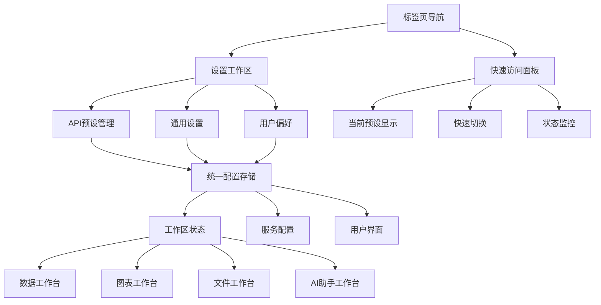

# API预设管理和设置面板集成方案

## 概述

将现有的API预设管理和设置面板功能无缝集成到新的多标签页架构中，创建统一的配置管理中心，提供现代化的用户体验和增强的功能集成。

---

## 1. 整体架构设计

### 1.1 新架构集成方案

```
ConfigurationCenter/
├── SettingsWorkspace/          # 设置工作区
│   ├── GeneralSettings/        # 通用设置
│   ├── ApiPresetsManager/      # API预设管理
│   ├── UserPreferences/        # 用户偏好
│   ├── WorkspaceConfig/        # 工作区配置
│   └── SystemInfo/             # 系统信息
├── QuickAccessPanel/           # 快速访问面板
│   ├── ActivePresetIndicator/  # 当前预设指示器
│   ├── QuickSettings/          # 快速设置
│   └── StatusMonitor/          # 状态监控
└── ConfigurationProvider/      # 配置提供者
    ├── UnifiedSettingsStore/   # 统一设置存储
    ├── PresetManager/          # 预设管理器
    └── ConfigSync/             # 配置同步
```

### 1.2 集成架构图



---

## 2. 统一配置管理系统

### 2.1 统一配置接口

```typescript
// 统一配置接口
interface UnifiedConfig {
  // API配置
  api: {
    activePreset: string;
    presets: ApiPreset[];
    fallbackSettings: AISettings;
  };
  
  // 用户界面配置
  ui: {
    theme: ThemeConfig;
    layout: LayoutConfig;
    shortcuts: ShortcutConfig;
    accessibility: AccessibilityConfig;
  };
  
  // 工作区配置
  workspace: {
    defaultWorkspace: string;
    autoSave: boolean;
    maxHistoryEntries: number;
    collaboration: CollaborationConfig;
  };
  
  // 功能配置
  features: {
    tableGeneration: TableFeatureConfig;
    chartGeneration: ChartFeatureConfig;
    fileProcessing: FileFeatureConfig;
    aiAssistant: AIFeatureConfig;
  };
  
  // 高级配置
  advanced: {
    debugMode: boolean;
    performanceMode: boolean;
    telemetry: TelemetryConfig;
    experimental: ExperimentalConfig;
  };
}

// 主题配置
interface ThemeConfig {
  mode: 'light' | 'dark' | 'auto';
  gradient: string;
  glassOpacity: number;
  animationSpeed: 'slow' | 'normal' | 'fast';
  customColors: Record<string, string>;
}

// 布局配置
interface LayoutConfig {
  sidebarWidth: number;
  tabBarPosition: 'top' | 'bottom';
  compactMode: boolean;
  showTooltips: boolean;
  autoHidePanels: boolean;
}
```

### 2.2 统一配置存储

```typescript
// 统一配置存储管理器
class UnifiedConfigStore {
  private static instance: UnifiedConfigStore;
  private config: UnifiedConfig;
  private subscribers: Set<ConfigSubscriber> = new Set();
  private readonly STORAGE_KEY = 'unified-config';
  
  private constructor() {
    this.config = this.loadConfig();
    this.setupAutoSave();
  }
  
  static getInstance(): UnifiedConfigStore {
    if (!UnifiedConfigStore.instance) {
      UnifiedConfigStore.instance = new UnifiedConfigStore();
    }
    return UnifiedConfigStore.instance;
  }
  
  // 获取配置
  getConfig(): UnifiedConfig {
    return { ...this.config };
  }
  
  // 更新配置
  updateConfig(updates: Partial<UnifiedConfig>): void {
    const previousConfig = { ...this.config };
    this.config = { ...this.config, ...updates };
    
    // 通知订阅者
    this.notifySubscribers(previousConfig, this.config);
    
    // 保存到存储
    this.saveConfig();
  }
  
  // 订阅配置变更
  subscribe(subscriber: ConfigSubscriber): () => void {
    this.subscribers.add(subscriber);
    return () => this.subscribers.delete(subscriber);
  }
  
  // 获取特定分类的配置
  getConfigSection<K extends keyof UnifiedConfig>(section: K): UnifiedConfig[K] {
    return this.config[section];
  }
  
  // 更新特定分类的配置
  updateConfigSection<K extends keyof UnifiedConfig>(
    section: K, 
    updates: Partial<UnifiedConfig[K]>
  ): void {
    this.updateConfig({
      [section]: { ...this.config[section], ...updates }
    } as Partial<UnifiedConfig>);
  }
  
  // 导出配置
  exportConfig(): string {
    return JSON.stringify(this.config, null, 2);
  }
  
  // 导入配置
  importConfig(jsonString: string): boolean {
    try {
      const importedConfig = JSON.parse(jsonString);
      this.config = { ...this.config, ...importedConfig };
      this.saveConfig();
      this.notifySubscribers(this.config, this.config);
      return true;
    } catch (error) {
      console.error('[UnifiedConfigStore] 导入配置失败:', error);
      return false;
    }
  }
  
  // 重置为默认配置
  resetToDefaults(): void {
    this.config = this.getDefaultConfig();
    this.saveConfig();
    this.notifySubscribers(this.config, this.config);
  }
  
  private loadConfig(): UnifiedConfig {
    try {
      const stored = localStorage.getItem(this.STORAGE_KEY);
      if (stored) {
        const parsed = JSON.parse(stored);
        return { ...this.getDefaultConfig(), ...parsed };
      }
    } catch (error) {
      console.warn('[UnifiedConfigStore] 加载配置失败:', error);
    }
    return this.getDefaultConfig();
  }
  
  private saveConfig(): void {
    try {
      localStorage.setItem(this.STORAGE_KEY, JSON.stringify(this.config));
    } catch (error) {
      console.error('[UnifiedConfigStore] 保存配置失败:', error);
    }
  }
  
  private notifySubscribers(previous: UnifiedConfig, current: UnifiedConfig): void {
    this.subscribers.forEach(subscriber => {
      subscriber.onConfigChange(previous, current);
    });
  }
  
  private setupAutoSave(): void {
    // 防抖自动保存
    let saveTimeout: NodeJS.Timeout;
    const originalUpdateConfig = this.updateConfig.bind(this);
    
    this.updateConfig = (updates: Partial<UnifiedConfig>) => {
      originalUpdateConfig(updates);
      
      clearTimeout(saveTimeout);
      saveTimeout = setTimeout(() => {
        this.saveConfig();
      }, 1000);
    };
  }
  
  private getDefaultConfig(): UnifiedConfig {
    return {
      api: {
        activePreset: '',
        presets: [],
        fallbackSettings: {
          baseUrl: 'https://api.openai.com/v1',
          apiKey: '',
          model: 'gpt-4',
          timeout: 60,
        }
      },
      ui: {
        theme: {
          mode: 'auto',
          gradient: 'cyber-blue',
          glassOpacity: 0.1,
          animationSpeed: 'normal',
          customColors: {}
        },
        layout: {
          sidebarWidth: 250,
          tabBarPosition: 'top',
          compactMode: false,
          showTooltips: true,
          autoHidePanels: false
        },
        shortcuts: {},
        accessibility: {
          highContrast: false,
          reducedMotion: false,
          screenReader: false
        }
      },
      workspace: {
        defaultWorkspace: 'data',
        autoSave: true,
        maxHistoryEntries: 50,
        collaboration: {
          enabled: false,
          showCursors: true,
          showSelections: true
        }
      },
      features: {
        tableGeneration: {
          enabled: true,
          autoStyle: true,
          defaultRowCount: 5
        },
        chartGeneration: {
          enabled: true,
          autoRecommend: true,
          defaultType: 'column'
        },
        fileProcessing: {
          enabled: true,
          maxFileSize: 100 * 1024 * 1024, // 100MB
          supportedFormats: ['.csv', '.xlsx', '.json']
        },
        aiAssistant: {
          enabled: true,
          streaming: true,
          suggestions: true
        }
      },
      advanced: {
        debugMode: false,
        performanceMode: false,
        telemetry: {
          enabled: false,
          anonymize: true
        },
        experimental: {
          enabled: false,
          features: []
        }
      }
    };
  }
}

// 配置订阅者接口
interface ConfigSubscriber {
  onConfigChange(previous: UnifiedConfig, current: UnifiedConfig): void;
}
```

---

## 3. API预设管理集成

### 3.1 增强的API预设管理器

```typescript
// 增强的API预设管理器
class EnhancedApiPresetManager {
  private configStore: UnifiedConfigStore;
  private presetService: ApiPresetService;
  private subscribers: Set<PresetSubscriber> = new Set();
  
  constructor() {
    this.configStore = UnifiedConfigStore.getInstance();
    this.presetService = apiPresetService;
    this.setupEventListeners();
  }
  
  // 获取所有预设
  getAllPresets(): ApiPreset[] {
    return this.presetService.getAllPresets();
  }
  
  // 获取当前活动预设
  getActivePreset(): ApiPreset | null {
    const activeId = this.configStore.getConfigSection('api').activePreset;
    return this.presetService.getAllPresets().find(p => p.id === activeId) || null;
  }
  
  // 切换预设
  async switchPreset(presetId: string): Promise<boolean> {
    try {
      const response = await this.presetService.switchPreset({ presetId });
      if (response.success) {
        // 更新统一配置
        this.configStore.updateConfigSection('api', {
          activePreset: presetId
        });
        
        // 通知所有订阅者
        this.notifyPresetChange('switch', presetId);
        return true;
      }
      return false;
    } catch (error) {
      console.error('[EnhancedApiPresetManager] 切换预设失败:', error);
      return false;
    }
  }
  
  // 创建预设
  async createPreset(request: CreateApiPresetRequest): Promise<ApiPreset | null> {
    try {
      const response = await this.presetService.createPreset(request);
      if (response.success && response.data) {
        // 更新统一配置中的预设列表
        const currentPresets = this.configStore.getConfigSection('api').presets;
        this.configStore.updateConfigSection('api', {
          presets: [...currentPresets, response.data]
        });
        
        this.notifyPresetChange('create', response.data.id);
        return response.data;
      }
      return null;
    } catch (error) {
      console.error('[EnhancedApiPresetManager] 创建预设失败:', error);
      return null;
    }
  }
  
  // 更新预设
  async updatePreset(request: UpdateApiPresetRequest): Promise<ApiPreset | null> {
    try {
      const response = await this.presetService.updatePreset(request);
      if (response.success && response.data) {
        // 更新统一配置中的预设列表
        const currentPresets = this.configStore.getConfigSection('api').presets;
        const updatedPresets = currentPresets.map(p => 
          p.id === request.id ? response.data! : p
        );
        this.configStore.updateConfigSection('api', {
          presets: updatedPresets
        });
        
        this.notifyPresetChange('update', response.data.id);
        return response.data;
      }
      return null;
    } catch (error) {
      console.error('[EnhancedApiPresetManager] 更新预设失败:', error);
      return null;
    }
  }
  
  // 删除预设
  async deletePreset(presetId: string): Promise<boolean> {
    try {
      const response = await this.presetService.deletePreset(presetId);
      if (response.success) {
        // 更新统一配置中的预设列表
        const currentPresets = this.configStore.getConfigSection('api').presets;
        const filteredPresets = currentPresets.filter(p => p.id !== presetId);
        this.configStore.updateConfigSection('api', {
          presets: filteredPresets
        });
        
        // 如果删除的是当前活动预设，切换到第一个可用预设
        const activePreset = this.getActivePreset();
        if (activePreset?.id === presetId && filteredPresets.length > 0) {
          await this.switchPreset(filteredPresets[0].id);
        }
        
        this.notifyPresetChange('delete', presetId);
        return true;
      }
      return false;
    } catch (error) {
      console.error('[EnhancedApiPresetManager] 删除预设失败:', error);
      return false;
    }
  }
  
  // 验证预设连接
  async validatePreset(presetId: string): Promise<ValidationResult> {
    const preset = this.getAllPresets().find(p => p.id === presetId);
    if (!preset) {
      return { success: false, error: '预设不存在' };
    }
    
    try {
      // 这里可以添加实际的连接测试逻辑
      const isValid = await this.testApiConnection(preset);
      return {
        success: isValid,
        error: isValid ? undefined : 'API连接失败'
      };
    } catch (error) {
      return {
        success: false,
        error: error instanceof Error ? error.message : '验证失败'
      };
    }
  }
  
  // 订阅预设变更
  subscribe(subscriber: PresetSubscriber): () => void {
    this.subscribers.add(subscriber);
    return () => this.subscribers.delete(subscriber);
  }
  
  private setupEventListeners(): void {
    // 监听统一配置变更
    this.configStore.subscribe((previous, current) => {
      if (previous.api.activePreset !== current.api.activePreset) {
        this.notifyPresetChange('switch', current.api.activePreset);
      }
    });
  }
  
  private notifyPresetChange(type: string, presetId: string): void {
    this.subscribers.forEach(subscriber => {
      subscriber.onPresetChange(type, presetId);
    });
  }
  
  private async testApiConnection(preset: ApiPreset): Promise<boolean> {
    // 简化的连接测试逻辑
    try {
      const response = await fetch(`${preset.baseUrl}/models`, {
        headers: {
          'Authorization': `Bearer ${preset.apiKey}`,
          'Content-Type': 'application/json'
        }
      });
      return response.ok;
    } catch {
      return false;
    }
  }
}

// 预设订阅者接口
interface PresetSubscriber {
  onPresetChange(type: string, presetId: string): void;
}
```

### 3.2 API预设UI组件

```typescript
// API预设管理组件
const ApiPresetsManager: React.FC = () => {
  const [presets, setPresets] = useState<ApiPreset[]>([]);
  const [activePreset, setActivePreset] = useState<ApiPreset | null>(null);
  const [isLoading, setIsLoading] = useState(false);
  const [showCreateModal, setShowCreateModal] = useState(false);
  const [editingPreset, setEditingPreset] = useState<ApiPreset | null>(null);
  
  const presetManager = useEnhancedApiPresetManager();
  
  useEffect(() => {
    // 加载预设列表
    loadPresets();
    
    // 订阅预设变更
    const unsubscribe = presetManager.subscribe((type, presetId) => {
      loadPresets();
    });
    
    return unsubscribe;
  }, []);
  
  const loadPresets = () => {
    const allPresets = presetManager.getAllPresets();
    const active = presetManager.getActivePreset();
    setPresets(allPresets);
    setActivePreset(active);
  };
  
  const handleSwitchPreset = async (presetId: string) => {
    setIsLoading(true);
    const success = await presetManager.switchPreset(presetId);
    if (success) {
      loadPresets();
    }
    setIsLoading(false);
  };
  
  const handleDeletePreset = async (presetId: string) => {
    if (confirm('确定要删除这个API预设吗？')) {
      setIsLoading(true);
      await presetManager.deletePreset(presetId);
      loadPresets();
      setIsLoading(false);
    }
  };
  
  return (
    <div className="api-presets-manager glass-panel">
      <div className="presets-header">
        <h3>API预设管理</h3>
        <div className="header-actions">
          <button
            onClick={() => setShowCreateModal(true)}
            className="btn-primary"
          >
            <PlusIcon />
            新建预设
          </button>
        </div>
      </div>
      
      <div className="presets-list">
        {presets.map(preset => (
          <PresetCard
            key={preset.id}
            preset={preset}
            isActive={activePreset?.id === preset.id}
            isLoading={isLoading}
            onSwitch={() => handleSwitchPreset(preset.id)}
            onEdit={() => setEditingPreset(preset)}
            onDelete={() => handleDeletePreset(preset.id)}
          />
        ))}
      </div>
      
      {presets.length === 0 && (
        <EmptyState
          icon="🔌"
          title="暂无API预设"
          description="创建您的第一个API预设以开始使用"
          action={
            <button
              onClick={() => setShowCreateModal(true)}
              className="btn-primary"
            >
              创建预设
            </button>
          }
        />
      )}
      
      {/* 创建/编辑模态框 */}
      {(showCreateModal || editingPreset) && (
        <PresetModal
          preset={editingPreset}
          onClose={() => {
            setShowCreateModal(false);
            setEditingPreset(null);
          }}
          onSave={() => {
            setShowCreateModal(false);
            setEditingPreset(null);
            loadPresets();
          }}
        />
      )}
    </div>
  );
};

// 预设卡片组件
const PresetCard: React.FC<{
  preset: ApiPreset;
  isActive: boolean;
  isLoading: boolean;
  onSwitch: () => void;
  onEdit: () => void;
  onDelete: () => void;
}> = ({ preset, isActive, isLoading, onSwitch, onEdit, onDelete }) => {
  return (
    <div className={`preset-card ${isActive ? 'active' : ''}`}>
      <div className="preset-info">
        <div className="preset-header">
          <h4 className="preset-name">{preset.name}</h4>
          {isActive && (
            <span className="active-badge">
              <CheckIcon />
              当前使用
            </span>
          )}
        </div>
        
        <div className="preset-details">
          <div className="detail-item">
            <span className="label">提供商:</span>
            <span className="value">{preset.provider}</span>
          </div>
          <div className="detail-item">
            <span className="label">模型:</span>
            <span className="value">{preset.model}</span>
          </div>
          <div className="detail-item">
            <span className="label">状态:</span>
            <span className={`value status ${preset.apiKey ? 'connected' : 'disconnected'}`}>
              {preset.apiKey ? '已配置' : '未配置'}
            </span>
          </div>
        </div>
        
        {preset.description && (
          <p className="preset-description">{preset.description}</p>
        )}
      </div>
      
      <div className="preset-actions">
        {!isActive && (
          <button
            onClick={onSwitch}
            disabled={isLoading || !preset.apiKey}
            className="btn-outline"
            title="切换到此预设"
          >
            <SwitchIcon />
          </button>
        )}
        
        <button
          onClick={onEdit}
          className="btn-outline"
          title="编辑预设"
        >
          <EditIcon />
        </button>
        
        <button
          onClick={onDelete}
          className="btn-outline text-red-500"
          title="删除预设"
        >
          <DeleteIcon />
        </button>
      </div>
    </div>
  );
};
```

---

## 4. 设置面板集成

### 4.1 统一设置管理器

```typescript
// 统一设置管理器
class UnifiedSettingsManager {
  private configStore: UnifiedConfigStore;
  private subscribers: Set<SettingsSubscriber> = new Set();
  
  constructor() {
    this.configStore = UnifiedConfigStore.getInstance();
  }
  
  // 获取设置
  getSettings(): UnifiedConfig {
    return this.configStore.getConfig();
  }
  
  // 更新AI设置
  updateAISettings(updates: Partial<AISettings>): void {
    this.configStore.updateConfigSection('api', {
      fallbackSettings: {
        ...this.configStore.getConfigSection('api').fallbackSettings,
        ...updates
      }
    });
  }
  
  // 更新UI设置
  updateUISettings(updates: Partial<UIConfig>): void {
    this.configStore.updateConfigSection('ui', {
      ...this.configStore.getConfigSection('ui'),
      ...updates
    });
  }
  
  // 更新工作区设置
  updateWorkspaceSettings(updates: Partial<WorkspaceConfig>): void {
    this.configStore.updateConfigSection('workspace', {
      ...this.configStore.getConfigSection('workspace'),
      ...updates
    });
  }
  
  // 更新功能设置
  updateFeatureSettings(updates: Partial<FeatureConfig>): void {
    this.configStore.updateConfigSection('features', {
      ...this.configStore.getConfigSection('features'),
      ...updates
    });
  }
  
  // 更新高级设置
  updateAdvancedSettings(updates: Partial<AdvancedConfig>): void {
    this.configStore.updateConfigSection('advanced', {
      ...this.configStore.getConfigSection('advanced'),
      ...updates
    });
  }
  
  // 重置设置
  resetSettings(): void {
    this.configStore.resetToDefaults();
  }
  
  // 导出设置
  exportSettings(): string {
    return this.configStore.exportConfig();
  }
  
  // 导入设置
  importSettings(jsonString: string): boolean {
    return this.configStore.importConfig(jsonString);
  }
  
  // 订阅设置变更
  subscribe(subscriber: SettingsSubscriber): () => void {
    this.subscribers.add(subscriber);
    return () => this.subscribers.delete(subscriber);
  }
}

// 设置订阅者接口
interface SettingsSubscriber {
  onSettingsChange(settings: UnifiedConfig): void;
}
```

### 4.2 现代化设置面板

```typescript
// 统一设置面板组件
const UnifiedSettingsPanel: React.FC = () => {
  const [activeSection, setActiveSection] = useState<string>('api');
  const [settings, setSettings] = useState<UnifiedConfig | null>(null);
  const [isDirty, setIsDirty] = useState(false);
  
  const settingsManager = useUnifiedSettingsManager();
  
  useEffect(() => {
    // 加载设置
    loadSettings();
    
    // 订阅设置变更
    const unsubscribe = settingsManager.subscribe((newSettings) => {
      setSettings(newSettings);
      setIsDirty(false);
    });
    
    return unsubscribe;
  }, []);
  
  const loadSettings = () => {
    const currentSettings = settingsManager.getSettings();
    setSettings(currentSettings);
  };
  
  const handleSettingChange = (section: string, updates: any) => {
    if (!settings) return;
    
    setSettings({
      ...settings,
      [section]: { ...settings[section as keyof UnifiedConfig], ...updates }
    });
    setIsDirty(true);
    
    // 应用设置变更
    applySettingChange(section, updates);
  };
  
  const applySettingChange = (section: string, updates: any) => {
    switch (section) {
      case 'api':
        settingsManager.updateAISettings(updates);
        break;
      case 'ui':
        settingsManager.updateUISettings(updates);
        break;
      case 'workspace':
        settingsManager.updateWorkspaceSettings(updates);
        break;
      case 'features':
        settingsManager.updateFeatureSettings(updates);
        break;
      case 'advanced':
        settingsManager.updateAdvancedSettings(updates);
        break;
    }
  };
  
  const handleExportSettings = () => {
    const settingsJson = settingsManager.exportSettings();
    const blob = new Blob([settingsJson], { type: 'application/json' });
    const url = URL.createObjectURL(blob);
    const a = document.createElement('a');
    a.href = url;
    a.download = `excel-addin-settings-${new Date().toISOString().split('T')[0]}.json`;
    a.click();
    URL.revokeObjectURL(url);
  };
  
  const handleImportSettings = (event: React.ChangeEvent<HTMLInputElement>) => {
    const file = event.target.files?.[0];
    if (file) {
      const reader = new FileReader();
      reader.onload = (e) => {
        const content = e.target?.result as string;
        const success = settingsManager.importSettings(content);
        if (success) {
          loadSettings();
          alert('设置导入成功！');
        } else {
          alert('设置导入失败，请检查文件格式。');
        }
      };
      reader.readAsText(file);
    }
  };
  
  if (!settings) {
    return <div className="settings-loading">加载中...</div>;
  }
  
  return (
    <div className="unified-settings-panel">
      <div className="settings-header">
        <h2>系统设置</h2>
        <div className="header-actions">
          <button onClick={handleExportSettings} className="btn-outline">
            <DownloadIcon />
            导出设置
          </button>
          <label className="btn-outline cursor-pointer">
            <UploadIcon />
            导入设置
            <input
              type="file"
              accept=".json"
              onChange={handleImportSettings}
              className="hidden"
            />
          </label>
          {isDirty && (
            <span className="dirty-indicator">
              有未保存的更改
            </span>
          )}
        </div>
      </div>
      
      <div className="settings-content">
        <SettingsSidebar
          activeSection={activeSection}
          onSectionChange={setActiveSection}
        />
        
        <div className="settings-main">
          {activeSection === 'api' && (
            <ApiSettingsSection
              settings={settings.api}
              onChange={(updates) => handleSettingChange('api', updates)}
            />
          )}
          
          {activeSection === 'ui' && (
            <UISettingsSection
              settings={settings.ui}
              onChange={(updates) => handleSettingChange('ui', updates)}
            />
          )}
          
          {activeSection === 'workspace' && (
            <WorkspaceSettingsSection
              settings={settings.workspace}
              onChange={(updates) => handleSettingChange('workspace', updates)}
            />
          )}
          
          {activeSection === 'features' && (
            <FeatureSettingsSection
              settings={settings.features}
              onChange={(updates) => handleSettingChange('features', updates)}
            />
          )}
          
          {activeSection === 'advanced' && (
            <AdvancedSettingsSection
              settings={settings.advanced}
              onChange={(updates) => handleSettingChange('advanced', updates)}
            />
          )}
        </div>
      </div>
    </div>
  );
};

// 设置侧边栏
const SettingsSidebar: React.FC<{
  activeSection: string;
  onSectionChange: (section: string) => void;
}> = ({ activeSection, onSectionChange }) => {
  const sections = [
    { id: 'api', name: 'API配置', icon: '🔌', description: 'API预设和连接设置' },
    { id: 'ui', name: '界面设置', icon: '🎨', description: '主题和布局配置' },
    { id: 'workspace', name: '工作区', icon: '📊', description: '工作区行为设置' },
    { id: 'features', name: '功能设置', icon: '⚙️', description: '各功能模块配置' },
    { id: 'advanced', name: '高级设置', icon: '🔧', description: '调试和实验性功能' },
  ];
  
  return (
    <div className="settings-sidebar glass-panel">
      <nav className="settings-nav">
        {sections.map(section => (
          <button
            key={section.id}
            onClick={() => onSectionChange(section.id)}
            className={`nav-item ${activeSection === section.id ? 'active' : ''}`}
          >
            <span className="nav-icon">{section.icon}</span>
            <div className="nav-content">
              <span className="nav-name">{section.name}</span>
              <span className="nav-description">{section.description}</span>
            </div>
          </button>
        ))}
      </nav>
    </div>
  );
};
```

---

## 5. 快速访问面板

### 5.1 快速访问组件

```typescript
// 快速访问面板
const QuickAccessPanel: React.FC = () => {
  const [activePreset, setActivePreset] = useState<ApiPreset | null>(null);
  const [connectionStatus, setConnectionStatus] = useState<'connected' | 'disconnected' | 'testing'>('disconnected');
  const [recentSettings, setRecentSettings] = useState<RecentSetting[]>([]);
  
  const presetManager = useEnhancedApiPresetManager();
  const settingsManager = useUnifiedSettingsManager();
  
  useEffect(() => {
    // 加载当前预设
    const currentPreset = presetManager.getActivePreset();
    setActivePreset(currentPreset);
    
    // 测试连接状态
    if (currentPreset) {
      testConnection(currentPreset.id);
    }
    
    // 加载最近的设置
    loadRecentSettings();
    
    // 订阅变更
    const unsubscribe = presetManager.subscribe((type, presetId) => {
      const newPreset = presetManager.getAllPresets().find(p => p.id === presetId);
      setActivePreset(newPreset || null);
      if (newPreset) {
        testConnection(newPreset.id);
      }
    });
    
    return unsubscribe;
  }, []);
  
  const testConnection = async (presetId: string) => {
    setConnectionStatus('testing');
    const result = await presetManager.validatePreset(presetId);
    setConnectionStatus(result.success ? 'connected' : 'disconnected');
  };
  
  const handleQuickSwitch = () => {
    // 显示预设选择器
    showPresetSelector();
  };
  
  const handleSettingToggle = (setting: string) => {
    // 快速切换设置
    const currentSettings = settingsManager.getSettings();
    // 实现快速设置切换逻辑
  };
  
  return (
    <div className="quick-access-panel glass-panel">
      <div className="panel-header">
        <h3>快速访问</h3>
        <button
          onClick={() => {/* 打开完整设置 */}}
          className="btn-text"
        >
          <SettingsIcon />
        </button>
      </div>
      
      <div className="panel-content">
        {/* 当前API预设状态 */}
        <div className="status-section">
          <div className="status-header">
            <span className="status-label">当前API预设</span>
            <ConnectionStatusIndicator status={connectionStatus} />
          </div>
          
          {activePreset ? (
            <div className="active-preset-info">
              <div className="preset-name">{activePreset.name}</div>
              <div className="preset-details">
                <span className="provider">{activePreset.provider}</span>
                <span className="model">{activePreset.model}</span>
              </div>
              <div className="preset-actions">
                <button
                  onClick={handleQuickSwitch}
                  className="btn-outline btn-sm"
                >
                  <SwitchIcon />
                  切换
                </button>
                <button
                  onClick={() => testConnection(activePreset.id)}
                  className="btn-outline btn-sm"
                  disabled={connectionStatus === 'testing'}
                >
                  <RefreshIcon />
                  测试
                </button>
              </div>
            </div>
          ) : (
            <div className="no-preset">
              <span>未选择API预设</span>
              <button
                onClick={handleQuickSwitch}
                className="btn-primary btn-sm"
              >
                选择预设
              </button>
            </div>
          )}
        </div>
        
        {/* 快速设置切换 */}
        <div className="quick-settings">
          <h4>快速设置</h4>
          <div className="setting-toggles">
            <QuickToggle
              label="自动保存"
              checked={true}
              onChange={(checked) => handleSettingToggle('autoSave')}
            />
            <QuickToggle
              label="调试模式"
              checked={false}
              onChange={(checked) => handleSettingToggle('debugMode')}
            />
            <QuickToggle
              label="流式响应"
              checked={true}
              onChange={(checked) => handleSettingToggle('streaming')}
            />
          </div>
        </div>
        
        {/* 最近使用的设置 */}
        <div className="recent-settings">
          <h4>最近使用</h4>
          <div className="recent-list">
            {recentSettings.map(setting => (
              <RecentSettingItem
                key={setting.id}
                setting={setting}
                onClick={() => handleSettingToggle(setting.key)}
              />
            ))}
          </div>
        </div>
      </div>
    </div>
  );
};

// 连接状态指示器
const ConnectionStatusIndicator: React.FC<{
  status: 'connected' | 'disconnected' | 'testing';
}> = ({ status }) => {
  const statusConfig = {
    connected: { color: 'green', text: '已连接', icon: CheckIcon },
    disconnected: { color: 'red', text: '未连接', icon: XIcon },
    testing: { color: 'yellow', text: '测试中', icon: LoadingIcon },
  };
  
  const config = statusConfig[status];
  const Icon = config.icon;
  
  return (
    <div className={`connection-status ${status}`}>
      <Icon className="status-icon" />
      <span className="status-text">{config.text}</span>
    </div>
  );
};
```

---

## 6. 与现有功能的兼容性

### 6.1 向后兼容层

```typescript
// 向后兼容层
class CompatibilityLayer {
  private configStore: UnifiedConfigStore;
  
  constructor() {
    this.configStore = UnifiedConfigStore.getInstance();
    this.migrateLegacySettings();
  }
  
  // 迁移旧设置
  private migrateLegacySettings(): void {
    try {
      // 从旧的localStorage键迁移设置
      const oldSettings = localStorage.getItem('excel-addin-settings');
      const oldPresets = localStorage.getItem('excel-addin-api-presets');
      
      if (oldSettings) {
        const parsed = JSON.parse(oldSettings);
        this.configStore.updateConfig({
          api: {
            ...this.configStore.getConfigSection('api'),
            fallbackSettings: parsed
          }
        });
      }
      
      if (oldPresets) {
        const parsed = JSON.parse(oldPresets);
        this.configStore.updateConfigSection('api', {
          presets: parsed
        });
      }
      
      // 清理旧数据
      localStorage.removeItem('excel-addin-settings');
      localStorage.removeItem('excel-addin-api-presets');
      
    } catch (error) {
      console.warn('[CompatibilityLayer] 迁移旧设置失败:', error);
    }
  }
  
  // 提供旧的API接口
  getLegacySettings(): AppSettings {
    const config = this.configStore.getConfig();
    return {
      ai: config.api.fallbackSettings,
      table: config.features.tableGeneration,
      style: config.ui.theme,
      advanced: config.advanced
    };
  }
  
  // 提供旧的预设接口
  getLegacyPresets(): ApiPreset[] {
    return this.configStore.getConfigSection('api').presets;
  }
}
```

### 6.2 渐进式迁移

```typescript
// 迁移管理器
class MigrationManager {
  private static instance: MigrationManager;
  private configStore: UnifiedConfigStore;
  private compatibilityLayer: CompatibilityLayer;
  
  private constructor() {
    this.configStore = UnifiedConfigStore.getInstance();
    this.compatibilityLayer = new CompatibilityLayer();
  }
  
  static getInstance(): MigrationManager {
    if (!MigrationManager.instance) {
      MigrationManager.instance = new MigrationManager();
    }
    return MigrationManager.instance;
  }
  
  // 检查是否需要迁移
  checkMigrationNeeded(): boolean {
    const hasLegacySettings = localStorage.getItem('excel-addin-settings') !== null;
    const hasLegacyPresets = localStorage.getItem('excel-addin-api-presets') !== null;
    return hasLegacySettings || hasLegacyPresets;
  }
  
  // 执行迁移
  async performMigration(): Promise<MigrationResult> {
    try {
      this.compatibilityLayer.migrateLegacySettings();
      
      return {
        success: true,
        migratedItems: ['settings', 'presets'],
        warnings: []
      };
    } catch (error) {
      return {
        success: false,
        migratedItems: [],
        warnings: [error instanceof Error ? error.message : '迁移失败']
      };
    }
  }
  
  // 验证迁移结果
  validateMigration(): ValidationResult {
    const config = this.configStore.getConfig();
    
    const issues: string[] = [];
    
    // 验证API配置
    if (!config.api.fallbackSettings.apiKey && config.api.presets.length === 0) {
      issues.push('没有配置任何API设置');
    }
    
    // 验证UI配置
    if (!config.ui.theme.mode) {
      issues.push('UI主题配置不完整');
    }
    
    return {
      isValid: issues.length === 0,
      issues
    };
  }
}
```

---

## 7. 实现计划

### 7.1 开发阶段

#### 阶段一：基础架构 (1周)
- [ ] 实现统一配置存储
- [ ] 创建配置管理器
- [ ] 建立向后兼容层
- [ ] 实现基础迁移功能

#### 阶段二：API预设集成 (1周)
- [ ] 重构API预设管理器
- [ ] 实现增强的预设UI
- [ ] 添加预设验证功能
- [ ] 集成到新架构

#### 阶段三：设置面板重构 (1周)
- [ ] 重构设置管理器
- [ ] 创建现代化设置UI
- [ ] 实现设置分类和导航
- [ ] 添加导入导出功能

#### 阶段四：快速访问面板 (3天)
- [ ] 实现快速访问组件
- [ ] 添加状态监控
- [ ] 实现快速设置切换
- [ ] 优化用户体验

#### 阶段五：集成测试 (2天)
- [ ] 测试向后兼容性
- [ ] 验证数据迁移
- [ ] 性能测试
- [ ] 用户体验测试

### 7.2 技术要点

#### 核心技术
- **TypeScript** - 完整类型安全
- **React Context** - 全局状态管理
- **LocalStorage** - 数据持久化
- **EventEmitter** - 事件系统
- **Validation** - 数据验证

#### 性能优化
- **防抖保存** - 减少存储操作
- **懒加载** - 按需加载组件
- **缓存策略** - 智能缓存管理
- **批量更新** - 减少重渲染

---

## 8. 成功指标

### 8.1 功能完整性指标
- **向后兼容性** - 100%兼容现有功能
- **数据迁移成功率** - 达到99%
- **设置同步准确性** - 100%准确
- **API预设切换速度** - < 500ms

### 8.2 用户体验指标
- **设置操作效率** - 提升50%
- **配置管理便利性** - 达到95%满意度
- **错误率降低** - 减少80%配置错误
- **学习成本** - 新用户10分钟内掌握

这个集成方案将为用户提供一个统一、现代化、易用的配置管理体验，同时确保与现有功能的完全兼容。