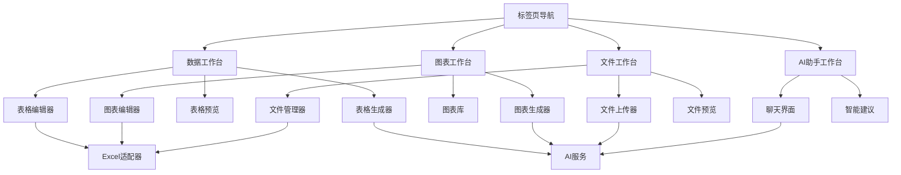

# 核心功能组件重构设计方案

## 概述

将现有的表格生成、图表生成、文件上传等核心功能组件重构为现代化、艺术化的组件架构，采用渐变科技感设计，支持多标签页工作区，为数据分析师提供卓越的工作体验。

---

## 1. 整体架构设计

### 1.1 新组件架构

```
CoreComponents/
├── DataWorkspace/           # 数据工作台
│   ├── TableGenerator/      # 表格生成器
│   ├── TableEditor/         # 表格编辑器
│   ├── TablePreview/        # 表格预览
│   └── TableHistory/        # 表格历史
├── ChartWorkspace/          # 图表工作台
│   ├── ChartGenerator/      # 图表生成器
│   ├── ChartEditor/         # 图表编辑器
│   ├── ChartGallery/        # 图表库
│   └── ChartTemplates/      # 图表模板
├── FileWorkspace/           # 文件工作台
│   ├── FileUploader/        # 文件上传器
│   ├── FileManager/         # 文件管理器
│   ├── FilePreview/         # 文件预览
│   └── FileProcessor/       # 文件处理器
└── AIWorkspace/             # AI助手工作台
    ├── ChatInterface/       # 聊天界面
    ├── SmartSuggestions/    # 智能建议
    └── WorkflowAssistant/   # 工作流助手
```

### 1.2 组件关系图



---

## 2. 数据工作台组件设计

### 2.1 表格生成器重构

#### 新架构设计
```typescript
// 新的表格生成器组件
interface TableGeneratorProps {
  workspaceId: string;
  onTableGenerated: (table: StyledTableData) => void;
  stylePreference: StylePreference;
  isCompact?: boolean;
}

const TableGenerator: React.FC<TableGeneratorProps> = ({
  workspaceId,
  onTableGenerated,
  stylePreference,
  isCompact = false
}) => {
  return (
    <div className="table-generator glass-panel">
      <GeneratorHeader />
      <PromptInputArea />
      <StyleSelector />
      <GenerationOptions />
      <ActionButtons />
    </div>
  );
};
```

#### 现代化UI设计
```css
.table-generator {
  background: linear-gradient(135deg, 
    rgba(255, 255, 255, 0.1) 0%, 
    rgba(255, 255, 255, 0.05) 100%);
  backdrop-filter: blur(20px);
  border: 1px solid rgba(255, 255, 255, 0.1);
  border-radius: 16px;
  padding: 24px;
  box-shadow: 0 8px 32px rgba(31, 38, 135, 0.37);
}

.generator-header {
  display: flex;
  align-items: center;
  justify-content: space-between;
  margin-bottom: 20px;
  padding-bottom: 16px;
  border-bottom: 1px solid rgba(255, 255, 255, 0.1);
}

.generator-title {
  font-size: 18px;
  font-weight: 600;
  background: linear-gradient(135deg, #4facfe 0%, #00f2fe 100%);
  -webkit-background-clip: text;
  -webkit-text-fill-color: transparent;
  background-clip: text;
}

.prompt-input {
  background: rgba(255, 255, 255, 0.05);
  border: 1px solid rgba(255, 255, 255, 0.1);
  border-radius: 12px;
  padding: 16px;
  color: white;
  font-size: 14px;
  resize: none;
  transition: all 0.3s ease;
}

.prompt-input:focus {
  outline: none;
  border-color: rgba(79, 172, 254, 0.5);
  box-shadow: 0 0 0 3px rgba(79, 172, 254, 0.1);
}

.prompt-input::placeholder {
  color: rgba(255, 255, 255, 0.5);
}
```

### 2.2 增强的样式选择器

#### 渐变科技感主题
```typescript
// 新的主题系统
interface TechTheme {
  id: string;
  name: string;
  gradient: string;
  accent: string;
  glassOpacity: number;
  animationSpeed: 'slow' | 'normal' | 'fast';
}

const TECH_THEMES: TechTheme[] = [
  {
    id: 'cyber-blue',
    name: '赛博蓝',
    gradient: 'linear-gradient(135deg, #667eea 0%, #764ba2 100%)',
    accent: '#4facfe',
    glassOpacity: 0.1,
    animationSpeed: 'normal'
  },
  {
    id: 'neon-purple',
    name: '霓虹紫',
    gradient: 'linear-gradient(135deg, #f093fb 0%, #f5576c 100%)',
    accent: '#a855f7',
    glassOpacity: 0.15,
    animationSpeed: 'fast'
  },
  {
    id: 'matrix-green',
    name: '矩阵绿',
    gradient: 'linear-gradient(135deg, #4facfe 0%, #00f2fe 100%)',
    accent: '#10b981',
    glassOpacity: 0.08,
    animationSpeed: 'slow'
  },
  {
    id: 'sunset-orange',
    name: '日落橙',
    gradient: 'linear-gradient(135deg, #fa709a 0%, #fee140 100%)',
    accent: '#f59e0b',
    glassOpacity: 0.12,
    animationSpeed: 'normal'
  }
];
```

#### 动态主题预览
```css
.theme-preview {
  position: relative;
  width: 80px;
  height: 60px;
  border-radius: 8px;
  overflow: hidden;
  cursor: pointer;
  transition: all 0.3s cubic-bezier(0.4, 0, 0.2, 1);
  border: 2px solid transparent;
}

.theme-preview:hover {
  transform: translateY(-2px);
  box-shadow: 0 8px 24px rgba(0, 0, 0, 0.3);
}

.theme-preview.selected {
  border-color: #4facfe;
  box-shadow: 0 0 0 3px rgba(79, 172, 254, 0.2);
}

.theme-preview::before {
  content: '';
  position: absolute;
  top: 0;
  left: 0;
  right: 0;
  bottom: 0;
  background: var(--theme-gradient);
  opacity: 0.8;
}

.theme-preview::after {
  content: '';
  position: absolute;
  top: 0;
  left: 0;
  right: 0;
  bottom: 0;
  background: rgba(255, 255, 255, 0.1);
  backdrop-filter: blur(10px);
}

.theme-name {
  position: absolute;
  bottom: 4px;
  left: 4px;
  right: 4px;
  font-size: 10px;
  font-weight: 500;
  color: white;
  text-shadow: 0 1px 2px rgba(0, 0, 0, 0.5);
  z-index: 1;
}
```

### 2.3 智能表格编辑器

#### 实时编辑功能
```typescript
interface TableEditorProps {
  tableData: StyledTableData;
  onTableChange: (table: StyledTableData) => void;
  onSave: () => void;
  readOnly?: boolean;
}

const TableEditor: React.FC<TableEditorProps> = ({
  tableData,
  onTableChange,
  onSave,
  readOnly = false
}) => {
  return (
    <div className="table-editor glass-panel">
      <EditorToolbar />
      <EditableTable 
        data={tableData}
        onChange={onTableChange}
        readOnly={readOnly}
      />
      <EditorStatusBar />
    </div>
  );
};

// 可编辑表格组件
const EditableTable: React.FC<{
  data: StyledTableData;
  onChange: (data: StyledTableData) => void;
  readOnly: boolean;
}> = ({ data, onChange, readOnly }) => {
  return (
    <div className="editable-table">
      <table className="data-table">
        <thead>
          <tr>
            {data.columns.map((column, index) => (
              <th key={index}>
                <EditableCell
                  value={column.name}
                  onChange={(value) => updateColumnName(index, value)}
                  readOnly={readOnly}
                />
              </th>
            ))}
          </tr>
        </thead>
        <tbody>
          {data.rows.map((row, rowIndex) => (
            <tr key={rowIndex}>
              {data.columns.map((column, colIndex) => (
                <td key={colIndex}>
                  <EditableCell
                    value={row[column.name]}
                    onChange={(value) => updateCell(rowIndex, colIndex, value)}
                    readOnly={readOnly}
                    type={column.type}
                  />
                </td>
              ))}
            </tr>
          ))}
        </tbody>
      </table>
    </div>
  );
};
```

---

## 3. 图表工作台组件设计

### 3.1 智能图表生成器

#### AI驱动的图表生成
```typescript
interface ChartGeneratorProps {
  tableData?: ReadTableData;
  onChartGenerated: (chart: ChartConfig) => void;
  stylePreference: ChartStylePreference;
}

const ChartGenerator: React.FC<ChartGeneratorProps> = ({
  tableData,
  onChartGenerated,
  stylePreference
}) => {
  return (
    <div className="chart-generator glass-panel">
      <GeneratorHeader 
        title="智能图表生成"
        icon="📊"
      />
      
      <ChartTypeSelector 
        tableData={tableData}
        onTypeSelect={handleChartTypeSelect}
      />
      
      <PromptInputArea 
        placeholder="描述您想要的图表，例如：创建一个显示销售趋势的折线图"
        onSubmit={handleGenerateChart}
      />
      
      <StyleCustomization 
        stylePreference={stylePreference}
        onChange={handleStyleChange}
      />
      
      <GenerationActions 
        onGenerate={handleGenerateChart}
        onPreview={handlePreviewChart}
      />
    </div>
  );
};
```

#### 图表类型智能推荐
```typescript
// 智能图表推荐系统
class ChartRecommendationEngine {
  static recommendCharts(tableData: ReadTableData): ChartRecommendation[] {
    const recommendations: ChartRecommendation[] = [];
    
    // 分析数据结构
    const analysis = this.analyzeDataStructure(tableData);
    
    // 基于数据特征推荐图表
    if (analysis.hasTimeSeries) {
      recommendations.push({
        type: 'line',
        confidence: 0.9,
        reason: '检测到时间序列数据，适合趋势分析',
        preview: this.generatePreview('line', tableData)
      });
    }
    
    if (analysis.hasCategories && analysis.numericColumns.length === 1) {
      recommendations.push({
        type: 'pie',
        confidence: 0.8,
        reason: '单一数值列，适合占比展示',
        preview: this.generatePreview('pie', tableData)
      });
    }
    
    if (analysis.hasMultipleNumericColumns) {
      recommendations.push({
        type: 'scatter',
        confidence: 0.7,
        reason: '多个数值列，适合相关性分析',
        preview: this.generatePreview('scatter', tableData)
      });
    }
    
    return recommendations.sort((a, b) => b.confidence - a.confidence);
  }
  
  private static analyzeDataStructure(tableData: ReadTableData) {
    const columns = tableData.columns;
    const numericColumns = columns.filter(c => 
      ['number', 'currency', 'percentage'].includes(c.type)
    );
    const dateColumns = columns.filter(c => c.type === 'date');
    const textColumns = columns.filter(c => c.type === 'text');
    
    return {
      numericColumns,
      dateColumns,
      textColumns,
      hasTimeSeries: dateColumns.length > 0 && numericColumns.length > 0,
      hasCategories: textColumns.length > 0,
      hasMultipleNumericColumns: numericColumns.length > 1
    };
  }
}
```

### 3.2 交互式图表编辑器

#### 拖拽式编辑
```typescript
const ChartEditor: React.FC<{
  chartConfig: ChartConfig;
  tableData: ReadTableData;
  onChartChange: (config: ChartConfig) => void;
}> = ({ chartConfig, tableData, onChartChange }) => {
  return (
    <div className="chart-editor">
      <EditorSidebar>
        <ChartPropertiesPanel 
          config={chartConfig}
          onChange={onChartChange}
        />
        <DataMappingPanel 
          tableData={tableData}
          config={chartConfig}
          onChange={onChartChange}
        />
        <StylePanel 
          config={chartConfig}
          onChange={onChartChange}
        />
      </EditorSidebar>
      
      <EditorCanvas>
        <ChartPreview 
          config={chartConfig}
          tableData={tableData}
          interactive={true}
        />
      </EditorCanvas>
    </div>
  );
};
```

#### 实时预览系统
```css
.chart-editor {
  display: flex;
  height: 100%;
  background: linear-gradient(135deg, 
    rgba(15, 23, 42, 0.8) 0%, 
    rgba(30, 41, 59, 0.6) 100%);
  backdrop-filter: blur(20px);
}

.editor-sidebar {
  width: 300px;
  background: rgba(255, 255, 255, 0.05);
  backdrop-filter: blur(20px);
  border-right: 1px solid rgba(255, 255, 255, 0.1);
  overflow-y: auto;
}

.editor-canvas {
  flex: 1;
  display: flex;
  align-items: center;
  justify-content: center;
  padding: 20px;
}

.chart-preview {
  background: rgba(255, 255, 255, 0.95);
  border-radius: 12px;
  padding: 20px;
  box-shadow: 0 20px 40px rgba(0, 0, 0, 0.3);
  max-width: 100%;
  max-height: 100%;
}
```

---

## 4. 文件工作台组件设计

### 4.1 智能文件上传器

#### 拖拽上传增强
```typescript
interface FileUploaderProps {
  onFilesUploaded: (files: UploadedFile[]) => void;
  acceptedTypes: string[];
  maxFileSize: number;
  maxFiles: number;
}

const FileUploader: React.FC<FileUploaderProps> = ({
  onFilesUploaded,
  acceptedTypes,
  maxFileSize,
  maxFiles
}) => {
  return (
    <div className="file-uploader">
      <DropZone 
        onDrop={handleFileDrop}
        onBrowse={handleFileBrowse}
        acceptedTypes={acceptedTypes}
        maxFileSize={maxFileSize}
      />
      
      <UploadProgress />
      
      <FilePreviewGrid />
    </div>
  );
};

// 增强的拖拽区域
const DropZone: React.FC<{
  onDrop: (files: File[]) => void;
  onBrowse: () => void;
  acceptedTypes: string[];
  maxFileSize: number;
}> = ({ onDrop, onBrowse, acceptedTypes, maxFileSize }) => {
  return (
    <div 
      className="drop-zone glass-panel"
      onDragOver={handleDragOver}
      onDrop={handleDrop}
      onClick={onBrowse}
    >
      <div className="drop-zone-content">
        <div className="upload-icon">📁</div>
        <h3>拖拽文件到此处</h3>
        <p>或点击选择文件</p>
        <div className="upload-specs">
          <span>支持: {acceptedTypes.join(', ')}</span>
          <span>最大: {formatFileSize(maxFileSize)}</span>
        </div>
      </div>
      
      <input
        type="file"
        multiple
        accept={acceptedTypes.join(',')}
        onChange={handleFileSelect}
        className="hidden"
      />
    </div>
  );
};
```

#### 文件处理流水线
```typescript
// 文件处理流水线
class FileProcessingPipeline {
  async processFiles(files: File[]): Promise<ProcessedFile[]> {
    const processedFiles: ProcessedFile[] = [];
    
    for (const file of files) {
      try {
        // 1. 文件验证
        const validation = await this.validateFile(file);
        if (!validation.isValid) {
          throw new Error(validation.error);
        }
        
        // 2. 文件解析
        const parsedData = await this.parseFile(file);
        
        // 3. 数据清洗
        const cleanedData = await this.cleanData(parsedData);
        
        // 4. 智能分析
        const analysis = await this.analyzeData(cleanedData);
        
        processedFiles.push({
          originalFile: file,
          parsedData: cleanedData,
          analysis,
          status: 'success'
        });
        
      } catch (error) {
        processedFiles.push({
          originalFile: file,
          error: error instanceof Error ? error.message : '处理失败',
          status: 'error'
        });
      }
    }
    
    return processedFiles;
  }
  
  private async analyzeData(data: any): Promise<DataAnalysis> {
    // 智能数据分析
    return {
      rowCount: data.rows?.length || 0,
      columnCount: data.columns?.length || 0,
      dataTypes: this.detectDataTypes(data),
      quality: this.assessDataQuality(data),
      suggestions: this.generateSuggestions(data)
    };
  }
}
```

### 4.2 文件预览系统

#### 多格式预览
```typescript
const FilePreview: React.FC<{
  file: ProcessedFile;
  onClose: () => void;
}> = ({ file, onClose }) => {
  const previewType = getPreviewType(file.originalFile);
  
  return (
    <div className="file-preview glass-panel">
      <PreviewHeader 
        file={file}
        onClose={onClose}
      />
      
      <PreviewContent type={previewType}>
        {previewType === 'table' && <TablePreview data={file.parsedData} />}
        {previewType === 'chart' && <ChartPreview data={file.parsedData} />}
        {previewType === 'image' && <ImagePreview file={file.originalFile} />}
        {previewType === 'text' && <TextPreview file={file.originalFile} />}
      </PreviewContent>
      
      <PreviewActions file={file} />
    </div>
  );
};
```

---

## 5. AI助手工作台设计

### 5.1 智能对话界面

#### 现代化聊天界面
```typescript
const AIWorkspace: React.FC = () => {
  return (
    <div className="ai-workspace">
      <ChatInterface />
      <SmartSuggestions />
      <WorkflowAssistant />
    </div>
  );
};

const ChatInterface: React.FC = () => {
  return (
    <div className="chat-interface glass-panel">
      <ChatHeader />
      <MessageList />
      <InputArea />
      <QuickActions />
    </div>
  );
};
```

#### 智能建议系统
```typescript
const SmartSuggestions: React.FC = () => {
  const [suggestions, setSuggestions] = useState<SmartSuggestion[]>([]);
  
  useEffect(() => {
    // 基于当前工作区状态生成智能建议
    const generateSuggestions = async () => {
      const currentContext = getCurrentWorkspaceContext();
      const aiSuggestions = await aiService.getSuggestions(currentContext);
      setSuggestions(aiSuggestions);
    };
    
    generateSuggestions();
  }, [workspaceState]);
  
  return (
    <div className="smart-suggestions glass-panel">
      <SuggestionsHeader />
      <SuggestionsList suggestions={suggestions} />
    </div>
  );
};
```

---

## 6. 统一状态管理

### 6.1 工作区状态管理

```typescript
// 工作区状态接口
interface WorkspaceState {
  // 当前活动工作区
  activeWorkspace: string | null;
  
  // 数据工作区
  dataWorkspace: {
    currentTable: StyledTableData | null;
    tableHistory: StyledTableData[];
    isGenerating: boolean;
    generationProgress: number;
  };
  
  // 图表工作区
  chartWorkspace: {
    currentChart: ChartConfig | null;
    chartLibrary: ChartConfig[];
    isGenerating: boolean;
  };
  
  // 文件工作区
  fileWorkspace: {
    uploadedFiles: ProcessedFile[];
    processingQueue: File[];
    selectedFile: ProcessedFile | null;
  };
  
  // AI助手
  aiWorkspace: {
    conversationHistory: Message[];
    suggestions: SmartSuggestion[];
    isTyping: boolean;
  };
}

// 工作区动作
interface WorkspaceActions {
  // 数据工作区
  setCurrentTable: (table: StyledTableData) => void;
  addToTableHistory: (table: StyledTableData) => void;
  clearTableHistory: () => void;
  
  // 图表工作区
  setCurrentChart: (chart: ChartConfig) => void;
  addToChartLibrary: (chart: ChartConfig) => void;
  
  // 文件工作区
  addUploadedFiles: (files: ProcessedFile[]) => void;
  removeUploadedFile: (fileId: string) => void;
  setSelectedFile: (file: ProcessedFile | null) => void;
  
  // AI助手
  addMessage: (message: Message) => void;
  setTyping: (typing: boolean) => void;
  clearConversation: () => void;
}
```

### 6.2 跨工作区数据共享

```typescript
// 数据共享服务
class WorkspaceDataService {
  private static instance: WorkspaceDataService;
  private subscribers: Map<string, Set<DataSubscriber>> = new Map();
  
  static getInstance(): WorkspaceDataService {
    if (!WorkspaceDataService.instance) {
      WorkspaceDataService.instance = new WorkspaceDataService();
    }
    return WorkspaceDataService.instance;
  }
  
  // 发布数据变更
  publishData(workspaceId: string, dataType: string, data: any): void {
    const key = `${workspaceId}:${dataType}`;
    const subscribers = this.subscribers.get(key);
    
    if (subscribers) {
      subscribers.forEach(subscriber => {
        subscriber.onDataChange(data);
      });
    }
  }
  
  // 订阅数据变更
  subscribeData(
    workspaceId: string, 
    dataType: string, 
    subscriber: DataSubscriber
  ): () => void {
    const key = `${workspaceId}:${dataType}`;
    
    if (!this.subscribers.has(key)) {
      this.subscribers.set(key, new Set());
    }
    
    this.subscribers.get(key)!.add(subscriber);
    
    // 返回取消订阅函数
    return () => {
      this.subscribers.get(key)!.delete(subscriber);
    };
  }
}
```

---

## 7. 性能优化策略

### 7.1 组件懒加载

```typescript
// 懒加载工作区组件
const DataWorkspace = lazy(() => import('./DataWorkspace'));
const ChartWorkspace = lazy(() => import('./ChartWorkspace'));
const FileWorkspace = lazy(() => import('./FileWorkspace'));
const AIWorkspace = lazy(() => import('./AIWorkspace'));

// 主工作区容器
const WorkspaceContainer: React.FC = () => {
  const [activeWorkspace, setActiveWorkspace] = useState<string>('data');
  
  return (
    <div className="workspace-container">
      <Suspense fallback={<WorkspaceLoadingSkeleton />}>
        {activeWorkspace === 'data' && <DataWorkspace />}
        {activeWorkspace === 'chart' && <ChartWorkspace />}
        {activeWorkspace === 'file' && <FileWorkspace />}
        {activeWorkspace === 'ai' && <AIWorkspace />}
      </Suspense>
    </div>
  );
};
```

### 7.2 虚拟化长列表

```typescript
// 虚拟化文件列表
const VirtualizedFileList: React.FC<{
  files: ProcessedFile[];
  itemHeight: number;
}> = ({ files, itemHeight }) => {
  const [visibleRange, setVisibleRange] = useState({ start: 0, end: 0 });
  
  return (
    <div className="virtualized-list" style={{ height: '400px', overflow: 'auto' }}>
      <div style={{ height: files.length * itemHeight, position: 'relative' }}>
        {files.slice(visibleRange.start, visibleRange.end).map((file, index) => (
          <div
            key={file.id}
            style={{
              position: 'absolute',
              top: (visibleRange.start + index) * itemHeight,
              height: itemHeight,
              width: '100%'
            }}
          >
            <FileItem file={file} />
          </div>
        ))}
      </div>
    </div>
  );
};
```

---

## 8. 实现计划

### 8.1 开发阶段

#### 阶段一：基础组件重构 (2周)
- [ ] 重构表格生成器组件
- [ ] 实现新的样式选择器
- [ ] 创建数据工作台容器
- [ ] 建立基础状态管理

#### 阶段二：图表工作台 (1.5周)
- [ ] 重构图表生成器
- [ ] 实现智能图表推荐
- [ ] 创建图表编辑器
- [ ] 添加图表库功能

#### 阶段三：文件工作台 (1周)
- [ ] 增强文件上传器
- [ ] 实现文件处理流水线
- [ ] 创建文件预览系统
- [ ] 添加文件管理功能

#### 阶段四：AI助手集成 (1周)
- [ ] 重构聊天界面
- [ ] 实现智能建议系统
- [ ] 添加工作流助手
- [ ] 集成跨工作区数据共享

#### 阶段五：性能优化 (0.5周)
- [ ] 实现组件懒加载
- [ ] 添加虚拟化列表
- [ ] 优化渲染性能
- [ ] 完善错误处理

### 8.2 技术要点

#### 核心技术栈
- **React 18** - 并发特性、Suspense
- **TypeScript** - 完整类型安全
- **Zustand** - 轻量级状态管理
- **Framer Motion** - 流畅动画效果
- **React Query** - 数据获取和缓存
- **React Table** - 表格组件库

#### 关键设计模式
- **Compound Components** - 复杂UI组件
- **Render Props** - 灵活的数据共享
- **Custom Hooks** - 逻辑复用
- **Provider Pattern** - 全局状态
- **Observer Pattern** - 数据订阅

---

## 9. 成功指标

### 9.1 用户体验指标
- **操作效率** - 减少50%的操作步骤
- **学习成本** - 新用户10分钟内上手
- **错误率** - 降低70%的操作错误
- **满意度** - 达到95%的用户满意度

### 9.2 技术性能指标
- **首屏加载** - < 1.5秒
- **组件切换** - < 200ms
- **大文件处理** - 支持100MB+文件
- **内存使用** - 控制在合理范围

这个重构方案将为数据分析师提供一个现代化、高性能、功能强大的工作环境，显著提升工作效率和用户体验。