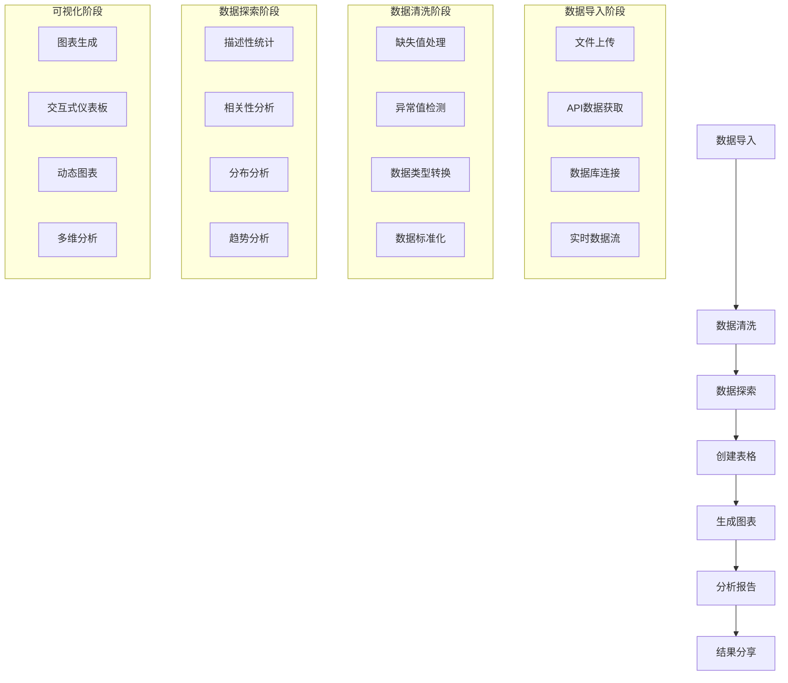

# 数据分析师工作流程交互体验优化方案

## 概述

针对数据分析师的典型工作流程，设计智能化的交互体验优化方案，通过AI辅助、智能建议、快捷操作和自动化流程，显著提升数据分析工作的效率和用户体验。

---

## 1. 数据分析师工作流程分析

### 1.1 典型工作流程



### 1.2 痛点分析

#### 当前存在的问题
- **流程割裂** - 各阶段之间缺乏连贯性，需要手动切换
- **重复操作** - 相似的数据处理步骤需要重复执行
- **上下文丢失** - 在不同工具间切换时丢失分析上下文
- **效率低下** - 大量时间花费在手动操作上
- **协作困难** - 缺乏实时协作和分享机制

#### 用户需求
- **智能化** - AI辅助完成重复性任务
- **自动化** - 自动化常见的数据处理流程
- **协作化** - 支持团队协作和知识共享
- **可视化** - 直观的工作流程展示
- **个性化** - 根据用户习惯定制工作流程

---

## 2. 智能工作流引导系统

### 2.1 工作流模板引擎

```typescript
// 工作流模板接口
interface WorkflowTemplate {
  id: string;
  name: string;
  description: string;
  category: WorkflowCategory;
  steps: WorkflowStep[];
  estimatedTime: number;
  difficulty: 'beginner' | 'intermediate' | 'advanced';
  tags: string[];
  prerequisites?: string[];
}

// 工作流步骤接口
interface WorkflowStep {
  id: string;
  title: string;
  description: string;
  type: StepType;
  component: string;
  config: Record<string, any>;
  dependencies?: string[];
  optional: boolean;
  estimatedTime: number;
}

// 工作流类别
enum WorkflowCategory {
  DATA_IMPORT = 'data-import',
  DATA_CLEANING = 'data-cleaning',
  EXPLORATORY_ANALYSIS = 'exploratory-analysis',
  REPORTING = 'reporting',
  VISUALIZATION = 'visualization',
  CUSTOM = 'custom'
}
```

#### 预设工作流模板

```typescript
// 销售数据分析工作流
const SALES_ANALYSIS_WORKFLOW: WorkflowTemplate = {
  id: 'sales-analysis',
  name: '销售数据分析',
  description: '完整的销售数据从导入到报告生成的工作流',
  category: WorkflowCategory.REPORTING,
  steps: [
    {
      id: 'import-sales-data',
      title: '导入销售数据',
      description: '上传或连接销售数据源',
      type: StepType.DATA_IMPORT,
      component: 'FileUploader',
      config: {
        acceptedTypes: ['.csv', '.xlsx', '.json'],
        maxFileSize: 100 * 1024 * 1024, // 100MB
        autoDetectFormat: true
      },
      estimatedTime: 5
    },
    {
      id: 'clean-sales-data',
      title: '清洗销售数据',
      description: '处理缺失值、异常值和数据类型',
      type: StepType.DATA_CLEANING,
      component: 'DataCleaner',
      config: {
        autoDetectIssues: true,
        suggestFixes: true,
        previewChanges: true
      },
      dependencies: ['import-sales-data'],
      estimatedTime: 10
    },
    {
      id: 'explore-sales-data',
      title: '探索销售数据',
      description: '生成描述性统计和趋势分析',
      type: StepType.EXPLORATORY_ANALYSIS,
      component: 'DataExplorer',
      config: {
        generateSummary: true,
        createVisualizations: true,
        detectPatterns: true
      },
      dependencies: ['clean-sales-data'],
      estimatedTime: 15
    },
    {
      id: 'create-sales-dashboard',
      title: '创建销售仪表板',
      description: '生成交互式销售数据仪表板',
      type: StepType.VISUALIZATION,
      component: 'DashboardCreator',
      config: {
        chartTypes: ['line', 'bar', 'pie', 'heatmap'],
        autoLayout: true,
        interactiveFilters: true
      },
      dependencies: ['explore-sales-data'],
      estimatedTime: 20
    },
    {
      id: 'generate-sales-report',
      title: '生成销售报告',
      description: '创建包含图表和分析的完整报告',
      type: StepType.REPORTING,
      component: 'ReportGenerator',
      config: {
        includeExecutiveSummary: true,
        addRecommendations: true,
        exportFormats: ['pdf', 'excel', 'powerpoint']
      },
      dependencies: ['create-sales-dashboard'],
      estimatedTime: 15
    }
  ],
  estimatedTime: 65, // 总预计时间（分钟）
  difficulty: 'intermediate',
  tags: ['销售', '数据分析', '报告'],
  prerequisites: ['basic-excel']
};
```

### 2.2 智能步骤推荐

```typescript
// 智能推荐引擎
class WorkflowRecommendationEngine {
  // 基于历史数据推荐工作流
  recommendWorkflows(userProfile: UserProfile, currentContext: WorkflowContext): WorkflowTemplate[] {
    const recommendations: WorkflowRecommendation[] = [];
    
    // 基于用户历史推荐
    const historicalRecommendations = this.getHistoricalRecommendations(userProfile);
    recommendations.push(...historicalRecommendations);
    
    // 基于当前数据推荐
    const dataBasedRecommendations = this.getDataBasedRecommendations(currentContext);
    recommendations.push(...dataBasedRecommendations);
    
    // 基于行业最佳实践推荐
    const industryRecommendations = this.getIndustryRecommendations(userProfile.industry);
    recommendations.push(...industryRecommendations);
    
    // 排序和去重
    return this.rankAndDeduplicate(recommendations);
  }
  
  // 智能步骤补全
  suggestNextSteps(currentWorkflow: WorkflowExecution, completedSteps: string[]): WorkflowStep[] {
    const remainingSteps = currentWorkflow.template.steps.filter(
      step => !completedSteps.includes(step.id)
    );
    
    // 基于依赖关系过滤
    const availableSteps = remainingSteps.filter(step => {
      if (!step.dependencies) return true;
      return step.dependencies.every(dep => completedSteps.includes(dep));
    });
    
    // 智能排序
    return this.intelligentStepOrdering(availableSteps, currentWorkflow.context);
  }
  
  // 步骤参数智能填充
  autoFillStepParameters(step: WorkflowStep, context: WorkflowContext): Record<string, any> {
    const autoFillConfig: Record<string, any> = {};
    
    switch (step.component) {
      case 'DataCleaner':
        autoFillConfig = {
          missingValueStrategy: context.dataProfile.missingValuePattern,
          outlierThreshold: context.dataProfile.outlierThreshold,
          dataTypes: context.dataProfile.columnTypes
        };
        break;
        
      case 'ChartGenerator':
        autoFillConfig = {
          recommendedChartTypes: this.recommendChartTypes(context.dataProfile),
          colorScheme: context.userPreferences.colorScheme,
          chartSize: context.viewportDimensions
        };
        break;
        
      case 'ReportGenerator':
        autoFillConfig = {
          reportTemplate: context.userPreferences.reportTemplate,
          includeCharts: true,
          chartQuality: 'high'
        };
        break;
    }
    
    return autoFillConfig;
  }
}
```

---

## 3. 快捷操作和批量处理

### 3.1 智能快捷键系统

```typescript
// 快捷键配置
interface KeyboardShortcut {
  key: string;
  modifiers: ('ctrl' | 'alt' | 'shift' | 'meta')[];
  action: string;
  description: string;
  context?: string[];
  icon?: string;
}

// 数据分析师专用快捷键
const DATA_ANALYST_SHORTCUTS: KeyboardShortcut[] = [
  // 文件操作
  {
    key: 'o',
    modifiers: ['ctrl'],
    action: 'open-file',
    description: '打开数据文件',
    context: ['workspace'],
    icon: '📁'
  },
  {
    key: 's',
    modifiers: ['ctrl'],
    action: 'save-workspace',
    description: '保存工作区',
    context: ['workspace'],
    icon: '💾'
  },
  
  // 数据操作
  {
    key: 'd',
    modifiers: ['ctrl', 'shift'],
    action: 'detect-data-types',
    description: '智能检测数据类型',
    context: ['data-selected'],
    icon: '🔍'
  },
  {
    key: 'c',
    modifiers: ['ctrl', 'shift'],
    action: 'clean-data',
    description: '一键数据清洗',
    context: ['data-selected'],
    icon: '🧹'
  },
  {
    key: 'e',
    modifiers: ['ctrl', 'shift'],
    action: 'explore-data',
    description: '探索性数据分析',
    context: ['data-selected'],
    icon: '📊'
  },
  
  // 图表操作
  {
    key: 'g',
    modifiers: ['ctrl', 'shift'],
    action: 'generate-chart',
    description: '智能生成图表',
    context: ['data-selected'],
    icon: '📈'
  },
  {
    key: 't',
    modifiers: ['ctrl', 'shift'],
    action: 'create-table',
    description: '创建数据表格',
    context: ['data-selected'],
    icon: '📋'
  },
  
  // 工作流操作
  {
    key: 'w',
    modifiers: ['ctrl', 'shift'],
    action: 'start-workflow',
    description: '启动工作流模板',
    context: ['workspace'],
    icon: '⚡'
  },
  {
    key: 'r',
    modifiers: ['ctrl', 'shift'],
    action: 'run-automation',
    description: '运行自动化脚本',
    context: ['workspace'],
    icon: '🤖'
  },
  
  // 协作操作
  {
    key: 'sh',
    modifiers: ['ctrl', 'shift'],
    action: 'share-workspace',
    description: '分享工作区',
    context: ['workspace'],
    icon: '🔗'
  },
  {
    key: 'co',
    modifiers: ['ctrl', 'shift'],
    action: 'start-collaboration',
    description: '开始协作',
    context: ['workspace'],
    icon: '👥'
  }
];

// 快捷键管理器
class ShortcutManager {
  private shortcuts: Map<string, KeyboardShortcut> = new Map();
  private contextStack: string[] = [];
  
  constructor() {
    this.loadShortcuts();
    this.setupEventListeners();
  }
  
  // 执行快捷键
  executeShortcut(key: string, modifiers: string[]): boolean {
    const shortcut = this.findShortcut(key, modifiers);
    if (!shortcut) return false;
    
    // 检查上下文
    if (!this.isContextValid(shortcut.context)) return false;
    
    // 执行动作
    this.executeAction(shortcut.action);
    return true;
  }
  
  // 动态快捷键提示
  getContextualShortcuts(): KeyboardShortcut[] {
    return Array.from(this.shortcuts.values())
      .filter(shortcut => this.isContextValid(shortcut.context))
      .sort((a, b) => a.description.localeCompare(b.description));
  }
}
```

### 3.2 批量操作工具

```typescript
// 批量操作接口
interface BatchOperation {
  id: string;
  name: string;
  description: string;
  targetType: 'files' | 'tables' | 'charts' | 'all';
  operation: BatchOperationType;
  parameters: Record<string, any>;
  preview: boolean;
}

// 批量操作类型
enum BatchOperationType {
  APPLY_STYLE = 'apply-style',
  EXPORT_DATA = 'export-data',
  GENERATE_CHARTS = 'generate-charts',
  CLEAN_DATA = 'clean-data',
  CREATE_REPORTS = 'create-reports',
  SHARE_ITEMS = 'share-items'
}

// 批量操作管理器
class BatchOperationManager {
  // 批量应用样式
  async applyStyleToTables(tables: StyledTableData[], styleConfig: StyleConfig): Promise<BatchResult> {
    const results: OperationResult[] = [];
    
    for (const table of tables) {
      try {
        const styledTable = await this.applyTableStyle(table, styleConfig);
        results.push({
          success: true,
          itemId: table.id,
          result: styledTable
        });
      } catch (error) {
        results.push({
          success: false,
          itemId: table.id,
          error: error instanceof Error ? error.message : 'Unknown error'
        });
      }
    }
    
    return {
      total: tables.length,
      successful: results.filter(r => r.success).length,
      failed: results.filter(r => !r.success).length,
      results
    };
  }
  
  // 批量生成图表
  async generateChartsForTables(tables: ReadTableData[], chartConfig: ChartConfig): Promise<BatchResult> {
    const results: OperationResult[] = [];
    
    // 并行处理以提高效率
    const chartPromises = tables.map(async (table, index) => {
      try {
        // 为每个表格调整图表配置
        const adjustedConfig = this.adjustChartConfigForTable(chartConfig, table);
        const chart = await this.generateChart(table, adjustedConfig);
        
        return {
          success: true,
          itemId: table.id,
          result: chart,
          metadata: { tableName: table.tableName, index }
        };
      } catch (error) {
        return {
          success: false,
          itemId: table.id,
          error: error instanceof Error ? error.message : 'Chart generation failed',
          metadata: { tableName: table.tableName, index }
        };
      }
    });
    
    const chartResults = await Promise.allSettled(chartPromises);
    
    chartResults.forEach((result, index) => {
      if (result.status === 'fulfilled') {
        results.push(result.value);
      } else {
        results.push({
          success: false,
          itemId: tables[index].id,
          error: result.reason?.message || 'Promise rejected'
        });
      }
    });
    
    return {
      total: tables.length,
      successful: results.filter(r => r.success).length,
      failed: results.filter(r => !r.success).length,
      results
    };
  }
  
  // 批量导出
  async batchExport(items: ExportableItem[], exportConfig: ExportConfig): Promise<BatchResult> {
    const results: OperationResult[] = [];
    
    // 按类型分组
    const groupedItems = this.groupItemsByType(items);
    
    for (const [type, typeItems] of Object.entries(groupedItems)) {
      const exportResults = await this.exportItemsOfType(type, typeItems, exportConfig);
      results.push(...exportResults);
    }
    
    return {
      total: items.length,
      successful: results.filter(r => r.success).length,
      failed: results.filter(r => !r.success).length,
      results
    };
  }
}
```

---

## 4. 上下文相关工具和建议

### 4.1 智能工具栏

```typescript
// 上下文工具接口
interface ContextualTool {
  id: string;
  name: string;
  icon: string;
  action: string;
  description: string;
  contexts: string[];
  priority: number;
  enabled: boolean;
  shortcut?: string;
}

// 智能工具栏组件
const SmartToolbar: React.FC = () => {
  const [contextualTools, setContextualTools] = useState<ContextualTool[]>([]);
  const [currentContext, setCurrentContext] = useState<string[]>([]);
  
  useEffect(() => {
    // 监听上下文变化
    const unsubscribe = subscribeToContextChanges((newContext) => {
      setCurrentContext(newContext);
      updateContextualTools(newContext);
    });
    
    return unsubscribe;
  }, []);
  
  const updateContextTools = (context: string[]) => {
    const tools = getContextualTools(context);
    setContextualTools(tools.sort((a, b) => b.priority - a.priority));
  };
  
  return (
    <div className="smart-toolbar glass-panel">
      <ToolbarSection title="常用工具">
        {contextualTools.slice(0, 4).map(tool => (
          <ToolbarButton
            key={tool.id}
            tool={tool}
            onClick={() => executeToolAction(tool.action)}
          />
        ))}
      </ToolbarSection>
      
      <ToolbarSection title="智能建议">
        {contextualTools.slice(4, 8).map(tool => (
          <ToolbarButton
            key={tool.id}
            tool={tool}
            variant="suggestion"
            onClick={() => executeToolAction(tool.action)}
          />
        ))}
      </ToolbarSection>
      
      <ToolbarSection title="高级工具">
        <MoreToolsButton onClick={() => showAdvancedTools()} />
      </ToolbarSection>
    </div>
  );
};

// 上下文检测器
class ContextDetector {
  // 检测当前工作区上下文
  detectCurrentContext(workspaceState: WorkspaceState): string[] {
    const contexts: string[] = [];
    
    // 数据上下文
    if (workspaceState.dataWorkspace.currentTable) {
      contexts.push('data-selected');
      contexts.push('table-active');
      
      const table = workspaceState.dataWorkspace.currentTable;
      if (table.rows.length > 1000) {
        contexts.push('large-dataset');
      }
      if (this.hasMissingValues(table)) {
        contexts.push('data-quality-issues');
      }
    }
    
    // 图表上下文
    if (workspaceState.chartWorkspace.currentChart) {
      contexts.push('chart-active');
      contexts.push('visualization-selected');
    }
    
    // 文件上下文
    if (workspaceState.fileWorkspace.uploadedFiles.length > 0) {
      contexts.push('files-available');
      if (workspaceState.fileWorkspace.uploadedFiles.length > 5) {
        contexts.push('multiple-files');
      }
    }
    
    // AI上下文
    if (workspaceState.aiWorkspace.conversationHistory.length > 0) {
      contexts.push('ai-assistant-active');
    }
    
    // 用户偏好上下文
    if (workspaceState.userPreferences.expertMode) {
      contexts.push('expert-mode');
    }
    
    return contexts;
  }
  
  // 获取上下文相关的工具
  getContextualTools(contexts: string[]): ContextualTool[] {
    const allTools = this.getAllAvailableTools();
    
    return allTools.filter(tool => 
      tool.contexts.some(toolContext => contexts.includes(toolContext))
    );
  }
}
```

### 4.2 智能建议系统

```typescript
// 智能建议接口
interface SmartSuggestion {
  id: string;
  type: SuggestionType;
  title: string;
  description: string;
  action: string;
  priority: number;
  confidence: number;
  context: string[];
  metadata?: Record<string, any>;
}

// 建议类型
enum SuggestionType {
  WORKFLOW = 'workflow',
  OPTIMIZATION = 'optimization',
  VISUALIZATION = 'visualization',
  CLEANING = 'cleaning',
  ANALYSIS = 'analysis',
  COLLABORATION = 'collaboration'
}

// 智能建议引擎
class SmartSuggestionEngine {
  // 生成智能建议
  generateSuggestions(context: WorkflowContext): SmartSuggestion[] {
    const suggestions: SmartSuggestion[] = [];
    
    // 基于数据质量的建议
    const dataQualitySuggestions = this.analyzeDataQuality(context);
    suggestions.push(...dataQualitySuggestions);
    
    // 基于工作流程的建议
    const workflowSuggestions = this.analyzeWorkflow(context);
    suggestions.push(...workflowSuggestions);
    
    // 基于可视化的建议
    const visualizationSuggestions = this.analyzeVisualizationNeeds(context);
    suggestions.push(...visualizationSuggestions);
    
    // 基于协作的建议
    const collaborationSuggestions = this.analyzeCollaborationNeeds(context);
    suggestions.push(...collaborationSuggestions);
    
    // 排序和过滤
    return this.rankAndFilterSuggestions(suggestions);
  }
  
  // 数据质量分析
  private analyzeDataQuality(context: WorkflowContext): SmartSuggestion[] {
    const suggestions: SmartSuggestion[] = [];
    
    if (context.dataProfile.missingValueRate > 0.1) {
      suggestions.push({
        id: 'handle-missing-values',
        type: SuggestionType.CLEANING,
        title: '处理缺失值',
        description: `检测到 ${(context.dataProfile.missingValueRate * 100).toFixed(1)}% 的缺失值，建议进行清洗`,
        action: 'clean-missing-values',
        priority: 9,
        confidence: 0.95,
        context: ['data-selected'],
        metadata: {
          missingValueRate: context.dataProfile.missingValueRate,
          affectedColumns: context.dataProfile.columnsWithMissingValues
        }
      });
    }
    
    if (context.dataProfile.outlierCount > 0) {
      suggestions.push({
        id: 'detect-outliers',
        type: SuggestionType.CLEANING,
        title: '检测异常值',
        description: `检测到 ${context.dataProfile.outlierCount} 个潜在异常值，建议进一步分析`,
        action: 'detect-outliers',
        priority: 8,
        confidence: 0.85,
        context: ['data-selected'],
        metadata: {
          outlierCount: context.dataProfile.outlierCount,
          outlierColumns: context.dataProfile.columnsWithOutliers
        }
      });
    }
    
    return suggestions;
  }
  
  // 工作流程分析
  private analyzeWorkflow(context: WorkflowContext): SmartSuggestion[] {
    const suggestions: SmartSuggestion[] = [];
    
    // 如果用户刚导入数据，建议进行数据探索
    if (context.recentActions.includes('import-data') && !context.recentActions.includes('explore-data')) {
      suggestions.push({
        id: 'explore-data',
        type: SuggestionType.ANALYSIS,
        title: '探索数据',
        description: '刚导入数据，建议先进行探索性数据分析以了解数据特征',
        action: 'start-data-exploration',
        priority: 9,
        confidence: 0.9,
        context: ['data-selected'],
        metadata: {
          recommendedSteps: ['summary-statistics', 'data-distribution', 'correlation-analysis']
        }
      });
    }
    
    // 如果有多个表格，建议创建关系分析
    if (context.tables.length > 1 && !context.recentActions.includes('relationship-analysis')) {
      suggestions.push({
        id: 'analyze-relationships',
        type: SuggestionType.ANALYSIS,
        title: '分析表格关系',
        description: '检测到多个数据表，建议分析它们之间的关系',
        action: 'start-relationship-analysis',
        priority: 7,
        confidence: 0.75,
        context: ['multiple-tables'],
        metadata: {
          tableCount: context.tables.length,
          potentialJoins: this.findPotentialJoins(context.tables)
        }
      });
    }
    
    return suggestions;
  }
}
```

---

## 5. 实时协作功能

### 5.1 协作工作区

```typescript
// 协作会话接口
interface CollaborationSession {
  id: string;
  name: string;
  participants: Participant[];
  workspace: SharedWorkspace;
  permissions: PermissionMap;
  createdAt: Date;
  lastActivity: Date;
}

// 参与者接口
interface Participant {
  id: string;
  name: string;
  avatar: string;
  role: 'owner' | 'editor' | 'viewer';
  status: 'online' | 'away' | 'offline';
  cursor?: CursorPosition;
  selection?: SelectionRange;
}

// 协作工作区组件
const CollaborationWorkspace: React.FC<{
  session: CollaborationSession;
  onSessionUpdate: (session: CollaborationSession) => void;
}> = ({ session, onSessionUpdate }) => {
  return (
    <div className="collaboration-workspace">
      <CollaborationHeader session={session} />
      
      <div className="workspace-content">
        <ParticipantList participants={session.participants} />
        
        <MainWorkspace 
          workspace={session.workspace}
          participants={session.participants}
          onWorkspaceChange={handleWorkspaceChange}
        />
        
        <CollaborationSidebar>
          <ActivityFeed session={session} />
          <CommentsPanel session={session} />
          <VersionHistory session={session} />
        </CollaborationSidebar>
      </div>
      
      <CollaborationFooter session={session} />
    </div>
  );
};

// 实时光标和选择
const CollaborativeEditor: React.FC<{
  content: string;
  participants: Participant[];
  onChange: (content: string) => void;
}> = ({ content, participants, onChange }) => {
  return (
    <div className="collaborative-editor">
      {participants
        .filter(p => p.cursor && p.status === 'online')
        .map(participant => (
          <RemoteCursor
            key={participant.id}
            participant={participant}
            position={participant.cursor!}
          />
        ))}
      
      <textarea
        value={content}
        onChange={(e) => onChange(e.target.value)}
        onSelect={handleSelectionChange}
        className="editor-content"
      />
      
      {participants
        .filter(p => p.selection && p.status === 'online')
        .map(participant => (
          <RemoteSelection
            key={participant.id}
            participant={participant}
            selection={participant.selection!}
          />
        ))}
    </div>
  );
};
```

### 5.2 实时通信

```typescript
// 实时通信管理器
class CollaborationManager {
  private socket: WebSocket | null = null;
  private messageQueue: CollaborationMessage[] = [];
  private subscribers: Map<string, Set<MessageSubscriber>> = new Map();
  
  // 发送消息
  sendMessage(message: CollaborationMessage): void {
    if (this.socket?.readyState === WebSocket.OPEN) {
      this.socket.send(JSON.stringify(message));
    } else {
      this.messageQueue.push(message);
    }
  }
  
  // 订阅消息
  subscribe(messageType: string, subscriber: MessageSubscriber): () => void {
    if (!this.subscribers.has(messageType)) {
      this.subscribers.set(messageType, new Set());
    }
    
    this.subscribers.get(messageType)!.add(subscriber);
    
    // 返回取消订阅函数
    return () => {
      this.subscribers.get(messageType)!.delete(subscriber);
    };
  }
  
  // 处理接收到的消息
  private handleMessage(message: CollaborationMessage): void {
    const subscribers = this.subscribers.get(message.type);
    if (subscribers) {
      subscribers.forEach(subscriber => {
        subscriber.onMessage(message);
      });
    }
  }
}

// 消息类型
enum MessageType {
  CURSOR_MOVE = 'cursor-move',
  SELECTION_CHANGE = 'selection-change',
  CONTENT_EDIT = 'content-edit',
  TABLE_UPDATE = 'table-update',
  CHART_UPDATE = 'chart-update',
  USER_JOIN = 'user-join',
  USER_LEAVE = 'user-leave',
  COMMENT_ADD = 'comment-add',
  COMMENT_RESOLVE = 'comment-resolve'
}
```

---

## 6. 自动化任务流程

### 6.1 自动化规则引擎

```typescript
// 自动化规则接口
interface AutomationRule {
  id: string;
  name: string;
  description: string;
  trigger: Trigger;
  conditions: Condition[];
  actions: Action[];
  enabled: boolean;
  priority: number;
}

// 触发器类型
interface Trigger {
  type: 'data-import' | 'data-change' | 'time-based' | 'manual' | 'workflow-step';
  config: Record<string, any>;
}

// 条件接口
interface Condition {
  field: string;
  operator: 'equals' | 'not-equals' | 'greater-than' | 'less-than' | 'contains';
  value: any;
}

// 动作接口
interface Action {
  type: 'send-notification' | 'run-workflow' | 'apply-style' | 'generate-chart' | 'export-data';
  config: Record<string, any>;
}

// 自动化规则管理器
class AutomationManager {
  private rules: AutomationRule[] = [];
  private isProcessing: boolean = false;
  
  // 添加规则
  addRule(rule: AutomationRule): void {
    this.rules.push(rule);
    this.rules.sort((a, b) => b.priority - a.priority);
  }
  
  // 触发规则
  async triggerRules(trigger: Trigger, context: any): Promise<void> {
    if (this.isProcessing) return;
    
    this.isProcessing = true;
    
    try {
      const applicableRules = this.findApplicableRules(trigger, context);
      
      for (const rule of applicableRules) {
        if (await this.evaluateConditions(rule.conditions, context)) {
          await this.executeActions(rule.actions, context);
        }
      }
    } finally {
      this.isProcessing = false;
    }
  }
  
  // 预设自动化规则
  getPresetRules(): AutomationRule[] {
    return [
      {
        id: 'auto-clean-large-datasets',
        name: '自动清洗大数据集',
        description: '当导入超过1000行的数据时，自动进行数据清洗',
        trigger: {
          type: 'data-import',
          config: { minRows: 1000 }
        },
        conditions: [
          {
            field: 'rowCount',
            operator: 'greater-than',
            value: 1000
          }
        ],
        actions: [
          {
            type: 'run-workflow',
            config: { workflowId: 'data-cleaning' }
          }
        ],
        enabled: true,
        priority: 8
      },
      {
        id: 'auto-generate-charts',
        name: '自动生成图表',
        description: '当数据表更新时，自动生成推荐的图表',
        trigger: {
          type: 'data-change',
          config: { significantChange: true }
        },
        conditions: [
          {
            field: 'hasNumericColumns',
            operator: 'equals',
            value: true
          }
        ],
        actions: [
          {
            type: 'generate-chart',
            config: { chartTypes: ['bar', 'line', 'pie'] }
          }
        ],
        enabled: true,
        priority: 6
      },
      {
        id: 'daily-data-backup',
        name: '每日数据备份',
        description: '每天自动备份工作区数据',
        trigger: {
          type: 'time-based',
          config: { schedule: '0 2 * * *' } // 每天凌晨2点
        },
        conditions: [],
        actions: [
          {
            type: 'export-data',
            config: { format: 'json', includeMetadata: true }
          }
        ],
        enabled: true,
        priority: 5
      }
    ];
  }
}
```

### 6.2 智能任务调度

```typescript
// 任务调度器
class TaskScheduler {
  private tasks: Map<string, ScheduledTask> = new Map();
  private executionQueue: TaskExecution[] = [];
  private maxConcurrentTasks: number = 3;
  
  // 调度任务
  scheduleTask(task: Task, schedule: TaskSchedule): string {
    const taskId = generateId();
    const scheduledTask: ScheduledTask = {
      id: taskId,
      task,
      schedule,
      nextExecution: this.calculateNextExecution(schedule),
      lastExecution: null,
      executionCount: 0,
      status: 'scheduled'
    };
    
    this.tasks.set(taskId, scheduledTask);
    this.startScheduler();
    
    return taskId;
  }
  
  // 执行任务
  private async executeTask(taskId: string): Promise<TaskResult> {
    const scheduledTask = this.tasks.get(taskId);
    if (!scheduledTask) {
      throw new Error(`Task ${taskId} not found`);
    }
    
    scheduledTask.status = 'running';
    scheduledTask.lastExecution = new Date();
    scheduledTask.executionCount++;
    
    try {
      const result = await scheduledTask.task.execute();
      scheduledTask.status = 'completed';
      
      // 记录执行结果
      this.logTaskExecution(taskId, result);
      
      return result;
    } catch (error) {
      scheduledTask.status = 'failed';
      scheduledTask.lastError = error;
      
      // 错误处理和重试逻辑
      if (this.shouldRetry(scheduledTask, error)) {
        scheduledTask.status = 'scheduled';
        scheduledTask.nextExecution = this.calculateNextRetry(scheduledTask);
      }
      
      throw error;
    }
  }
  
  // 智能任务优化
  optimizeTaskExecution(): void {
    // 根据历史执行时间优化调度
    const taskStats = this.getTaskStatistics();
    
    for (const [taskId, stats] of taskStats) {
      const scheduledTask = this.tasks.get(taskId);
      if (scheduledTask && stats.averageExecutionTime > 30000) { // 超过30秒的任务
        // 建议分解任务或调整优先级
        this.suggestTaskOptimization(taskId, stats);
      }
    }
  }
}
```

---

## 7. 用户体验优化

### 7.1 个性化界面

```typescript
// 用户偏好接口
interface UserPreferences {
  theme: 'light' | 'dark' | 'auto';
  colorScheme: string;
  layout: 'compact' | 'comfortable' | 'spacious';
  defaultWorkflows: string[];
  shortcuts: KeyboardShortcut[];
  notifications: NotificationSettings;
  collaboration: CollaborationSettings;
}

// 个性化设置管理器
class PersonalizationManager {
  // 根据用户行为学习偏好
  learnUserPreferences(userActions: UserAction[]): UserPreferences {
    const preferences: Partial<UserPreferences> = {};
    
    // 分析主题偏好
    preferences.theme = this.analyzeThemePreference(userActions);
    
    // 分析布局偏好
    preferences.layout = this.analyzeLayoutPreference(userActions);
    
    // 分析工作流偏好
    preferences.defaultWorkflows = this.analyzeWorkflowPreference(userActions);
    
    // 分析快捷键使用
    preferences.shortcuts = this.analyzeShortcutUsage(userActions);
    
    return preferences as UserPreferences;
  }
  
  // 动态界面调整
  adaptInterface(userProfile: UserProfile, currentContext: WorkflowContext): InterfaceAdaptation {
    const adaptations: InterfaceAdaptation = {
      toolbar: this.adaptToolbar(userProfile, currentContext),
      shortcuts: this.adaptShortcuts(userProfile, currentContext),
      suggestions: this.adaptSuggestions(userProfile, currentContext),
      automation: this.adaptAutomation(userProfile, currentContext)
    };
    
    return adaptations;
  }
}
```

### 7.2 智能帮助系统

```typescript
// 智能帮助引擎
class SmartHelpEngine {
  // 提供上下文相关的帮助
  getContextualHelp(context: WorkflowContext): HelpContent {
    const helpTopics = this.findRelevantTopics(context);
    const tutorials = this.findRelevantTutorials(context);
    const suggestions = this.generateHelpSuggestions(context);
    
    return {
      topics: helpTopics,
      tutorials,
      suggestions,
      quickActions: this.getQuickHelpActions(context)
    };
  }
  
  // 交互式教程
  startInteractiveTutorial(tutorialId: string, userLevel: 'beginner' | 'intermediate' | 'advanced'): InteractiveTutorial {
    return {
      id: tutorialId,
      steps: this.getTutorialSteps(tutorialId, userLevel),
      currentStep: 0,
      progress: 0,
      estimatedTime: this.getEstimatedTime(tutorialId, userLevel)
    };
  }
  
  // 智能问题诊断
  diagnoseIssues(workspaceState: WorkspaceState): IssueDiagnosis[] {
    const issues: IssueDiagnosis[] = [];
    
    // 数据质量问题
    if (workspaceState.dataWorkspace.currentTable) {
      const dataIssues = this.diagnoseDataIssues(workspaceState.dataWorkspace.currentTable);
      issues.push(...dataIssues);
    }
    
    // 性能问题
    const performanceIssues = this.diagnosePerformanceIssues(workspaceState);
    issues.push(...performanceIssues);
    
    // 用户体验问题
    const uxIssues = this.diagnoseUXIssues(workspaceState);
    issues.push(...uxIssues);
    
    return issues;
  }
}
```

---

## 8. 实现计划

### 8.1 开发阶段

#### 阶段一：基础工作流系统 (2周)
- [ ] 实现工作流模板引擎
- [ ] 创建智能步骤推荐系统
- [ ] 建立快捷键管理系统
- [ ] 实现基础批量操作

#### 阶段二：智能建议系统 (1.5周)
- [ ] 开发上下文检测器
- [ ] 实现智能建议引擎
- [ ] 创建智能工具栏
- [ ] 添加建议优先级排序

#### 阶段三：协作功能 (1.5周)
- [ ] 实现协作工作区
- [ ] 开发实时通信系统
- [ ] 添加光标和选择同步
- [ ] 实现评论和活动流

#### 阶段四：自动化系统 (1周)
- [ ] 创建自动化规则引擎
- [ ] 实现任务调度器
- [ ] 添加智能任务优化
- [ ] 建立错误处理机制

#### 阶段五：个性化优化 (1周)
- [ ] 开发个性化界面系统
- [ ] 实现智能帮助引擎
- [ ] 添加用户行为学习
- [ ] 完善用户体验优化

### 8.2 技术要点

#### 核心技术
- **WebSocket** - 实时协作通信
- **Service Worker** - 后台任务处理
- **Web Workers** - 大数据处理
- **IndexedDB** - 本地数据存储
- **Machine Learning** - 用户行为分析

#### 性能优化
- **虚拟滚动** - 大列表性能优化
- **懒加载** - 按需加载组件和数据
- **缓存策略** - 智能缓存管理
- **并发控制** - 任务并发执行限制

---

## 9. 成功指标

### 9.1 效率提升指标
- **任务完成时间** - 减少60%的重复操作时间
- **工作流完成率** - 提高85%的工作流完成率
- **错误减少** - 降低80%的人工错误
- **学习曲线** - 新用户30分钟内掌握核心功能

### 9.2 用户满意度指标
- **工作流满意度** - 达到95%的用户满意度
- **协作体验** - 团队协作效率提升50%
- **自动化接受度** - 80%用户启用自动化功能
- **个性化使用** - 90%用户使用个性化设置

这个优化方案将为数据分析师提供一个智能化、自动化、协作化的工作环境，显著提升工作效率和用户体验。