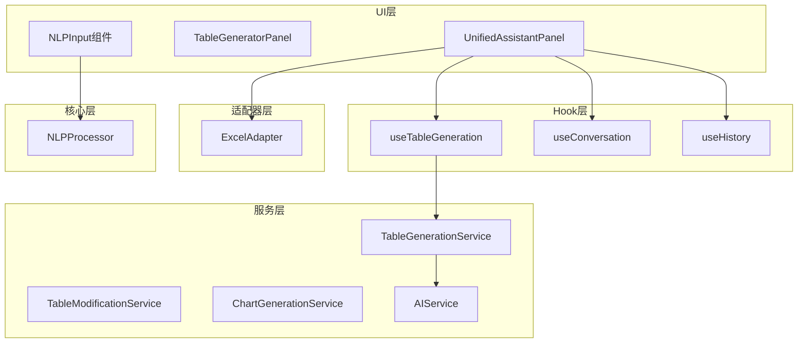
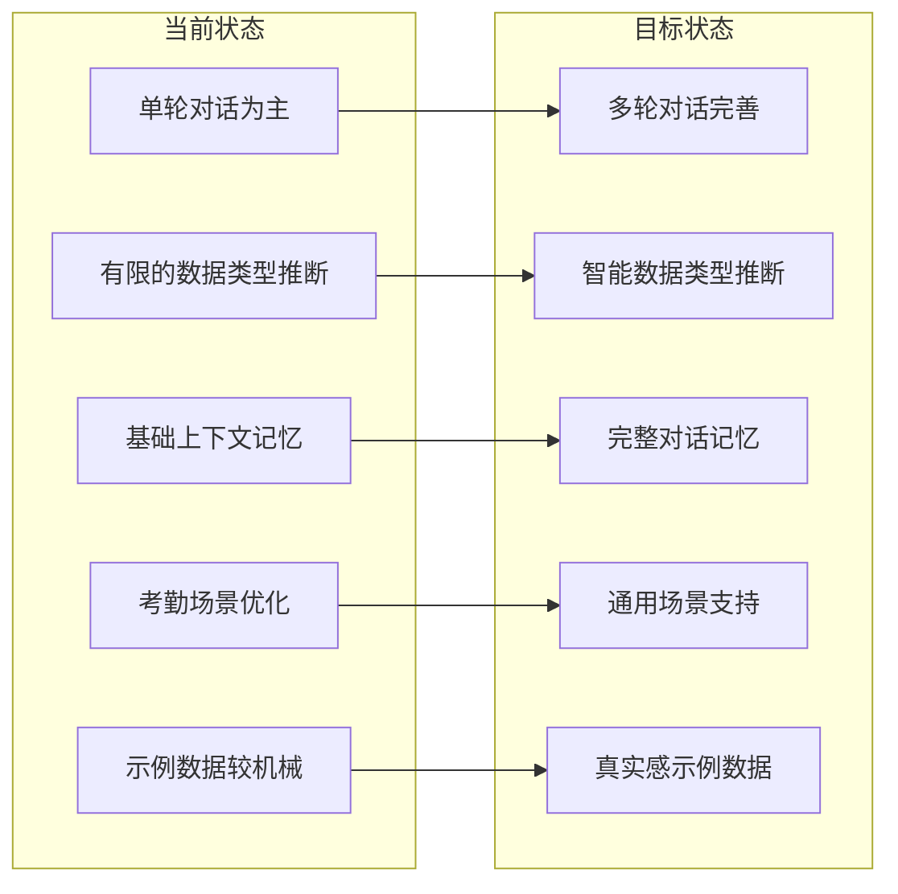
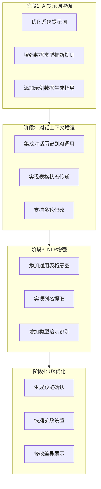
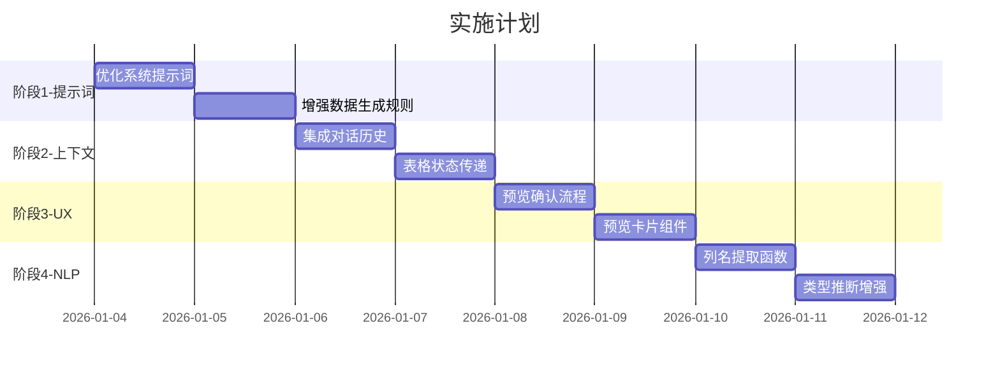

# 类Kilo Code自然语言表格生成增强方案

## 1. 现有能力分析

### 1.1 当前系统架构概览



### 1.2 已有核心能力

| 模块             | 文件路径                                   | 已实现能力                                       | 能力评分   |
| ---------------- | ------------------------------------------ | ------------------------------------------------ | ---------- |
| **AI服务**       | `src/services/ai-service.ts`               | OpenAI API调用、JSON解析修复、表格结构验证       | ⭐⭐⭐⭐   |
| **表格生成服务** | `src/services/table-generation-service.ts` | 通用表格生成、样式推断、条件格式、主题管理       | ⭐⭐⭐⭐⭐ |
| **Excel适配器**  | `src/adapters/excel-adapter.ts`            | 表格写入、样式应用、条件格式、选区检测、位置管理 | ⭐⭐⭐⭐⭐ |
| **NLP处理器**    | `src/core/nlp/processor.ts`                | 意图识别、实体提取、上下文管理                   | ⭐⭐⭐     |
| **统一助手面板** | `src/components/UnifiedAssistantPanel`     | 对话式交互、快捷操作、表格修改                   | ⭐⭐⭐⭐   |

### 1.3 详细能力清单

#### AIService 能力

```typescript
// 已支持
- generateTable(userInput: string): 根据自然语言生成表格JSON
- enhanceTable(table, instruction): 修改现有表格
- chat(messages): 通用对话能力
- JSON解析与修复（尾随逗号修复）
- 配置热更新

// 当前系统提示词特点
- 严格JSON输出
- 支持考勤表专用列类型
- 有限的数据类型推断
```

#### TableGenerationService 能力

```typescript
// 已支持
- generateTable(request): 无样式表格生成
- generateStyledTable(request): 带样式表格生成
- 12种扩展列类型（text/number/date/time/datetime/currency/percentage/boolean/email/phone/url/formula）
- 6种颜色主题（professional/energetic/nature/elegant/dark/fresh）
- 智能样式推断（从关键词推断主题）
- 自动条件格式生成（颜色阶梯/数据条/图标集/单元格值）
- JSON解析与修复
- 表格数据验证
```

#### ExcelAdapter 能力

```typescript
// 已支持
- writeGenericTable(): 写入通用表格
- writeStyledTable(): 写入带样式表格（含条件格式）
- writeRenderResult(): 写入模板渲染结果
- readTableData(): 读取表格数据
- detectTableRange(): 智能选区检测
- updateTableData(): 更新表格（撤销/重做）
- createChartV2(): 创建图表
- findNextAvailablePosition(): 智能位置定位
- resolveInsertPosition(): 支持三种插入模式（auto/manual/newSheet）
- 条件格式应用（colorScale/dataBar/iconSet/cellValue）
- 状态列自动着色
```

#### NLPProcessor 能力

```typescript
// 已支持
- process(): 本地NLP处理
- processWithAI(): AI增强处理
- 意图识别（考勤相关）
- 实体提取（日期/员工/部门）
- 上下文记忆
- 输入预处理（全半角/数字标准化）
- 建议生成
```

---

## 2. Kilo Code类工具核心能力对比

### 2.1 Kilo Code典型能力

| 能力维度             | Kilo Code特点 | 描述                                     |
| -------------------- | ------------- | ---------------------------------------- |
| **完全自然语言驱动** | ⭐⭐⭐⭐⭐    | 用户只需描述需求，无需任何技术操作       |
| **智能结构推断**     | ⭐⭐⭐⭐⭐    | 从描述中自动推断列名、数据类型、关系     |
| **上下文理解**       | ⭐⭐⭐⭐⭐    | 理解追问、修改指令、引用之前的表格       |
| **示例数据生成**     | ⭐⭐⭐⭐⭐    | 生成合理、多样化、符合业务逻辑的示例数据 |
| **渐进式完善**       | ⭐⭐⭐⭐      | 支持多轮对话逐步完善表格                 |
| **错误容错**         | ⭐⭐⭐⭐      | 模糊输入也能理解意图                     |
| **即时预览**         | ⭐⭐⭐⭐      | 生成前可预览结构                         |
| **一键填充**         | ⭐⭐⭐⭐⭐    | 自动将表格填入目标应用                   |

### 2.2 当前系统能力对比

| 能力维度             | 当前系统   | 差距                                 |
| -------------------- | ---------- | ------------------------------------ |
| **完全自然语言驱动** | ⭐⭐⭐⭐   | 已支持，但提示词可优化               |
| **智能结构推断**     | ⭐⭐⭐⭐   | 已支持12种类型，但推断规则可增强     |
| **上下文理解**       | ⭐⭐       | 基础上下文，需增强对话记忆           |
| **示例数据生成**     | ⭐⭐⭐     | 已支持，但数据多样性和真实性可提升   |
| **渐进式完善**       | ⭐⭐⭐     | 支持修改，但多轮对话体验需优化       |
| **错误容错**         | ⭐⭐⭐     | JSON修复能力强，但模糊输入理解需增强 |
| **即时预览**         | ⭐⭐⭐     | TablePreview组件存在，需集成到主流程 |
| **一键填充**         | ⭐⭐⭐⭐⭐ | 已完善                               |

---

## 3. 差距识别与增强机会

### 3.1 核心差距



### 3.2 详细差距分析

#### 差距1：AI提示词优化空间

**现状**：当前`GENERIC_TABLE_SYSTEM_PROMPT`已经较完善，但缺少：

- 更智能的列类型推断规则
- 业务场景感知能力
- 示例数据生成指导

**改进方向**：

- 增加行业/场景特定的推断规则
- 增强示例数据的真实性和多样性
- 添加列关系推断（如总额=数量×单价）

#### 差距2：对话上下文管理

**现状**：`useConversation`支持基础消息记录，但：

- AI调用时未传递对话历史
- 缺少表格状态的上下文传递
- 修改操作缺乏对历史意图的理解

**改进方向**：

- 在AI调用中集成对话历史
- 实现表格状态的上下文存储
- 支持引用之前生成的表格

#### 差距3：本地NLP能力不足

**现状**：`NLPProcessor`专注考勤场景，缺少：

- 通用表格意图识别
- 列名提取能力
- 数据类型暗示识别

**改进方向**：

- 添加通用表格生成意图规则
- 实现列名正则提取
- 增加类型暗示词库

#### 差距4：用户体验流程

**现状**：`UnifiedAssistantPanel`流程基本完整，但：

- 生成前无预览确认
- 缺少生成参数快捷设置
- 表格修改反馈不够直观

**改进方向**：

- 添加生成预览确认步骤
- 增加行数/样式快捷选择
- 优化修改差异展示

---

## 4. 增强方案设计

### 4.1 方案总览



### 4.2 具体代码改动点

#### 4.2.1 AI提示词增强 (`src/services/table-generation-service.ts`)

**改动位置**：`GENERIC_TABLE_SYSTEM_PROMPT` 和 `STYLED_TABLE_SYSTEM_PROMPT`

**改动内容**：

```typescript
// 新增：增强版系统提示词
const ENHANCED_TABLE_SYSTEM_PROMPT = `你是一个专业的表格生成引擎，专门帮助用户通过自然语言创建Excel表格。

## 核心能力
1. **智能结构推断**：从用户描述中准确识别所需的列结构
2. **类型精准匹配**：为每列选择最合适的数据类型
3. **数据真实生成**：生成符合业务逻辑的真实感示例数据
4. **公式关系推断**：识别列之间的计算关系

## 列类型推断规则（按优先级）

### 身份类
- 姓名/名字/员工/人员/客户/联系人 → text
- 工号/编号/ID/编码 → text
- 邮箱/电子邮件/email → email
- 电话/手机/联系方式/电话号码 → phone

### 时间类
- 日期/时间/日子 + 无具体时分秒 → date
- 时间/时刻 + 有具体时分秒 → time
- 创建时间/更新时间/登记时间/操作时间 → datetime

### 数值类
- 年龄/数量/数目/个数/次数/天数/人数 → number
- 金额/价格/费用/成本/收入/工资/薪资/预算/支出 → currency
- 比例/占比/百分比/完成率/达成率/出勤率 → percentage
- 得分/评分/分数 → number

### 状态类
- 状态/进度/结果/情况 + 有限选项 → 用text表示，在数据中使用固定值

### 布尔类
- 是否/有无/已/未 → boolean

### 链接类
- 网址/链接/URL/地址(网络) → url

### 公式类（关系推断）
- 总额/总价/合计 = 数量 × 单价
- 利润 = 收入 - 成本
- 完成率 = 已完成 / 总数

## 示例数据生成规则

1. **姓名类**：使用常见中文姓名，避免测试1/测试2
2. **日期类**：使用最近3个月内的合理日期
3. **金额类**：根据业务场景使用合理范围
4. **状态类**：确保各状态有合理分布
5. **百分比类**：分布在0-100%之间，体现差异
6. **电话类**：使用合理的手机号格式
7. **邮箱类**：使用合理的邮箱格式

## 输出格式
返回严格的JSON对象，结构如下：
{
  "tableName": "表格名称",
  "columns": [
    {"name": "列名", "type": "类型", "width": 宽度, "format": "格式(可选)"}
  ],
  "rows": [
    {"列名1": 值1, "列名2": 值2}
  ]
}

**你的输出必须从 { 开始，到 } 结束，不包含任何其他内容。**`;
```

#### 4.2.2 对话上下文增强 (`src/services/table-generation-service.ts`)

**改动位置**：新增方法 `generateTableWithContext`

**改动内容**：

```typescript
// 新增：带对话历史的表格生成
interface ContextualTableGenerationRequest extends TableGenerationRequest {
  /** 对话历史 */
  conversationHistory?: Array<{ role: 'user' | 'assistant'; content: string }>;
  /** 当前表格状态（用于修改场景） */
  currentTableContext?: {
    tableName: string;
    columns: string[];
    rowCount: number;
  };
}

async generateTableWithContext(
  request: ContextualTableGenerationRequest
): Promise<TableGenerationResponse> {
  // 构建包含上下文的提示词
  let contextPrompt = '';

  if (request.currentTableContext) {
    contextPrompt += `\n当前表格「${request.currentTableContext.tableName}」包含列：${request.currentTableContext.columns.join('、')}，共${request.currentTableContext.rowCount}行数据。\n`;
  }

  // 构建对话历史摘要
  if (request.conversationHistory && request.conversationHistory.length > 0) {
    const recentHistory = request.conversationHistory.slice(-4); // 最近4条
    contextPrompt += '\n最近对话：\n';
    recentHistory.forEach(msg => {
      contextPrompt += `${msg.role === 'user' ? '用户' : '助手'}：${msg.content}\n`;
    });
  }

  const enhancedPrompt = contextPrompt + '\n用户请求：' + request.prompt;

  return this.generateTable({ ...request, prompt: enhancedPrompt });
}
```

#### 4.2.3 NLP增强 (`src/core/nlp/rules/intents.ts`)

**改动位置**：新增通用表格意图规则

**改动内容**：

```typescript
// 新增：通用表格生成意图
export const TABLE_GENERATION_INTENTS = [
  {
    id: 'CREATE_GENERIC_TABLE',
    patterns: [
      /创建.*表[格]?/,
      /生成.*表[格]?/,
      /制作.*表[格]?/,
      /建.*表[格]?/,
      /做.*表[格]?/,
      /新建.*表[格]?/,
      /弄.*表[格]?/,
    ],
    priority: 10,
    extract: (input: string) => {
      // 提取列名
      const columnPattern = /(?:包含|有|含有|包括|需要|要有)\s*[：:]*\s*([^，。]+)/;
      const match = input.match(columnPattern);
      const columns = match ? match[1].split(/[、,，\s]+/).filter(Boolean) : [];

      // 提取行数
      const rowPattern = /(\d+)\s*[条行个]/;
      const rowMatch = input.match(rowPattern);
      const rowCount = rowMatch ? parseInt(rowMatch[1]) : 5;

      return { columns, rowCount };
    },
  },
  {
    id: 'MODIFY_TABLE',
    patterns: [
      /修改.*表/,
      /更新.*表/,
      /改一下.*表/,
      /调整.*表/,
      /添加.*[列行]/,
      /删除.*[列行]/,
      /增加.*[列行]/,
      /去掉.*[列行]/,
    ],
    priority: 9,
  },
];
```

#### 4.2.4 列名提取增强 (`src/core/nlp/rules/entities.ts`)

**改动位置**：新增列名提取函数

**改动内容**：

```typescript
// 新增：从自然语言中提取列名
export function extractColumnNames(input: string): string[] {
  const columns: string[] = [];

  // 模式1：包含/有 + 列名列表
  const pattern1 = /(?:包含|有|含有|包括|需要|要有|带有)\s*[：:]*\s*([^，。！？]+?)(?:的表|表格|$)/;
  const match1 = input.match(pattern1);
  if (match1) {
    const colStr = match1[1];
    const cols = colStr.split(/[、,，和与及\s]+/).filter(c => c.length > 0 && c.length < 10);
    columns.push(...cols);
  }

  // 模式2：列为 + 列名
  const pattern2 = /[列字段].*?[为是有][：:]*\s*([^，。]+)/;
  const match2 = input.match(pattern2);
  if (match2) {
    const cols = match2[1].split(/[、,，和与及\s]+/).filter(c => c.length > 0 && c.length < 10);
    columns.push(...cols);
  }

  // 模式3：直接引号包围的列名
  const pattern3 = /[「『"'"]([^」』"'"]+)[」』"'"]/g;
  let match3;
  while ((match3 = pattern3.exec(input)) !== null) {
    columns.push(match3[1]);
  }

  // 去重
  return [...new Set(columns)];
}

// 新增：推断列类型的暗示词
export function inferColumnTypeHint(columnName: string): ExtendedColumnType {
  const lowerName = columnName.toLowerCase();

  // 精确匹配
  const exactMatch: Record<string, ExtendedColumnType> = {
    姓名: 'text',
    名字: 'text',
    年龄: 'number',
    日期: 'date',
    时间: 'time',
    电话: 'phone',
    手机: 'phone',
    邮箱: 'email',
    金额: 'currency',
    价格: 'currency',
    比例: 'percentage',
    完成率: 'percentage',
    状态: 'text',
    是否: 'boolean',
    网址: 'url',
  };

  for (const [key, type] of Object.entries(exactMatch)) {
    if (columnName.includes(key)) {
      return type;
    }
  }

  // 模糊匹配
  if (/费|款|钱|元|价/.test(columnName)) return 'currency';
  if (/率|比|占|百分/.test(columnName)) return 'percentage';
  if (/时间|日期|月|日|年/.test(columnName)) return 'date';
  if (/电话|手机|联系/.test(columnName)) return 'phone';
  if (/@|邮件|邮箱/.test(columnName)) return 'email';
  if (/数量|数目|个数|次/.test(columnName)) return 'number';

  return 'text';
}
```

#### 4.2.5 UnifiedAssistantPanel增强 (`src/components/UnifiedAssistantPanel/UnifiedAssistantPanel.tsx`)

**改动位置**：`processUserInput` 和相关UI

**改动内容**：

```typescript
// 新增：生成预览确认流程
const [previewMode, setPreviewMode] = useState(false);
const [pendingTable, setPendingTable] = useState<StyledTableData | null>(null);

// 修改 handleGenerate：添加预览步骤
const handleGenerate = useCallback(
  async (prompt: string) => {
    const assistantMsg = conversation.addMessage(
      'assistant',
      '正在生成表格预览...',
      undefined,
      true
    );

    // 收集对话历史用于上下文
    const recentMessages = conversation.currentConversation?.messages.slice(-6).map(m => ({
      role: m.role as 'user' | 'assistant',
      content: m.content,
    }));

    const result = await tableGenerationService.generateTableWithContext({
      prompt,
      options: { includeExampleData: true, rowCount: settings.table.defaultRowCount },
      conversationHistory: recentMessages,
      currentTableContext: selectedTable
        ? {
            tableName: selectedTable.tableName || 'CurrentTable',
            columns: selectedTable.columns.map(c => c.name),
            rowCount: selectedTable.totalRows,
          }
        : undefined,
    });

    if (result.success && result.data) {
      // 显示预览而不是直接写入
      setPendingTable(result.data);
      setPreviewMode(true);

      if (assistantMsg) {
        conversation.updateStreamingMessage(
          assistantMsg.id,
          `📋 表格预览已生成：「${result.data.tableName}」\n` +
            `📊 ${result.data.columns.length} 列 × ${result.data.rows.length} 行\n\n` +
            `点击"确认填入"将表格写入Excel，或继续描述修改需求。`,
          true
        );
      }
    } else {
      // 错误处理...
    }
  },
  [conversation, settings, selectedTable, tableGenerationService]
);

// 新增：确认填入
const handleConfirmInsert = useCallback(async () => {
  if (!pendingTable) return;

  const insertPos = await getInsertPosition();
  await excelAdapter.writeStyledTable(pendingTable, {
    createTable: settings.table.autoCreateTable,
    startCell: insertPos.startCell,
    sheetName: insertPos.sheetName,
  });

  conversation.addMessage(
    'assistant',
    `✅ 表格「${pendingTable.tableName}」已填入Excel\n📍 位置: ${insertPos.sheetName || 'Sheet1'}!${insertPos.startCell}`
  );

  history.pushHistory(
    'create',
    `创建表格: ${pendingTable.tableName}`,
    null,
    pendingTable,
    insertPos.startCell,
    insertPos.sheetName || 'Sheet1'
  );

  setPendingTable(null);
  setPreviewMode(false);
}, [pendingTable, getInsertPosition, settings, excelAdapter, conversation, history]);
```

### 4.3 新增UI组件：TablePreviewCard

**新文件**：`src/components/UnifiedAssistantPanel/TablePreviewCard.tsx`

```typescript
/**
 * 表格预览卡片组件
 * 在确认填入前显示表格预览
 */
interface TablePreviewCardProps {
  table: StyledTableData;
  onConfirm: () => void;
  onModify: (instruction: string) => void;
  onCancel: () => void;
}

export const TablePreviewCard: React.FC<TablePreviewCardProps> = ({
  table, onConfirm, onModify, onCancel
}) => {
  const [modifyInput, setModifyInput] = useState('');

  return (
    <div className="bg-white border rounded-lg shadow-sm p-4 my-2">
      {/* 表格信息 */}
      <div className="flex items-center justify-between mb-3">
        <h4 className="font-medium text-gray-800">{table.tableName}</h4>
        <span className="text-xs text-gray-500">
          {table.columns.length} 列 × {table.rows.length} 行
        </span>
      </div>

      {/* 列预览 */}
      <div className="flex flex-wrap gap-1 mb-3">
        {table.columns.map((col, idx) => (
          <span key={idx} className="px-2 py-1 bg-blue-50 text-blue-700 text-xs rounded">
            {col.name}
            <span className="text-blue-400 ml-1">({col.type})</span>
          </span>
        ))}
      </div>

      {/* 数据预览（前3行） */}
      <div className="overflow-x-auto mb-3">
        <table className="w-full text-xs">
          <thead>
            <tr className="bg-gray-50">
              {table.columns.slice(0, 5).map((col, idx) => (
                <th key={idx} className="px-2 py-1 text-left font-medium text-gray-600">
                  {col.name}
                </th>
              ))}
              {table.columns.length > 5 && <th className="px-2 py-1 text-gray-400">...</th>}
            </tr>
          </thead>
          <tbody>
            {table.rows.slice(0, 3).map((row, rowIdx) => (
              <tr key={rowIdx} className="border-t">
                {table.columns.slice(0, 5).map((col, colIdx) => (
                  <td key={colIdx} className="px-2 py-1 text-gray-700">
                    {String(row[col.name] ?? '')}
                  </td>
                ))}
                {table.columns.length > 5 && <td className="px-2 py-1 text-gray-400">...</td>}
              </tr>
            ))}
          </tbody>
        </table>
      </div>

      {/* 修改输入 */}
      <div className="flex gap-2 mb-3">
        <input
          type="text"
          value={modifyInput}
          onChange={e => setModifyInput(e.target.value)}
          placeholder="描述修改需求，如：增加一列'部门'"
          className="flex-1 px-3 py-1.5 text-sm border rounded-lg"
        />
        <button
          onClick={() => { onModify(modifyInput); setModifyInput(''); }}
          disabled={!modifyInput.trim()}
          className="px-3 py-1.5 text-sm bg-gray-100 hover:bg-gray-200 rounded-lg disabled:opacity-50"
        >
          修改
        </button>
      </div>

      {/* 操作按钮 */}
      <div className="flex justify-end gap-2">
        <button
          onClick={onCancel}
          className="px-4 py-2 text-sm text-gray-600 hover:bg-gray-100 rounded-lg"
        >
          取消
        </button>
        <button
          onClick={onConfirm}
          className="px-4 py-2 text-sm bg-blue-500 text-white hover:bg-blue-600 rounded-lg"
        >
          确认填入Excel
        </button>
      </div>
    </div>
  );
};
```

---

## 5. 改进的AI提示词模板

### 5.1 主表格生成提示词

```typescript
const KILO_CODE_STYLE_PROMPT = `你是一个专业的Excel表格生成助手，擅长将用户的自然语言需求转化为结构化的表格。

## 你的核心能力

### 1. 智能结构理解
- 从用户描述中识别表格用途（销售、人事、财务、项目管理等）
- 自动推断合适的列结构，即使用户未明确指定
- 理解中文语境下的业务逻辑

### 2. 精准类型推断
根据列名和上下文选择最合适的类型：
- text: 姓名、标题、描述、备注、部门、职位
- number: 数量、年龄、数目、次数、得分
- date: 日期、生日、入职日期、截止日期
- time: 时间、时刻（具体时分秒）
- datetime: 创建时间、更新时间、操作时间
- currency: 金额、价格、费用、工资、预算、成本、收入
- percentage: 比例、完成率、出勤率、占比
- email: 邮箱、邮件地址
- phone: 电话、手机、联系电话
- boolean: 是否类字段
- url: 网址、链接

### 3. 真实感数据生成
生成示例数据时遵循：
- 姓名：使用常见中文姓名（张伟、李娜、王芳等）
- 日期：最近3个月内的工作日
- 金额：符合业务场景的合理范围
- 状态：确保各状态有合理分布
- 电话：使用1XX-XXXX-XXXX格式
- 邮箱：使用 name@company.com 格式

### 4. 列关系识别
识别并标注可能的计算关系：
- 总价 = 单价 × 数量
- 利润 = 收入 - 成本
- 完成率 = 已完成数 / 总数 × 100%

## 输出格式

返回严格的JSON对象：
{
  "tableName": "简洁的表格名称",
  "columns": [
    {
      "name": "列名（中文）",
      "type": "数据类型",
      "width": 列宽(可选),
      "format": "格式(可选，如日期格式)"
    }
  ],
  "rows": [
    {"列名1": 值1, "列名2": 值2, ...}
  ]
}

## 重要规则

1. 输出必须是纯JSON，从{开始到}结束
2. 不要包含任何解释、注释或markdown标记
3. 列名使用用户指定的中文名称
4. 默认生成5行示例数据，除非用户指定其他数量
5. 如果用户描述模糊，做出合理推断并生成完整表格
`;
```

### 5.2 表格修改提示词

```typescript
const TABLE_MODIFICATION_PROMPT = `你是一个表格修改助手，根据用户指令修改现有表格。

## 当前表格状态
表名：{tableName}
列结构：{columns}
数据行数：{rowCount}

## 用户指令
{instruction}

## 修改能力
1. 添加列：在表格中添加新列，自动推断类型并填充合理数据
2. 删除列：移除指定列
3. 重命名列：更改列名
4. 添加行：添加新数据行
5. 修改数据：更新特定单元格或批量更新
6. 调整顺序：重排列顺序

## 输出格式
返回修改后的完整表格JSON，结构与原表格相同。

注意：
- 保持未修改部分不变
- 新增列的数据要与现有数据行数匹配
- 删除列时同时删除对应数据
`;
```

### 5.3 对话式交互提示词

```typescript
const CONVERSATIONAL_PROMPT = `你正在帮助用户完善一个Excel表格。

## 对话历史
{conversationHistory}

## 当前表格（如有）
{currentTableContext}

## 用户新请求
{userRequest}

## 交互规则
1. 如果用户的请求清晰，直接生成或修改表格
2. 如果请求模糊，做出合理假设并说明
3. 支持用户说"加一列XX"、"去掉XX列"、"改成XX"等口语化指令
4. 理解指代词，如"这个表"指当前表格，"刚才那个"指上一个生成的表格

请直接返回JSON格式的表格数据。
`;
```

---

## 6. 实现优先级与步骤

### 6.1 优先级排序

| 优先级 | 任务                 | 影响范围 | 复杂度 |
| ------ | -------------------- | -------- | ------ |
| P0     | AI提示词优化         | 高       | 低     |
| P0     | 示例数据生成规则增强 | 高       | 低     |
| P1     | 对话历史集成到AI调用 | 高       | 中     |
| P1     | 表格预览确认流程     | 高       | 中     |
| P2     | NLP列名提取增强      | 中       | 中     |
| P2     | 类型暗示词库扩展     | 中       | 低     |
| P3     | 修改差异展示         | 低       | 中     |
| P3     | 通用表格意图规则     | 中       | 低     |

### 6.2 实施步骤



### 6.3 详细步骤清单

#### 步骤1：AI提示词优化（P0）

1. 替换 `GENERIC_TABLE_SYSTEM_PROMPT` 为增强版
2. 添加行业场景推断规则
3. 优化示例数据生成指导
4. 测试不同场景的生成效果

#### 步骤2：对话上下文集成（P1）

1. 在 `TableGenerationService` 添加 `generateTableWithContext` 方法
2. 修改 `UnifiedAssistantPanel` 收集对话历史
3. 实现表格状态上下文传递
4. 测试多轮对话场景

#### 步骤3：预览确认流程（P1）

1. 创建 `TablePreviewCard` 组件
2. 修改 `handleGenerate` 流程，添加预览步骤
3. 实现"确认填入"和"继续修改"逻辑
4. 添加预览状态管理

#### 步骤4：NLP增强（P2）

1. 实现 `extractColumnNames` 函数
2. 实现 `inferColumnTypeHint` 函数
3. 添加通用表格意图规则
4. 集成到 `NLPProcessor`

---

## 7. 测试用例

### 7.1 核心场景测试

```typescript
// 测试用例1：简单表格生成
const test1 = '创建一个员工信息表，包含姓名、年龄、部门、入职日期';
// 期望：生成4列表格，类型分别为text/number/text/date

// 测试用例2：带数据量的生成
const test2 = '生成一个销售记录表，有产品名、数量、单价、总价，要10条数据';
// 期望：生成4列10行表格，总价=数量×单价

// 测试用例3：模糊描述
const test3 = '帮我做一个考勤表';
// 期望：自动推断列结构（姓名、日期、上班时间、下班时间、状态等）

// 测试用例4：多轮对话
const test4_1 = '创建一个项目进度表';
const test4_2 = '加一列负责人';
const test4_3 = '把完成率改成百分比格式';
// 期望：支持连续修改

// 测试用例5：上下文引用
const test5 = '在刚才那个表格里增加一列备注';
// 期望：理解"刚才那个表格"的指代
```

### 7.2 边界条件测试

```typescript
// 测试：超长列名
const testLong = "创建表格，列名为'这是一个非常非常长的列名称用于测试'";

// 测试：特殊字符
const testSpecial = '创建表格，包含姓名、年龄（岁）、薪资/月';

// 测试：空描述
const testEmpty = '创建表格';
// 期望：提示用户补充列信息或生成常用模板

// 测试：非表格请求
const testNonTable = '今天天气怎么样';
// 期望：识别为非表格意图，给出友好提示
```

---

## 8. 总结

本增强方案通过以下四个维度提升系统能力：

1. **AI提示词优化**：使生成的表格结构更智能、数据更真实
2. **对话上下文增强**：支持多轮对话和上下文理解
3. **UX流程优化**：添加预览确认，提升用户控制感
4. **NLP能力增强**：本地预处理减少AI依赖，提升响应速度

实施后，系统将具备接近Kilo Code的自然语言表格生成能力，同时保持现有功能的稳定性。
