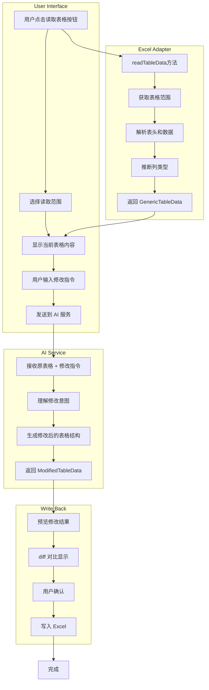
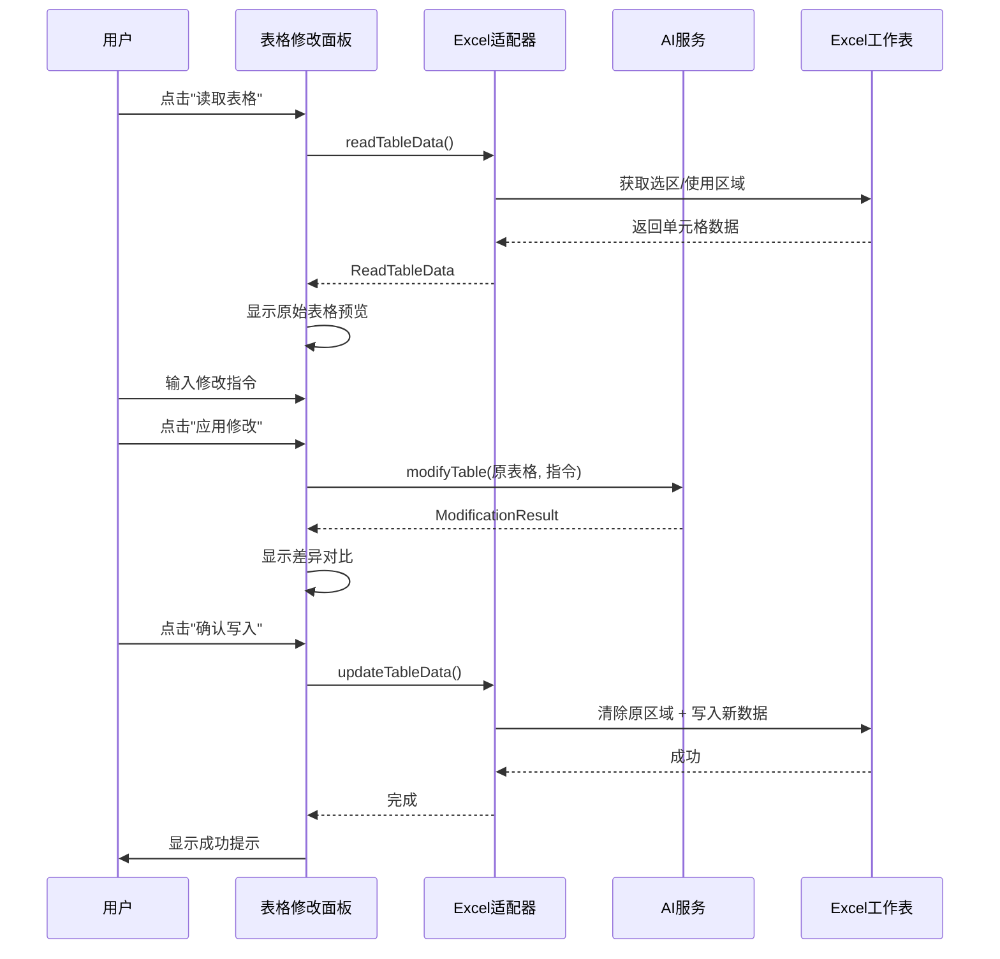

# 表格读取与智能修改功能设计

## 1. 功能概述

本功能允许用户：

1. **读取当前 Excel 中已存在的表格数据**
2. **通过自然语言描述需要进行的修改**
3. **AI 理解修改意图并生成修改后的表格**
4. **预览修改结果并写回 Excel**

类似于 Kilo Code 读取代码并进行修改的体验，但针对 Excel 表格。

---

## 2. 用户使用场景

### 场景示例

| 用户输入                         | 期望行为               |
| -------------------------------- | ---------------------- |
| "在表格末尾添加一列'备注'"       | 在现有表格右侧添加新列 |
| "删除'电话'这一列"               | 移除指定列             |
| "把所有'待处理'状态改为'已完成'" | 批量修改单元格值       |
| "按销售额从高到低排序"           | 对数据进行排序         |
| "在表格最后添加5行空数据"        | 插入新行               |
| "把日期格式改为YYYY/MM/DD"       | 修改列的格式           |
| "计算每行的总计并添加到新列"     | 添加公式列             |
| "给销售额超过1000的行标红"       | 添加条件格式           |
| "合并前两列为'全名'列"           | 列合并操作             |

---

## 3. 技术架构

### 3.1 数据流程图



### 3.2 模块结构

```
src/
├── types/
│   └── common.ts                    # 新增修改相关类型
├── adapters/
│   └── excel-adapter.ts             # 新增 readTableData 方法
├── services/
│   └── table-modification-service.ts # 新增表格修改服务
├── hooks/
│   └── useTableModification.ts      # 新增表格修改 Hook
└── components/
    └── TableModifierPanel/          # 新增表格修改面板
        ├── TableModifierPanel.tsx
        ├── TableReader.tsx          # 表格读取组件
        ├── ModificationInput.tsx    # 修改指令输入
        ├── DiffPreview.tsx          # 差异对比预览
        └── index.ts
```

---

## 4. 类型定义

### 4.1 读取相关类型

```typescript
// 在 src/types/common.ts 中添加

/**
 * 表格读取选项
 */
export interface TableReadOptions {
  /** 读取范围：当前选区 | 使用的区域 | 指定范围 */
  rangeType: 'selection' | 'usedRange' | 'custom';
  /** 自定义范围地址（如 "A1:D10"） */
  customRange?: string;
  /** 是否将第一行作为表头 */
  firstRowAsHeader?: boolean;
  /** 工作表名称（可选，默认当前工作表） */
  sheetName?: string;
}

/**
 * 表格读取结果（扩展 GenericTableData）
 */
export interface ReadTableData extends GenericTableData {
  /** 原始范围地址 */
  sourceRange: string;
  /** 工作表名称 */
  sheetName: string;
  /** 读取时间戳 */
  readAt: string;
}

/**
 * 表格修改请求
 */
export interface TableModificationRequest {
  /** 原始表格数据 */
  originalTable: ReadTableData;
  /** 修改指令（自然语言） */
  instruction: string;
  /** 修改选项 */
  options?: {
    /** 是否保留原始样式 */
    preserveStyle?: boolean;
    /** 语言偏好 */
    language?: 'zh' | 'en';
  };
}

/**
 * 修改类型枚举
 */
export type ModificationType =
  | 'addColumn' // 添加列
  | 'deleteColumn' // 删除列
  | 'renameColumn' // 重命名列
  | 'modifyValues' // 修改值
  | 'addRows' // 添加行
  | 'deleteRows' // 删除行
  | 'sortData' // 排序
  | 'filterData' // 过滤
  | 'formatColumn' // 格式化列
  | 'addFormula' // 添加公式
  | 'mergeColumns' // 合并列
  | 'splitColumn' // 拆分列
  | 'conditionalFormat'; // 条件格式

/**
 * 单个修改操作
 */
export interface ModificationOperation {
  /** 修改类型 */
  type: ModificationType;
  /** 操作描述 */
  description: string;
  /** 受影响的列名 */
  affectedColumns?: string[];
  /** 受影响的行索引 */
  affectedRows?: number[];
  /** 操作详情 */
  details?: Record<string, unknown>;
}

/**
 * 表格修改结果
 */
export interface TableModificationResult {
  /** 修改后的表格数据 */
  modifiedTable: StyledTableData;
  /** 执行的修改操作列表 */
  operations: ModificationOperation[];
  /** 变更摘要 */
  summary: {
    /** 新增列数 */
    columnsAdded: number;
    /** 删除列数 */
    columnsRemoved: number;
    /** 修改列数 */
    columnsModified: number;
    /** 新增行数 */
    rowsAdded: number;
    /** 删除行数 */
    rowsRemoved: number;
    /** 修改单元格数 */
    cellsModified: number;
  };
}

/**
 * 表格修改响应
 */
export interface TableModificationResponse {
  /** 是否成功 */
  success: boolean;
  /** 修改结果 */
  data?: TableModificationResult;
  /** 错误信息 */
  error?: string;
}
```

---

## 5. Excel 适配器扩展

### 5.1 新增 readTableData 方法

在 [`src/adapters/excel-adapter.ts`](src/adapters/excel-adapter.ts:1) 中添加：

```typescript
/**
 * 读取 Excel 表格数据
 * @param options - 读取选项
 * @returns 表格数据
 */
async readTableData(options: TableReadOptions = {}): Promise<ReadTableData> {
  let result: ReadTableData | null = null;

  await Excel.run(async (context: Excel.RequestContext) => {
    const sheet = options.sheetName
      ? context.workbook.worksheets.getItem(options.sheetName)
      : context.workbook.worksheets.getActiveWorksheet();

    sheet.load('name');

    // 获取目标范围
    let range: Excel.Range;
    switch (options.rangeType) {
      case 'selection':
        range = context.workbook.getSelectedRange();
        break;
      case 'custom':
        if (!options.customRange) {
          throw new Error('自定义范围需要提供 customRange 参数');
        }
        range = sheet.getRange(options.customRange);
        break;
      case 'usedRange':
      default:
        range = sheet.getUsedRange();
        break;
    }

    range.load(['values', 'address', 'rowCount', 'columnCount']);
    await context.sync();

    const values = range.values;
    const firstRowAsHeader = options.firstRowAsHeader !== false;

    // 解析表头
    const headers: string[] = firstRowAsHeader
      ? (values[0] as unknown[]).map(v => String(v || ''))
      : Array.from({ length: values[0].length }, (_, i) => `列${i + 1}`);

    // 解析数据行
    const dataStartRow = firstRowAsHeader ? 1 : 0;
    const rows: Record<string, unknown>[] = [];

    for (let i = dataStartRow; i < values.length; i++) {
      const row: Record<string, unknown> = {};
      headers.forEach((header, j) => {
        row[header] = values[i][j];
      });
      rows.push(row);
    }

    // 推断列类型
    const columns = headers.map((header, index) => ({
      name: header,
      type: this.inferColumnType(rows, header),
      width: 100,
    }));

    result = {
      tableName: sheet.name,
      columns,
      rows,
      sourceRange: range.address,
      sheetName: sheet.name,
      readAt: new Date().toISOString(),
      metadata: {
        createdAt: new Date().toISOString(),
        source: 'import',
      },
    };
  });

  if (!result) {
    throw new Error('读取表格失败');
  }

  return result;
}

/**
 * 推断列的数据类型
 */
private inferColumnType(
  rows: Record<string, unknown>[],
  columnName: string
): ExtendedColumnType {
  // 采样最多100行来推断类型
  const samples = rows.slice(0, 100).map(r => r[columnName]).filter(v => v != null);

  if (samples.length === 0) return 'text';

  // 检查是否全部是数字
  const allNumbers = samples.every(v => typeof v === 'number' || !isNaN(Number(v)));
  if (allNumbers) {
    // 进一步判断是否是百分比或货币
    const strSamples = samples.map(String);
    if (strSamples.some(s => s.includes('%'))) return 'percentage';
    if (strSamples.some(s => /^[¥$€£]/.test(s))) return 'currency';
    return 'number';
  }

  // 检查是否是日期
  const allDates = samples.every(v => {
    if (v instanceof Date) return true;
    if (typeof v === 'string') {
      const d = new Date(v);
      return !isNaN(d.getTime());
    }
    return false;
  });
  if (allDates) return 'date';

  // 检查是否是布尔
  const allBooleans = samples.every(v =>
    typeof v === 'boolean' ||
    ['是', '否', 'true', 'false', 'yes', 'no', '1', '0'].includes(String(v).toLowerCase())
  );
  if (allBooleans) return 'boolean';

  // 检查是否是邮箱
  const emailPattern = /^[^\s@]+@[^\s@]+\.[^\s@]+$/;
  if (samples.every(v => emailPattern.test(String(v)))) return 'email';

  // 检查是否是电话
  const phonePattern = /^[\d\-\+\(\)\s]{7,}$/;
  if (samples.every(v => phonePattern.test(String(v)))) return 'phone';

  // 默认为文本
  return 'text';
}

/**
 * 更新表格数据（覆盖原位置）
 */
async updateTableData(
  modifiedTable: StyledTableData,
  originalRange: string,
  options: WriteTableOptions = {}
): Promise<void> {
  await Excel.run(async (context: Excel.RequestContext) => {
    const sheet = options.sheetName
      ? context.workbook.worksheets.getItem(options.sheetName)
      : context.workbook.worksheets.getActiveWorksheet();

    // 清除原区域
    const originalRangeRef = sheet.getRange(originalRange);
    originalRangeRef.clear();

    await context.sync();

    // 写入新数据（使用已有的 writeStyledTable 方法）
    await this.writeStyledTable(modifiedTable, {
      ...options,
      startCell: originalRange.split(':')[0], // 使用原范围的起始单元格
    });
  });
}
```

---

## 6. 表格修改服务

### 6.1 新增 table-modification-service.ts

```typescript
// src/services/table-modification-service.ts

/**
 * 表格修改服务
 * 使用 AI 理解自然语言修改指令并生成修改后的表格
 */

import { config as appConfig } from '@/config';
import {
  TableModificationRequest,
  TableModificationResponse,
  TableModificationResult,
  ModificationOperation,
  ReadTableData,
  StyledTableData,
} from '@/types/common';

/**
 * 表格修改的系统提示词
 */
const TABLE_MODIFICATION_SYSTEM_PROMPT = `你是一个智能表格修改引擎。根据用户的原始表格和修改指令，生成修改后的表格。

**输入格式:**
你会收到：
1. 原始表格的 JSON 结构（包含 tableName, columns, rows）
2. 用户的修改指令（自然语言）

**规则:**
1. 必须返回一个完整的、语法正确的 JSON 对象。
2. 绝对不能在 JSON 之外包含任何解释、注释或 Markdown 代码块。
3. 返回的 JSON 对象必须严格遵循以下结构：
   {
     "modifiedTable": {
       "tableName": "表格名称",
       "columns": [...],
       "rows": [...],
       "style": {...}  // 可选
     },
     "operations": [
       {
         "type": "addColumn|deleteColumn|renameColumn|modifyValues|addRows|deleteRows|sortData|filterData|formatColumn|addFormula|mergeColumns|splitColumn|conditionalFormat",
         "description": "操作描述",
         "affectedColumns": ["列名"],
         "affectedRows": [行索引],
         "details": {}
       }
     ],
     "summary": {
       "columnsAdded": 数字,
       "columnsRemoved": 数字,
       "columnsModified": 数字,
       "rowsAdded": 数字,
       "rowsRemoved": 数字,
       "cellsModified": 数字
     }
   }

**支持的修改类型:**
- addColumn: 添加新列（可以是空列、常量值或公式）
- deleteColumn: 删除指定列
- renameColumn: 重命名列
- modifyValues: 批量修改单元格值（如替换、清空等）
- addRows: 添加新行
- deleteRows: 删除指定行或符合条件的行
- sortData: 按列排序
- filterData: 过滤数据（保留符合条件的行）
- formatColumn: 修改列的格式（类型转换）
- addFormula: 添加计算列（如求和、平均值等）
- mergeColumns: 合并多列为一列
- splitColumn: 拆分列为多列
- conditionalFormat: 添加条件格式规则

**智能理解规则:**
- "添加一列xxx" → addColumn
- "删除xxx列" → deleteColumn  
- "把xxx改成yyy" → modifyValues
- "按xxx排序" → sortData
- "只保留xxx" → filterData
- "计算xxx的总和" → addFormula

**你的输出必须从 { 开始，到 } 结束。**`;

export class TableModificationService {
  private apiKey: string;
  private baseUrl: string;
  private model: string;

  constructor(config?: { apiKey?: string; baseUrl?: string; model?: string }) {
    this.apiKey = config?.apiKey || appConfig.openai.apiKey;
    this.baseUrl = config?.baseUrl || appConfig.openai.baseUrl;
    this.model = config?.model || appConfig.openai.model;
  }

  /**
   * 修改表格
   */
  async modifyTable(request: TableModificationRequest): Promise<TableModificationResponse> {
    if (!this.apiKey || !this.baseUrl) {
      return { success: false, error: 'AI服务未配置' };
    }

    if (!request.instruction.trim()) {
      return { success: false, error: '请输入修改指令' };
    }

    try {
      // 构建用户提示词
      const userPrompt = this.buildModificationPrompt(request);

      // 调用 AI
      const response = await fetch(`${this.baseUrl}/chat/completions`, {
        method: 'POST',
        headers: {
          'Content-Type': 'application/json',
          Authorization: `Bearer ${this.apiKey}`,
        },
        body: JSON.stringify({
          model: this.model,
          messages: [
            { role: 'system', content: TABLE_MODIFICATION_SYSTEM_PROMPT },
            { role: 'user', content: userPrompt },
          ],
          temperature: 0.5, // 较低的温度以获得更稳定的结果
          max_tokens: 8192,
        }),
      });

      if (!response.ok) {
        throw new Error(`API请求失败: ${response.status}`);
      }

      const data = await response.json();
      const content = data.choices?.[0]?.message?.content;

      if (!content) {
        throw new Error('AI 返回了空响应');
      }

      // 解析响应
      const result = this.parseModificationResponse(content, request.originalTable);

      return { success: true, data: result };
    } catch (error) {
      return {
        success: false,
        error: error instanceof Error ? error.message : '修改表格失败',
      };
    }
  }

  /**
   * 构建修改提示词
   */
  private buildModificationPrompt(request: TableModificationRequest): string {
    const { originalTable, instruction, options } = request;

    // 简化表格数据以减少 token 消耗
    const simplifiedTable = {
      tableName: originalTable.tableName,
      columns: originalTable.columns.map(c => ({
        name: c.name,
        type: c.type,
      })),
      rows: originalTable.rows.slice(0, 20), // 最多发送20行数据
      totalRows: originalTable.rows.length,
    };

    return `**原始表格:**
\`\`\`json
${JSON.stringify(simplifiedTable, null, 2)}
\`\`\`

**修改指令:** ${instruction}

${options?.preserveStyle ? '请保留原有样式。' : ''}
${options?.language === 'en' ? '使用英文返回。' : '使用中文返回。'}

请根据修改指令生成完整的修改后表格（包含所有 ${originalTable.rows.length} 行数据）。`;
  }

  /**
   * 解析修改响应
   */
  private parseModificationResponse(
    rawResponse: string,
    originalTable: ReadTableData
  ): TableModificationResult {
    // 提取 JSON
    const jsonMatch = rawResponse.match(/\{[\s\S]*\}/);
    if (!jsonMatch) {
      throw new Error('无法解析 AI 响应');
    }

    const parsed = JSON.parse(jsonMatch[0]);

    // 验证响应结构
    if (!parsed.modifiedTable || !parsed.operations || !parsed.summary) {
      throw new Error('AI 响应格式不正确');
    }

    // 如果 AI 返回的行数不够，补充原始数据
    if (parsed.modifiedTable.rows.length < originalTable.rows.length) {
      console.warn('[TableModificationService] AI返回的行数不足，使用原始数据补充');
      // 根据修改类型决定如何处理
    }

    return {
      modifiedTable: {
        ...parsed.modifiedTable,
        metadata: {
          createdAt: new Date().toISOString(),
          source: 'ai',
          prompt: `修改自: ${originalTable.tableName}`,
        },
      },
      operations: parsed.operations,
      summary: parsed.summary,
    };
  }
}

export const tableModificationService = new TableModificationService();
```

---

## 7. React Hook

### 7.1 新增 useTableModification.ts

```typescript
// src/hooks/useTableModification.ts

import { useState, useCallback } from 'react';
import {
  ReadTableData,
  TableReadOptions,
  TableModificationRequest,
  TableModificationResult,
  StyledTableData,
} from '@/types/common';
import { excelAdapter } from '@/adapters';
import { tableModificationService } from '@/services';

export interface UseTableModificationReturn {
  // 状态
  isReading: boolean;
  isModifying: boolean;
  isWriting: boolean;
  error: string | null;
  originalTable: ReadTableData | null;
  modificationResult: TableModificationResult | null;

  // 方法
  readTable: (options?: TableReadOptions) => Promise<void>;
  modifyTable: (instruction: string) => Promise<void>;
  writeModifiedTable: () => Promise<void>;
  clearAll: () => void;
  clearError: () => void;
}

export function useTableModification(): UseTableModificationReturn {
  const [isReading, setIsReading] = useState(false);
  const [isModifying, setIsModifying] = useState(false);
  const [isWriting, setIsWriting] = useState(false);
  const [error, setError] = useState<string | null>(null);
  const [originalTable, setOriginalTable] = useState<ReadTableData | null>(null);
  const [modificationResult, setModificationResult] = useState<TableModificationResult | null>(
    null
  );

  /**
   * 读取表格
   */
  const readTable = useCallback(async (options: TableReadOptions = { rangeType: 'usedRange' }) => {
    setIsReading(true);
    setError(null);
    setModificationResult(null);

    try {
      const data = await excelAdapter.readTableData(options);
      setOriginalTable(data);
    } catch (err) {
      setError(err instanceof Error ? err.message : '读取表格失败');
    } finally {
      setIsReading(false);
    }
  }, []);

  /**
   * 修改表格
   */
  const modifyTable = useCallback(
    async (instruction: string) => {
      if (!originalTable) {
        setError('请先读取表格');
        return;
      }

      setIsModifying(true);
      setError(null);

      try {
        const request: TableModificationRequest = {
          originalTable,
          instruction,
          options: { language: 'zh' },
        };

        const response = await tableModificationService.modifyTable(request);

        if (response.success && response.data) {
          setModificationResult(response.data);
        } else {
          setError(response.error || '修改失败');
        }
      } catch (err) {
        setError(err instanceof Error ? err.message : '修改表格失败');
      } finally {
        setIsModifying(false);
      }
    },
    [originalTable]
  );

  /**
   * 写入修改后的表格
   */
  const writeModifiedTable = useCallback(async () => {
    if (!modificationResult || !originalTable) {
      setError('没有可写入的数据');
      return;
    }

    setIsWriting(true);
    setError(null);

    try {
      await excelAdapter.updateTableData(
        modificationResult.modifiedTable,
        originalTable.sourceRange,
        { sheetName: originalTable.sheetName }
      );
    } catch (err) {
      setError(err instanceof Error ? err.message : '写入失败');
    } finally {
      setIsWriting(false);
    }
  }, [modificationResult, originalTable]);

  const clearAll = useCallback(() => {
    setOriginalTable(null);
    setModificationResult(null);
    setError(null);
  }, []);

  const clearError = useCallback(() => {
    setError(null);
  }, []);

  return {
    isReading,
    isModifying,
    isWriting,
    error,
    originalTable,
    modificationResult,
    readTable,
    modifyTable,
    writeModifiedTable,
    clearAll,
    clearError,
  };
}
```

---

## 8. 前端组件

### 8.1 组件结构

```tsx
// src/components/TableModifierPanel/TableModifierPanel.tsx

import React, { useState, useCallback } from 'react';
import { useTableModification } from '@/hooks/useTableModification';
import { TableReader } from './TableReader';
import { ModificationInput } from './ModificationInput';
import { DiffPreview } from './DiffPreview';
import { Button, Card, Loading } from '../common';

export const TableModifierPanel: React.FC = () => {
  const {
    isReading,
    isModifying,
    isWriting,
    error,
    originalTable,
    modificationResult,
    readTable,
    modifyTable,
    writeModifiedTable,
    clearAll,
  } = useTableModification();

  // UI 状态
  const [step, setStep] = useState<'read' | 'modify' | 'preview'>('read');

  return (
    <div className="space-y-4">
      {/* 步骤指示器 */}
      <StepIndicator currentStep={step} />

      {/* 步骤1：读取表格 */}
      {step === 'read' && (
        <TableReader
          isLoading={isReading}
          onRead={async options => {
            await readTable(options);
            setStep('modify');
          }}
        />
      )}

      {/* 步骤2：输入修改指令 */}
      {step === 'modify' && originalTable && (
        <ModificationInput
          originalTable={originalTable}
          isLoading={isModifying}
          onModify={async instruction => {
            await modifyTable(instruction);
            setStep('preview');
          }}
          onBack={() => setStep('read')}
        />
      )}

      {/* 步骤3：预览和确认 */}
      {step === 'preview' && modificationResult && (
        <DiffPreview
          originalTable={originalTable!}
          result={modificationResult}
          isWriting={isWriting}
          onConfirm={writeModifiedTable}
          onRegenerate={() => setStep('modify')}
          onCancel={clearAll}
        />
      )}

      {/* 错误提示 */}
      {error && <ErrorAlert message={error} />}
    </div>
  );
};
```

### 8.2 DiffPreview 组件

差异对比预览是核心功能，需要直观显示变更：

```tsx
// src/components/TableModifierPanel/DiffPreview.tsx

import React from 'react';
import { ReadTableData, TableModificationResult } from '@/types/common';

interface DiffPreviewProps {
  originalTable: ReadTableData;
  result: TableModificationResult;
  isWriting: boolean;
  onConfirm: () => void;
  onRegenerate: () => void;
  onCancel: () => void;
}

export const DiffPreview: React.FC<DiffPreviewProps> = ({
  originalTable,
  result,
  isWriting,
  onConfirm,
  onRegenerate,
  onCancel,
}) => {
  return (
    <div className="space-y-4">
      {/* 变更摘要 */}
      <Card title="📊 变更摘要">
        <div className="grid grid-cols-3 gap-4 text-center">
          <SummaryItem
            label="列变更"
            added={result.summary.columnsAdded}
            removed={result.summary.columnsRemoved}
            modified={result.summary.columnsModified}
          />
          <SummaryItem
            label="行变更"
            added={result.summary.rowsAdded}
            removed={result.summary.rowsRemoved}
            modified={0}
          />
          <SummaryItem
            label="单元格"
            added={0}
            removed={0}
            modified={result.summary.cellsModified}
          />
        </div>
      </Card>

      {/* 操作列表 */}
      <Card title="🔄 执行的操作">
        <ul className="space-y-2">
          {result.operations.map((op, index) => (
            <li key={index} className="flex items-center gap-2">
              <OperationIcon type={op.type} />
              <span>{op.description}</span>
            </li>
          ))}
        </ul>
      </Card>

      {/* 并排对比表格 */}
      <div className="grid grid-cols-2 gap-4">
        <Card title="📄 原始表格">
          <MiniTable data={originalTable} />
        </Card>
        <Card title="✨ 修改后">
          <MiniTable data={result.modifiedTable} highlight />
        </Card>
      </div>

      {/* 操作按钮 */}
      <div className="flex gap-2 justify-end">
        <Button variant="outline" onClick={onCancel}>
          取消
        </Button>
        <Button variant="outline" onClick={onRegenerate}>
          重新生成
        </Button>
        <Button onClick={onConfirm} loading={isWriting}>
          ✅ 确认写入 Excel
        </Button>
      </div>
    </div>
  );
};
```

---

## 9. UI 交互流程

### 9.1 完整用户流程



### 9.2 界面草图

```
┌──────────────────────────────────────────────────────────┐
│  📝 表格智能修改                                           │
├──────────────────────────────────────────────────────────┤
│                                                          │
│  ┌─────────┐   ┌─────────┐   ┌─────────┐                │
│  │ ① 读取  │──▶│ ② 修改  │──▶│ ③ 确认  │                │
│  └─────────┘   └─────────┘   └─────────┘                │
│                                                          │
│  ┌────────────────────────────────────────────────────┐ │
│  │ 📊 当前表格（来自 Sheet1!A1:E10）                     │ │
│  │                                                    │ │
│  │  姓名    部门    销售额    日期       状态          │ │
│  │  张三    销售    12000    2024-01    已完成        │ │
│  │  李四    市场    8500     2024-01    进行中        │ │
│  │  ...                                               │ │
│  └────────────────────────────────────────────────────┘ │
│                                                          │
│  ┌────────────────────────────────────────────────────┐ │
│  │ 💬 输入修改指令:                                     │ │
│  │ ┌────────────────────────────────────────────────┐ │ │
│  │ │ 在表格末尾添加一列"完成率"，计算为销售额/15000     │ │ │
│  │ └────────────────────────────────────────────────┘ │ │
│  │                                                    │ │
│  │ 💡 快捷指令: [添加列] [删除列] [排序] [批量替换]      │ │
│  └────────────────────────────────────────────────────┘ │
│                                                          │
│  ┌─────────────┐                                        │
│  │ 🚀 应用修改  │                                        │
│  └─────────────┘                                        │
└──────────────────────────────────────────────────────────┘
```

---

## 10. 快捷指令模板

提供常用修改操作的快捷按钮：

```typescript
const quickCommands = [
  { icon: '➕', label: '添加列', template: '在表格末尾添加一列"{列名}"' },
  { icon: '➖', label: '删除列', template: '删除"{列名}"这一列' },
  { icon: '✏️', label: '重命名', template: '把"{旧名称}"列重命名为"{新名称}"' },
  { icon: '🔄', label: '批量替换', template: '把所有"{旧值}"替换为"{新值}"' },
  { icon: '📊', label: '排序', template: '按"{列名}"从高到低排序' },
  { icon: '🔢', label: '计算列', template: '添加一列计算{列A}+{列B}的总和' },
  { icon: '🎨', label: '条件格式', template: '给{列名}大于{值}的单元格标红' },
  { icon: '📝', label: '填充空值', template: '把"{列名}"列的空值填充为"{默认值}"' },
];
```

---

## 11. 实现计划

| 阶段      | 任务                                               | 优先级 |
| --------- | -------------------------------------------------- | ------ |
| **阶段1** | 类型定义：添加读取和修改相关类型                   | 高     |
| **阶段2** | Excel适配器：实现 readTableData 和 updateTableData | 高     |
| **阶段3** | AI服务：实现 table-modification-service            | 高     |
| **阶段4** | React Hook：实现 useTableModification              | 中     |
| **阶段5** | UI组件：TableModifierPanel 及子组件                | 中     |
| **阶段6** | 集成测试和优化                                     | 低     |

---

## 12. 与现有架构的集成

### 12.1 App.tsx 更新

```tsx
// 添加 Tab 切换支持
const [activeTab, setActiveTab] = useState<'generate' | 'modify'>('generate');

return (
  <div>
    <TabBar>
      <Tab active={activeTab === 'generate'} onClick={() => setActiveTab('generate')}>
        ✨ 生成表格
      </Tab>
      <Tab active={activeTab === 'modify'} onClick={() => setActiveTab('modify')}>
        📝 修改表格
      </Tab>
    </TabBar>

    {activeTab === 'generate' && <TableGeneratorPanel />}
    {activeTab === 'modify' && <TableModifierPanel />}
  </div>
);
```

### 12.2 导出更新

```typescript
// src/components/index.ts
export * from './TableModifierPanel';

// src/hooks/index.ts
export * from './useTableModification';

// src/services/index.ts
export * from './table-modification-service';
```

---

## 13. 注意事项

1. **性能考虑**：大表格（>1000行）时，只发送部分数据给 AI，但保留完整数据在本地
2. **Token 限制**：AI 提示词包含表格数据，需要限制发送的行数
3. **错误恢复**：修改失败时不应影响原始数据
4. **撤销支持**：考虑保存修改历史以支持撤销
5. **样式保留**：读取时尽量保留原有格式，修改时可选择是否保留

---

## 14. 扩展可能

1. **多步修改**：支持连续多次修改，逐步叠加
2. **修改历史**：记录修改历史，支持回滚
3. **批量操作**：一次输入多个修改指令
4. **模板保存**：将常用修改保存为模板
5. **智能建议**：根据表格内容提供修改建议
