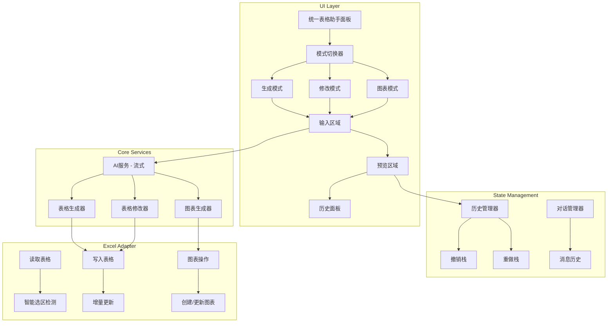

# 智能表格助手 - 增强版设计 V2

## 1. 功能概述

基于用户反馈，本设计整合了以下增强功能：

### 1.1 核心增强

| 功能          | 描述                                     |
| ------------- | ---------------------------------------- |
| **撤销/重做** | 支持历史版本管理，可回退到之前的任意状态 |
| **连续对话**  | 支持多轮对话，逐步完善表格               |
| **图表生成**  | 支持生成和修改图表                       |
| **统一界面**  | 与现有表格生成功能整合为统一入口         |
| **智能选区**  | 自动检测表格区域，也支持手动选择         |
| **流式响应**  | 使用 SSE 流式输出，实时显示生成进度      |
| **超时优化**  | API 超时时间调整为 60 秒                 |

---

## 2. 系统架构

### 2.1 整体架构图



### 2.2 新的文件结构

```
src/
├── services/
│   ├── ai-stream-service.ts         # 新增：流式 AI 服务
│   ├── table-generation-service.ts  # 修改：使用流式
│   ├── table-modification-service.ts # 新增：表格修改服务
│   ├── chart-generation-service.ts  # 新增：图表服务
│   └── history-service.ts           # 新增：历史管理
├── hooks/
│   ├── useUnifiedTableAssistant.ts  # 新增：统一助手 Hook
│   ├── useStreamingAI.ts            # 新增：流式响应 Hook
│   ├── useHistory.ts                # 新增：历史管理 Hook
│   └── useConversation.ts           # 新增：对话管理 Hook
├── components/
│   └── UnifiedAssistant/            # 新增：统一助手组件
│       ├── UnifiedAssistantPanel.tsx
│       ├── ModeSelector.tsx
│       ├── ConversationView.tsx
│       ├── PreviewPanel.tsx
│       ├── HistoryPanel.tsx
│       ├── ChartPreview.tsx
│       └── index.ts
└── types/
    └── common.ts                     # 扩展类型定义
```

---

## 3. 流式 AI 服务

### 3.1 流式服务实现

```typescript
// src/services/ai-stream-service.ts

/**
 * 流式 AI 服务配置
 */
export interface StreamConfig {
  apiKey: string;
  baseUrl: string;
  model: string;
  /** 超时时间（毫秒），默认 60000 */
  timeout?: number;
  /** 流式回调 */
  onChunk?: (chunk: string) => void;
  /** 完成回调 */
  onComplete?: (fullResponse: string) => void;
  /** 错误回调 */
  onError?: (error: Error) => void;
}

/**
 * 流式 AI 请求
 */
export async function streamAIRequest(
  systemPrompt: string,
  userPrompt: string,
  config: StreamConfig
): Promise<string> {
  const controller = new AbortController();
  const timeout = config.timeout || 60000; // 默认 60 秒

  // 设置超时
  const timeoutId = setTimeout(() => {
    controller.abort();
    config.onError?.(new Error(`请求超时 (${timeout / 1000}秒)`));
  }, timeout);

  try {
    const response = await fetch(`${config.baseUrl}/chat/completions`, {
      method: 'POST',
      headers: {
        'Content-Type': 'application/json',
        Authorization: `Bearer ${config.apiKey}`,
      },
      body: JSON.stringify({
        model: config.model,
        messages: [
          { role: 'system', content: systemPrompt },
          { role: 'user', content: userPrompt },
        ],
        temperature: 0.7,
        max_tokens: 8192,
        stream: true, // 启用流式
      }),
      signal: controller.signal,
    });

    clearTimeout(timeoutId);

    if (!response.ok) {
      throw new Error(`API请求失败: ${response.status}`);
    }

    // 处理 SSE 流
    const reader = response.body?.getReader();
    const decoder = new TextDecoder();
    let fullResponse = '';

    if (!reader) {
      throw new Error('无法读取响应流');
    }

    while (true) {
      const { done, value } = await reader.read();

      if (done) break;

      const chunk = decoder.decode(value, { stream: true });
      const lines = chunk.split('\n').filter(line => line.startsWith('data: '));

      for (const line of lines) {
        const data = line.replace('data: ', '');

        if (data === '[DONE]') continue;

        try {
          const parsed = JSON.parse(data);
          const content = parsed.choices?.[0]?.delta?.content || '';

          if (content) {
            fullResponse += content;
            config.onChunk?.(content);
          }
        } catch {
          // 忽略解析错误
        }
      }
    }

    config.onComplete?.(fullResponse);
    return fullResponse;
  } catch (error) {
    clearTimeout(timeoutId);

    if (error instanceof Error) {
      if (error.name === 'AbortError') {
        throw new Error(`请求超时 (${timeout / 1000}秒)`);
      }
      config.onError?.(error);
      throw error;
    }
    throw new Error('未知错误');
  }
}
```

### 3.2 流式响应 Hook

```typescript
// src/hooks/useStreamingAI.ts

import { useState, useCallback, useRef } from 'react';
import { streamAIRequest, StreamConfig } from '@/services/ai-stream-service';
import { config as appConfig } from '@/config';

interface UseStreamingAIReturn {
  /** 是否正在请求 */
  isStreaming: boolean;
  /** 当前已接收的内容 */
  streamContent: string;
  /** 完整响应 */
  fullResponse: string | null;
  /** 错误信息 */
  error: string | null;
  /** 开始流式请求 */
  startStream: (systemPrompt: string, userPrompt: string) => Promise<string>;
  /** 取消请求 */
  cancelStream: () => void;
  /** 清除状态 */
  reset: () => void;
}

export function useStreamingAI(): UseStreamingAIReturn {
  const [isStreaming, setIsStreaming] = useState(false);
  const [streamContent, setStreamContent] = useState('');
  const [fullResponse, setFullResponse] = useState<string | null>(null);
  const [error, setError] = useState<string | null>(null);
  const abortRef = useRef<(() => void) | null>(null);

  const startStream = useCallback(
    async (systemPrompt: string, userPrompt: string): Promise<string> => {
      setIsStreaming(true);
      setStreamContent('');
      setFullResponse(null);
      setError(null);

      try {
        const result = await streamAIRequest(systemPrompt, userPrompt, {
          apiKey: appConfig.openai.apiKey,
          baseUrl: appConfig.openai.baseUrl,
          model: appConfig.openai.model,
          timeout: 60000, // 60 秒超时
          onChunk: chunk => {
            setStreamContent(prev => prev + chunk);
          },
          onComplete: full => {
            setFullResponse(full);
          },
          onError: err => {
            setError(err.message);
          },
        });

        return result;
      } catch (err) {
        setError(err instanceof Error ? err.message : '请求失败');
        throw err;
      } finally {
        setIsStreaming(false);
      }
    },
    []
  );

  const cancelStream = useCallback(() => {
    abortRef.current?.();
  }, []);

  const reset = useCallback(() => {
    setIsStreaming(false);
    setStreamContent('');
    setFullResponse(null);
    setError(null);
  }, []);

  return {
    isStreaming,
    streamContent,
    fullResponse,
    error,
    startStream,
    cancelStream,
    reset,
  };
}
```

---

## 4. 撤销/重做系统

### 4.1 历史管理类型

```typescript
// 在 src/types/common.ts 中添加

/**
 * 历史记录项
 */
export interface HistoryEntry {
  /** 唯一ID */
  id: string;
  /** 时间戳 */
  timestamp: string;
  /** 操作描述 */
  description: string;
  /** 表格快照 */
  tableSnapshot: StyledTableData;
  /** 图表快照（如有） */
  chartSnapshot?: ChartConfig;
  /** 用户输入 */
  userInput: string;
  /** AI 响应 */
  aiResponse: string;
}

/**
 * 历史管理器状态
 */
export interface HistoryState {
  /** 撤销栈 */
  undoStack: HistoryEntry[];
  /** 重做栈 */
  redoStack: HistoryEntry[];
  /** 当前状态索引 */
  currentIndex: number;
  /** 最大历史记录数 */
  maxSize: number;
}
```

### 4.2 历史管理 Hook

```typescript
// src/hooks/useHistory.ts

import { useState, useCallback, useMemo } from 'react';
import { HistoryEntry, HistoryState, StyledTableData } from '@/types/common';

interface UseHistoryReturn {
  /** 是否可以撤销 */
  canUndo: boolean;
  /** 是否可以重做 */
  canRedo: boolean;
  /** 历史记录列表 */
  history: HistoryEntry[];
  /** 当前状态 */
  currentEntry: HistoryEntry | null;
  /** 添加新记录 */
  push: (entry: Omit<HistoryEntry, 'id' | 'timestamp'>) => void;
  /** 撤销 */
  undo: () => HistoryEntry | null;
  /** 重做 */
  redo: () => HistoryEntry | null;
  /** 跳转到指定记录 */
  goTo: (index: number) => HistoryEntry | null;
  /** 清空历史 */
  clear: () => void;
}

export function useHistory(maxSize: number = 50): UseHistoryReturn {
  const [state, setState] = useState<HistoryState>({
    undoStack: [],
    redoStack: [],
    currentIndex: -1,
    maxSize,
  });

  const canUndo = useMemo(() => state.undoStack.length > 0, [state.undoStack]);
  const canRedo = useMemo(() => state.redoStack.length > 0, [state.redoStack]);

  const currentEntry = useMemo(() => {
    if (state.currentIndex >= 0 && state.currentIndex < state.undoStack.length) {
      return state.undoStack[state.currentIndex];
    }
    return null;
  }, [state.undoStack, state.currentIndex]);

  const push = useCallback((entry: Omit<HistoryEntry, 'id' | 'timestamp'>) => {
    const newEntry: HistoryEntry = {
      ...entry,
      id: `history_${Date.now()}_${Math.random().toString(36).substr(2, 9)}`,
      timestamp: new Date().toISOString(),
    };

    setState(prev => {
      // 如果在历史中间添加新记录，清除后面的重做栈
      const newUndoStack = [...prev.undoStack.slice(0, prev.currentIndex + 1), newEntry];

      // 限制历史记录大小
      while (newUndoStack.length > prev.maxSize) {
        newUndoStack.shift();
      }

      return {
        ...prev,
        undoStack: newUndoStack,
        redoStack: [], // 清空重做栈
        currentIndex: newUndoStack.length - 1,
      };
    });
  }, []);

  const undo = useCallback(() => {
    if (!canUndo) return null;

    let result: HistoryEntry | null = null;

    setState(prev => {
      if (prev.currentIndex <= 0) return prev;

      const currentEntry = prev.undoStack[prev.currentIndex];
      result = prev.undoStack[prev.currentIndex - 1];

      return {
        ...prev,
        redoStack: [currentEntry, ...prev.redoStack],
        currentIndex: prev.currentIndex - 1,
      };
    });

    return result;
  }, [canUndo]);

  const redo = useCallback(() => {
    if (!canRedo) return null;

    let result: HistoryEntry | null = null;

    setState(prev => {
      if (prev.redoStack.length === 0) return prev;

      const [nextEntry, ...restRedo] = prev.redoStack;
      result = nextEntry;

      return {
        ...prev,
        undoStack: [...prev.undoStack, nextEntry],
        redoStack: restRedo,
        currentIndex: prev.currentIndex + 1,
      };
    });

    return result;
  }, [canRedo]);

  const goTo = useCallback(
    (index: number) => {
      if (index < 0 || index >= state.undoStack.length) return null;

      setState(prev => ({
        ...prev,
        currentIndex: index,
        // 调整撤销/重做栈
        redoStack: prev.undoStack.slice(index + 1),
      }));

      return state.undoStack[index];
    },
    [state.undoStack]
  );

  const clear = useCallback(() => {
    setState({
      undoStack: [],
      redoStack: [],
      currentIndex: -1,
      maxSize: state.maxSize,
    });
  }, [state.maxSize]);

  return {
    canUndo,
    canRedo,
    history: state.undoStack,
    currentEntry,
    push,
    undo,
    redo,
    goTo,
    clear,
  };
}
```

---

## 5. 连续对话系统

### 5.1 对话类型定义

```typescript
// 在 src/types/common.ts 中添加

/**
 * 对话消息角色
 */
export type MessageRole = 'user' | 'assistant' | 'system';

/**
 * 对话消息
 */
export interface ConversationMessage {
  /** 唯一ID */
  id: string;
  /** 角色 */
  role: MessageRole;
  /** 内容 */
  content: string;
  /** 时间戳 */
  timestamp: string;
  /** 关联的表格数据（如有） */
  tableData?: StyledTableData;
  /** 关联的图表配置（如有） */
  chartConfig?: ChartConfig;
  /** 是否正在流式输出 */
  isStreaming?: boolean;
}

/**
 * 对话上下文
 */
export interface ConversationContext {
  /** 当前表格 */
  currentTable: StyledTableData | null;
  /** 当前图表 */
  currentChart: ChartConfig | null;
  /** 工作表名称 */
  sheetName: string;
  /** 选区范围 */
  selectedRange: string | null;
}
```

### 5.2 对话管理 Hook

```typescript
// src/hooks/useConversation.ts

import { useState, useCallback, useMemo } from 'react';
import { ConversationMessage, ConversationContext, StyledTableData } from '@/types/common';

interface UseConversationReturn {
  /** 消息历史 */
  messages: ConversationMessage[];
  /** 当前上下文 */
  context: ConversationContext;
  /** 是否有活跃对话 */
  hasActiveConversation: boolean;
  /** 添加用户消息 */
  addUserMessage: (content: string) => ConversationMessage;
  /** 添加助手消息（开始流式） */
  startAssistantMessage: () => ConversationMessage;
  /** 更新流式消息 */
  updateStreamingMessage: (id: string, chunk: string) => void;
  /** 完成流式消息 */
  finishStreamingMessage: (id: string, tableData?: StyledTableData) => void;
  /** 更新上下文 */
  updateContext: (update: Partial<ConversationContext>) => void;
  /** 清空对话 */
  clearConversation: () => void;
  /** 获取用于 AI 的消息历史 */
  getMessagesForAI: () => Array<{ role: string; content: string }>;
}

export function useConversation(): UseConversationReturn {
  const [messages, setMessages] = useState<ConversationMessage[]>([]);
  const [context, setContext] = useState<ConversationContext>({
    currentTable: null,
    currentChart: null,
    sheetName: 'Sheet1',
    selectedRange: null,
  });

  const hasActiveConversation = useMemo(() => messages.length > 0, [messages]);

  const generateId = () => `msg_${Date.now()}_${Math.random().toString(36).substr(2, 9)}`;

  const addUserMessage = useCallback((content: string): ConversationMessage => {
    const message: ConversationMessage = {
      id: generateId(),
      role: 'user',
      content,
      timestamp: new Date().toISOString(),
    };

    setMessages(prev => [...prev, message]);
    return message;
  }, []);

  const startAssistantMessage = useCallback((): ConversationMessage => {
    const message: ConversationMessage = {
      id: generateId(),
      role: 'assistant',
      content: '',
      timestamp: new Date().toISOString(),
      isStreaming: true,
    };

    setMessages(prev => [...prev, message]);
    return message;
  }, []);

  const updateStreamingMessage = useCallback((id: string, chunk: string) => {
    setMessages(prev =>
      prev.map(msg => (msg.id === id ? { ...msg, content: msg.content + chunk } : msg))
    );
  }, []);

  const finishStreamingMessage = useCallback((id: string, tableData?: StyledTableData) => {
    setMessages(prev =>
      prev.map(msg => (msg.id === id ? { ...msg, isStreaming: false, tableData } : msg))
    );

    if (tableData) {
      setContext(prev => ({ ...prev, currentTable: tableData }));
    }
  }, []);

  const updateContext = useCallback((update: Partial<ConversationContext>) => {
    setContext(prev => ({ ...prev, ...update }));
  }, []);

  const clearConversation = useCallback(() => {
    setMessages([]);
    setContext({
      currentTable: null,
      currentChart: null,
      sheetName: 'Sheet1',
      selectedRange: null,
    });
  }, []);

  const getMessagesForAI = useCallback(() => {
    // 只返回最近 10 条消息，避免超过 token 限制
    return messages.slice(-10).map(msg => ({
      role: msg.role,
      content: msg.content,
    }));
  }, [messages]);

  return {
    messages,
    context,
    hasActiveConversation,
    addUserMessage,
    startAssistantMessage,
    updateStreamingMessage,
    finishStreamingMessage,
    updateContext,
    clearConversation,
    getMessagesForAI,
  };
}
```

---

## 6. 智能选区检测

### 6.1 Excel 适配器扩展

```typescript
// 在 src/adapters/excel-adapter.ts 中添加

/**
 * 智能检测表格区域
 * 自动识别当前工作表中的表格范围
 */
async detectTableRange(): Promise<{
  hasTable: boolean;
  range: string | null;
  rowCount: number;
  columnCount: number;
  hasHeaders: boolean;
}> {
  let result = {
    hasTable: false,
    range: null as string | null,
    rowCount: 0,
    columnCount: 0,
    hasHeaders: false,
  };

  await Excel.run(async (context: Excel.RequestContext) => {
    const sheet = context.workbook.worksheets.getActiveWorksheet();
    const usedRange = sheet.getUsedRange();

    usedRange.load(['address', 'rowCount', 'columnCount', 'values']);
    await context.sync();

    if (usedRange.rowCount > 0 && usedRange.columnCount > 0) {
      result = {
        hasTable: true,
        range: usedRange.address,
        rowCount: usedRange.rowCount,
        columnCount: usedRange.columnCount,
        // 检查第一行是否是表头（通过检查是否全是文本）
        hasHeaders: (usedRange.values[0] as unknown[]).every(
          cell => typeof cell === 'string' && cell.trim().length > 0
        ),
      };
    }
  });

  return result;
}

/**
 * 获取当前选区信息
 */
async getSelectionInfo(): Promise<{
  hasSelection: boolean;
  range: string | null;
  rowCount: number;
  columnCount: number;
}> {
  let result = {
    hasSelection: false,
    range: null as string | null,
    rowCount: 0,
    columnCount: 0,
  };

  await Excel.run(async (context: Excel.RequestContext) => {
    const selection = context.workbook.getSelectedRange();
    selection.load(['address', 'rowCount', 'columnCount']);
    await context.sync();

    result = {
      hasSelection: true,
      range: selection.address,
      rowCount: selection.rowCount,
      columnCount: selection.columnCount,
    };
  });

  return result;
}
```

---

## 7. 图表生成与修改

### 7.1 图表类型定义

```typescript
// 在 src/types/common.ts 中添加

/**
 * 图表类型
 */
export type ChartType =
  | 'column' // 柱状图
  | 'bar' // 条形图
  | 'line' // 折线图
  | 'pie' // 饼图
  | 'doughnut' // 环形图
  | 'area' // 面积图
  | 'scatter' // 散点图
  | 'combo'; // 组合图

/**
 * 图表配置
 */
export interface ChartConfig {
  /** 图表类型 */
  type: ChartType;
  /** 图表标题 */
  title: string;
  /** 数据源范围 */
  dataRange: string;
  /** X轴标签列 */
  xAxisColumn?: string;
  /** Y轴数据列 */
  yAxisColumns: string[];
  /** 图例位置 */
  legendPosition?: 'top' | 'bottom' | 'left' | 'right' | 'none';
  /** 是否显示数据标签 */
  showDataLabels?: boolean;
  /** 颜色方案 */
  colorScheme?: string[];
  /** 图表大小 */
  size?: {
    width: number;
    height: number;
  };
  /** 图表位置 */
  position?: {
    left: number;
    top: number;
  };
}

/**
 * 图表生成请求
 */
export interface ChartGenerationRequest {
  /** 表格数据 */
  tableData: StyledTableData;
  /** 用户描述 */
  prompt: string;
  /** 图表偏好 */
  preference?: {
    type?: ChartType;
    style?: 'simple' | 'detailed' | 'professional';
  };
}

/**
 * 图表生成响应
 */
export interface ChartGenerationResponse {
  success: boolean;
  data?: ChartConfig;
  error?: string;
}
```

### 7.2 图表生成服务

```typescript
// src/services/chart-generation-service.ts

import { config as appConfig } from '@/config';
import { streamAIRequest } from './ai-stream-service';
import {
  ChartGenerationRequest,
  ChartGenerationResponse,
  ChartConfig,
  StyledTableData,
} from '@/types/common';

const CHART_SYSTEM_PROMPT = `你是一个图表生成专家。根据用户提供的表格数据和需求，生成最合适的图表配置。

**规则:**
1. 必须返回一个完整的 JSON 对象
2. 不要包含任何解释或 Markdown 代码块
3. 返回格式：
   {
     "type": "column|bar|line|pie|doughnut|area|scatter|combo",
     "title": "图表标题",
     "dataRange": "数据范围（如 A1:D10）",
     "xAxisColumn": "X轴列名",
     "yAxisColumns": ["Y轴列名数组"],
     "legendPosition": "top|bottom|left|right|none",
     "showDataLabels": true/false,
     "colorScheme": ["颜色数组"]
   }

**图表类型选择规则:**
- 比较类数据 → column 或 bar
- 趋势类数据 → line 或 area
- 占比类数据 → pie 或 doughnut
- 相关性分析 → scatter
- 多指标比较 → combo`;

export class ChartGenerationService {
  private apiKey: string;
  private baseUrl: string;
  private model: string;

  constructor() {
    this.apiKey = appConfig.openai.apiKey;
    this.baseUrl = appConfig.openai.baseUrl;
    this.model = appConfig.openai.model;
  }

  async generateChart(
    request: ChartGenerationRequest,
    onProgress?: (chunk: string) => void
  ): Promise<ChartGenerationResponse> {
    const userPrompt = this.buildPrompt(request);

    try {
      const response = await streamAIRequest(CHART_SYSTEM_PROMPT, userPrompt, {
        apiKey: this.apiKey,
        baseUrl: this.baseUrl,
        model: this.model,
        timeout: 60000,
        onChunk: onProgress,
      });

      const chartConfig = this.parseResponse(response);
      return { success: true, data: chartConfig };
    } catch (error) {
      return {
        success: false,
        error: error instanceof Error ? error.message : '图表生成失败',
      };
    }
  }

  private buildPrompt(request: ChartGenerationRequest): string {
    const { tableData, prompt } = request;

    return `**表格数据:**
表名: ${tableData.tableName}
列: ${tableData.columns.map(c => `${c.name}(${c.type})`).join(', ')}
行数: ${tableData.rows.length}

**用户需求:** ${prompt}

请生成合适的图表配置。`;
  }

  private parseResponse(response: string): ChartConfig {
    const jsonMatch = response.match(/\{[\s\S]*\}/);
    if (!jsonMatch) throw new Error('无法解析图表配置');
    return JSON.parse(jsonMatch[0]);
  }
}

export const chartGenerationService = new ChartGenerationService();
```

---

## 8. 统一助手面板

### 8.1 统一面板组件

```tsx
// src/components/UnifiedAssistant/UnifiedAssistantPanel.tsx

import React, { useState, useCallback, useEffect } from 'react';
import { useStreamingAI } from '@/hooks/useStreamingAI';
import { useHistory } from '@/hooks/useHistory';
import { useConversation } from '@/hooks/useConversation';
import { excelAdapter } from '@/adapters';
import { ModeSelector, AssistantMode } from './ModeSelector';
import { ConversationView } from './ConversationView';
import { PreviewPanel } from './PreviewPanel';
import { HistoryPanel } from './HistoryPanel';
import { Button, Card, Loading } from '../common';
import { StyledTableData, ChartConfig } from '@/types/common';

export const UnifiedAssistantPanel: React.FC = () => {
  // 模式
  const [mode, setMode] = useState<AssistantMode>('generate');

  // 输入
  const [input, setInput] = useState('');

  // 选区
  const [selectedRange, setSelectedRange] = useState<string | null>(null);
  const [autoDetectedRange, setAutoDetectedRange] = useState<string | null>(null);

  // Hooks
  const { isStreaming, streamContent, startStream, reset: resetStream } = useStreamingAI();
  const { canUndo, canRedo, push: pushHistory, undo, redo, history } = useHistory();
  const {
    messages,
    context,
    addUserMessage,
    startAssistantMessage,
    updateStreamingMessage,
    finishStreamingMessage,
    updateContext,
    clearConversation,
    getMessagesForAI,
  } = useConversation();

  // 预览状态
  const [previewTable, setPreviewTable] = useState<StyledTableData | null>(null);
  const [previewChart, setPreviewChart] = useState<ChartConfig | null>(null);
  const [showHistory, setShowHistory] = useState(false);

  // 初始化：检测表格
  useEffect(() => {
    const detectTable = async () => {
      try {
        const detection = await excelAdapter.detectTableRange();
        if (detection.hasTable) {
          setAutoDetectedRange(detection.range);
        }
      } catch {
        // 忽略错误
      }
    };
    detectTable();
  }, []);

  // 读取选区数据
  const handleReadSelection = useCallback(async () => {
    try {
      const range = selectedRange || autoDetectedRange;
      if (!range) return;

      const tableData = await excelAdapter.readTableData({
        rangeType: selectedRange ? 'custom' : 'usedRange',
        customRange: selectedRange || undefined,
      });

      updateContext({ currentTable: tableData, selectedRange: range });
      setPreviewTable(tableData);
    } catch (error) {
      console.error('读取表格失败:', error);
    }
  }, [selectedRange, autoDetectedRange, updateContext]);

  // 发送消息
  const handleSend = useCallback(async () => {
    if (!input.trim() || isStreaming) return;

    // 添加用户消息
    addUserMessage(input);
    setInput('');

    // 开始助手消息
    const assistantMsg = startAssistantMessage();

    // 构建提示词
    const systemPrompt = buildSystemPrompt(mode, context);
    const userPrompt = buildUserPrompt(input, context, getMessagesForAI());

    try {
      const response = await startStream(systemPrompt, userPrompt);

      // 更新流式消息
      updateStreamingMessage(assistantMsg.id, response);

      // 解析响应
      const result = parseResponse(response, mode);

      if (result.table) {
        setPreviewTable(result.table);
        finishStreamingMessage(assistantMsg.id, result.table);

        // 保存到历史
        pushHistory({
          description: input,
          tableSnapshot: result.table,
          userInput: input,
          aiResponse: response,
        });
      }

      if (result.chart) {
        setPreviewChart(result.chart);
      }
    } catch (error) {
      console.error('AI 请求失败:', error);
    }
  }, [
    input,
    isStreaming,
    mode,
    context,
    addUserMessage,
    startAssistantMessage,
    startStream,
    updateStreamingMessage,
    finishStreamingMessage,
    pushHistory,
    getMessagesForAI,
  ]);

  // 撤销
  const handleUndo = useCallback(() => {
    const entry = undo();
    if (entry) {
      setPreviewTable(entry.tableSnapshot);
      updateContext({ currentTable: entry.tableSnapshot });
    }
  }, [undo, updateContext]);

  // 重做
  const handleRedo = useCallback(() => {
    const entry = redo();
    if (entry) {
      setPreviewTable(entry.tableSnapshot);
      updateContext({ currentTable: entry.tableSnapshot });
    }
  }, [redo, updateContext]);

  // 写入 Excel
  const handleWriteToExcel = useCallback(async () => {
    if (!previewTable) return;

    try {
      if (context.selectedRange && mode === 'modify') {
        // 修改模式：覆盖原位置
        await excelAdapter.updateTableData(previewTable, context.selectedRange, {
          sheetName: context.sheetName,
        });
      } else {
        // 生成模式：写入新位置
        await excelAdapter.writeStyledTable(previewTable, {
          createTable: true,
          applyConditionalFormats: true,
        });
      }
    } catch (error) {
      console.error('写入失败:', error);
    }
  }, [previewTable, context, mode]);

  return (
    <div className="flex flex-col h-full">
      {/* 头部：模式选择 + 撤销重做 */}
      <div className="flex items-center justify-between p-3 border-b">
        <ModeSelector value={mode} onChange={setMode} />

        <div className="flex gap-2">
          <Button
            variant="outline"
            size="small"
            onClick={handleUndo}
            disabled={!canUndo}
            title="撤销 (Ctrl+Z)"
          >
            ↶
          </Button>
          <Button
            variant="outline"
            size="small"
            onClick={handleRedo}
            disabled={!canRedo}
            title="重做 (Ctrl+Y)"
          >
            ↷
          </Button>
          <Button variant="outline" size="small" onClick={() => setShowHistory(!showHistory)}>
            📜 历史
          </Button>
        </div>
      </div>

      {/* 主体：对话 + 预览 */}
      <div className="flex-1 flex overflow-hidden">
        {/* 左侧：对话区域 */}
        <div className="flex-1 flex flex-col border-r">
          {/* 选区提示（修改模式） */}
          {mode === 'modify' && (
            <div className="p-3 bg-blue-50 border-b">
              <div className="flex items-center justify-between">
                <span className="text-sm">
                  {autoDetectedRange
                    ? `📊 检测到表格: ${autoDetectedRange}`
                    : '未检测到表格，请选择区域'}
                </span>
                <Button size="small" onClick={handleReadSelection}>
                  读取表格
                </Button>
              </div>
            </div>
          )}

          {/* 对话消息 */}
          <ConversationView
            messages={messages}
            isStreaming={isStreaming}
            streamContent={streamContent}
          />

          {/* 输入区域 */}
          <div className="p-3 border-t">
            <div className="flex gap-2">
              <textarea
                value={input}
                onChange={e => setInput(e.target.value)}
                onKeyDown={e => {
                  if (e.key === 'Enter' && !e.shiftKey) {
                    e.preventDefault();
                    handleSend();
                  }
                }}
                placeholder={getPlaceholder(mode)}
                rows={2}
                className="flex-1 px-3 py-2 border rounded-lg resize-none"
                disabled={isStreaming}
              />
              <Button onClick={handleSend} loading={isStreaming}>
                发送
              </Button>
            </div>
          </div>
        </div>

        {/* 右侧：预览区域 */}
        <div className="w-1/2 flex flex-col">
          <PreviewPanel
            table={previewTable}
            chart={previewChart}
            onWriteToExcel={handleWriteToExcel}
          />
        </div>
      </div>

      {/* 历史面板（侧边抽屉） */}
      {showHistory && (
        <HistoryPanel
          history={history}
          onSelect={entry => {
            setPreviewTable(entry.tableSnapshot);
            updateContext({ currentTable: entry.tableSnapshot });
            setShowHistory(false);
          }}
          onClose={() => setShowHistory(false)}
        />
      )}
    </div>
  );
};

// 辅助函数
function buildSystemPrompt(mode: AssistantMode, context: ConversationContext): string {
  // 根据模式返回不同的系统提示词
  switch (mode) {
    case 'generate':
      return GENERATE_SYSTEM_PROMPT;
    case 'modify':
      return MODIFY_SYSTEM_PROMPT;
    case 'chart':
      return CHART_SYSTEM_PROMPT;
    default:
      return GENERATE_SYSTEM_PROMPT;
  }
}

function buildUserPrompt(
  input: string,
  context: ConversationContext,
  history: Array<{ role: string; content: string }>
): string {
  let prompt = input;

  // 如果有当前表格，添加上下文
  if (context.currentTable) {
    prompt = `当前表格: ${context.currentTable.tableName}
列: ${context.currentTable.columns.map(c => c.name).join(', ')}
行数: ${context.currentTable.rows.length}

用户指令: ${input}`;
  }

  return prompt;
}

function parseResponse(
  response: string,
  mode: AssistantMode
): {
  table?: StyledTableData;
  chart?: ChartConfig;
} {
  // 解析 AI 响应
  try {
    const jsonMatch = response.match(/\{[\s\S]*\}/);
    if (jsonMatch) {
      const data = JSON.parse(jsonMatch[0]);
      if (data.columns && data.rows) {
        return { table: data as StyledTableData };
      }
      if (data.type && data.yAxisColumns) {
        return { chart: data as ChartConfig };
      }
    }
  } catch {
    // 解析失败
  }
  return {};
}

function getPlaceholder(mode: AssistantMode): string {
  switch (mode) {
    case 'generate':
      return '描述您想创建的表格，如：创建一个销售报表，包含日期、产品、数量...';
    case 'modify':
      return '描述您想进行的修改，如：添加一列"备注"、按销售额排序...';
    case 'chart':
      return '描述您想创建的图表，如：用柱状图显示各产品销售额...';
    default:
      return '请输入...';
  }
}

// 系统提示词常量
const GENERATE_SYSTEM_PROMPT = `...`; // 使用之前定义的
const MODIFY_SYSTEM_PROMPT = `...`;
const CHART_SYSTEM_PROMPT = `...`;
```

### 8.2 模式选择器

```tsx
// src/components/UnifiedAssistant/ModeSelector.tsx

import React from 'react';

export type AssistantMode = 'generate' | 'modify' | 'chart';

interface ModeSelectorProps {
  value: AssistantMode;
  onChange: (mode: AssistantMode) => void;
}

const modes: Array<{ value: AssistantMode; label: string; icon: string; description: string }> = [
  { value: 'generate', label: '生成', icon: '✨', description: '创建新表格' },
  { value: 'modify', label: '修改', icon: '📝', description: '修改现有表格' },
  { value: 'chart', label: '图表', icon: '📊', description: '生成图表' },
];

export const ModeSelector: React.FC<ModeSelectorProps> = ({ value, onChange }) => {
  return (
    <div className="flex gap-1 p-1 bg-gray-100 rounded-lg">
      {modes.map(mode => (
        <button
          key={mode.value}
          onClick={() => onChange(mode.value)}
          className={`
            flex items-center gap-2 px-4 py-2 rounded-md transition-all
            ${
              value === mode.value
                ? 'bg-white shadow text-blue-600'
                : 'text-gray-600 hover:text-gray-900'
            }
          `}
          title={mode.description}
        >
          <span>{mode.icon}</span>
          <span className="font-medium">{mode.label}</span>
        </button>
      ))}
    </div>
  );
};
```

### 8.3 对话视图

```tsx
// src/components/UnifiedAssistant/ConversationView.tsx

import React, { useRef, useEffect } from 'react';
import { ConversationMessage } from '@/types/common';
import { Loading } from '../common';

interface ConversationViewProps {
  messages: ConversationMessage[];
  isStreaming: boolean;
  streamContent: string;
}

export const ConversationView: React.FC<ConversationViewProps> = ({
  messages,
  isStreaming,
  streamContent,
}) => {
  const bottomRef = useRef<HTMLDivElement>(null);

  // 自动滚动到底部
  useEffect(() => {
    bottomRef.current?.scrollIntoView({ behavior: 'smooth' });
  }, [messages, streamContent]);

  return (
    <div className="flex-1 overflow-y-auto p-4 space-y-4">
      {messages.length === 0 && (
        <div className="text-center text-gray-400 py-8">
          <p className="text-lg mb-2">👋 你好！</p>
          <p>我是智能表格助手，可以帮你：</p>
          <ul className="mt-2 text-sm">
            <li>✨ 用自然语言生成表格</li>
            <li>📝 读取并修改现有表格</li>
            <li>📊 根据数据生成图表</li>
          </ul>
        </div>
      )}

      {messages.map(msg => (
        <MessageBubble key={msg.id} message={msg} />
      ))}

      {isStreaming && (
        <div className="flex items-start gap-3">
          <div className="w-8 h-8 rounded-full bg-blue-500 flex items-center justify-center text-white">
            🤖
          </div>
          <div className="flex-1 bg-gray-100 rounded-lg p-3">
            <div className="prose prose-sm">
              {streamContent || <Loading size="small" text="思考中..." />}
            </div>
          </div>
        </div>
      )}

      <div ref={bottomRef} />
    </div>
  );
};

const MessageBubble: React.FC<{ message: ConversationMessage }> = ({ message }) => {
  const isUser = message.role === 'user';

  return (
    <div className={`flex items-start gap-3 ${isUser ? 'flex-row-reverse' : ''}`}>
      <div
        className={`
        w-8 h-8 rounded-full flex items-center justify-center text-white
        ${isUser ? 'bg-green-500' : 'bg-blue-500'}
      `}
      >
        {isUser ? '👤' : '🤖'}
      </div>
      <div
        className={`
        max-w-[80%] rounded-lg p-3
        ${isUser ? 'bg-green-100' : 'bg-gray-100'}
      `}
      >
        <div className="prose prose-sm">{message.content}</div>
        {message.tableData && (
          <div className="mt-2 text-xs text-gray-500">
            📊 生成了 {message.tableData.columns.length} 列 × {message.tableData.rows.length}{' '}
            行的表格
          </div>
        )}
      </div>
    </div>
  );
};
```

---

## 9. 实现计划（更新）

| 阶段      | 任务             | 详情                                             |
| --------- | ---------------- | ------------------------------------------------ |
| **阶段1** | 流式 AI 服务     | 实现 ai-stream-service.ts 和 useStreamingAI hook |
| **阶段2** | 类型定义扩展     | 添加历史、对话、图表相关类型                     |
| **阶段3** | 历史管理         | 实现 useHistory hook                             |
| **阶段4** | 对话管理         | 实现 useConversation hook                        |
| **阶段5** | Excel 适配器扩展 | 添加智能选区检测和表格读取                       |
| **阶段6** | 表格修改服务     | 实现 table-modification-service（使用流式）      |
| **阶段7** | 图表服务         | 实现 chart-generation-service                    |
| **阶段8** | 统一面板组件     | 实现 UnifiedAssistantPanel 及子组件              |
| **阶段9** | 集成和测试       | 整合到 App.tsx，替换原有组件                     |

---

## 10. API 配置更新

在 `src/config.ts` 中确保配置：

```typescript
export const config = {
  openai: {
    apiKey: import.meta.env.VITE_OPENAI_API_KEY || '',
    baseUrl: import.meta.env.VITE_OPENAI_BASE_URL || 'https://api.openai.com/v1',
    model: import.meta.env.VITE_OPENAI_MODEL || 'gpt-4o',
  },
  // 新增：请求配置
  request: {
    /** API 超时时间（毫秒） */
    timeout: 60000, // 60 秒
    /** 是否启用流式响应 */
    enableStreaming: true,
    /** 最大重试次数 */
    maxRetries: 2,
  },
};
```

---

## 11. 总结

本增强版设计包含：

1. ✅ **撤销/重做** - 通过 useHistory hook 实现
2. ✅ **连续对话** - 通过 useConversation hook 实现
3. ✅ **图表生成** - 通过 chart-generation-service 实现
4. ✅ **统一界面** - UnifiedAssistantPanel 整合所有功能
5. ✅ **智能选区** - Excel 适配器扩展自动检测
6. ✅ **流式响应** - ai-stream-service 支持 SSE
7. ✅ **60秒超时** - 配置中可调整

所有服务都支持流式输出，用户可以实时看到 AI 的响应进度。
